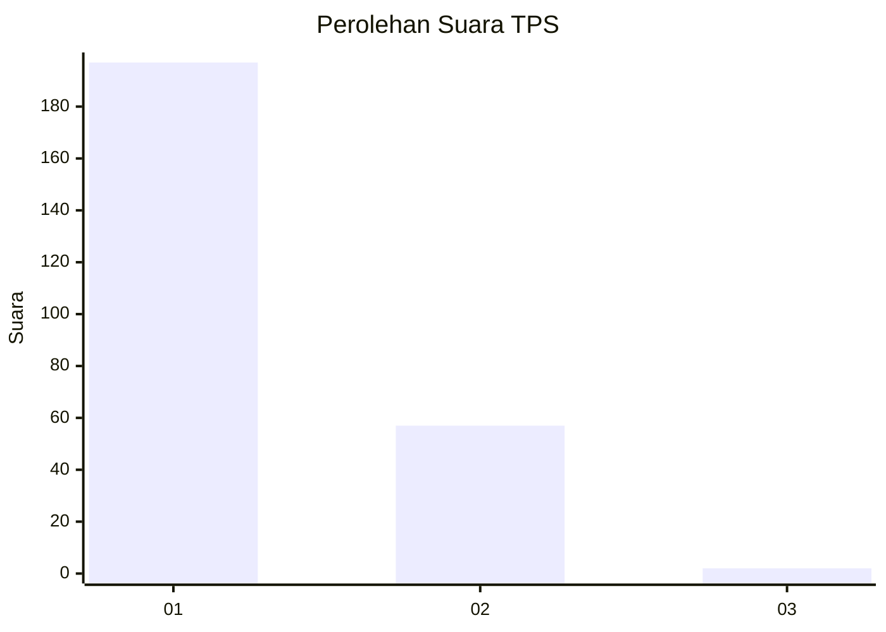
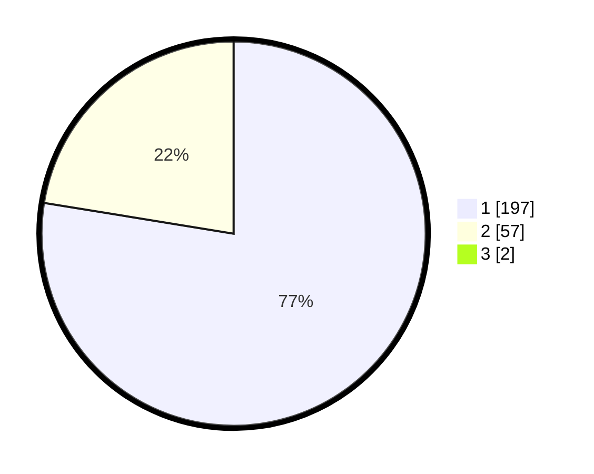

# Hasil

## Grafik

## Tabel

| No. | Nama Paslon    | Suara | Suara (raw) | Persentase |
|:--- |:-------------- | -----:| -----------:| ----------:|
| 1   | ANIES MUHAIMIN | 197   | [197][p-1]  | 76,95      |
| 2   | PRABOWO GIBRAN | 57    | [57][p-2]   | 22,27      |
| 3   | GANJAR MAHFUD  | 2     | [2][p-3]    | 0,78       |

[p-1]: https://github.com/gigit-pemilu/pemilu-2024-35-jawa-timur/blob/main/pilpres/hitung-suara/sub/35-jawa-timur/sub/28-pamekasan/sub/05-proppo/sub/2023-campor/sub/011-tps/sub/paslon-1.txt
[p-2]: https://github.com/gigit-pemilu/pemilu-2024-35-jawa-timur/blob/main/pilpres/hitung-suara/sub/35-jawa-timur/sub/28-pamekasan/sub/05-proppo/sub/2023-campor/sub/011-tps/sub/paslon-2.txt
[p-3]: https://github.com/gigit-pemilu/pemilu-2024-35-jawa-timur/blob/main/pilpres/hitung-suara/sub/35-jawa-timur/sub/28-pamekasan/sub/05-proppo/sub/2023-campor/sub/011-tps/sub/paslon-3.txt

## Foto C Plano

https://sirekap-obj-formc.kpu.go.id/eb09/pemilu/ppwp/35/28/05/20/23/3528052023011-20240214-213355--defb1ac2-10d2-47ed-937c-bc8880b1e71e.jpg

https://sirekap-obj-formc.kpu.go.id/eb09/pemilu/ppwp/35/28/05/20/23/3528052023011-20240214-213704--5da05d62-7cd4-4c10-8af6-96da99cc3420.jpg

https://sirekap-obj-formc.kpu.go.id/eb09/pemilu/ppwp/35/28/05/20/23/3528052023011-20240214-213900--383e5546-7e29-4b9b-885c-bf0f32aac001.jpg

## Metadata

| Key        | Value               |
| ---------- | ------------------- |
| Time Stamp | 2024-02-15 20:00:44 |

