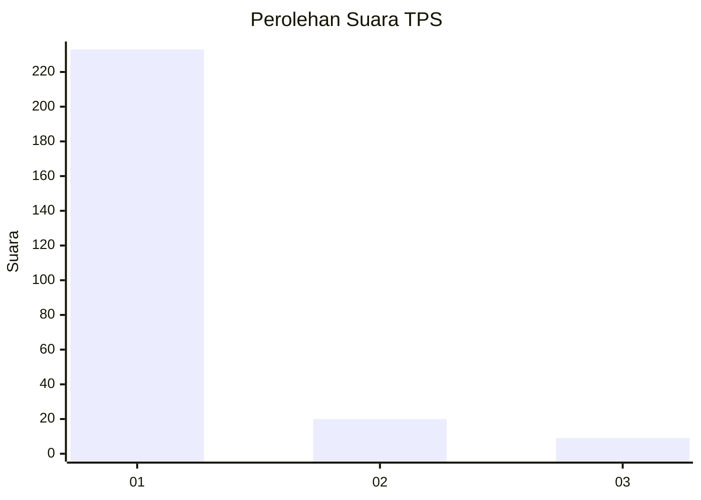
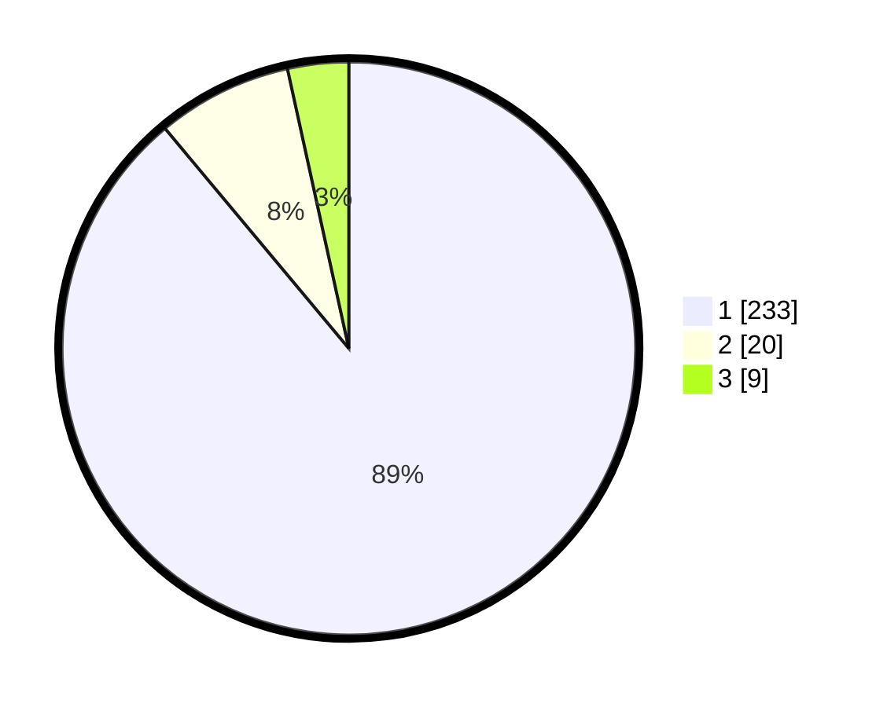

# Hasil

## Grafik

## Tabel

| No. | Nama Paslon    | Suara | Suara (raw) | Persentase |
|:--- |:-------------- | -----:| -----------:| ----------:|
| 1   | ANIES MUHAIMIN | 233   | [233][p-1]  | 88,93      |
| 2   | PRABOWO GIBRAN | 20    | [20][p-2]   | 7,63       |
| 3   | GANJAR MAHFUD  | 9     | [9][p-3]    | 3,44       |

[p-1]: https://github.com/gigit-pemilu/pemilu-2024-35-jawa-timur/blob/main/pilpres/hitung-suara/sub/35-jawa-timur/sub/28-pamekasan/sub/05-proppo/sub/2023-campor/sub/015-tps/sub/paslon-1.txt
[p-2]: https://github.com/gigit-pemilu/pemilu-2024-35-jawa-timur/blob/main/pilpres/hitung-suara/sub/35-jawa-timur/sub/28-pamekasan/sub/05-proppo/sub/2023-campor/sub/015-tps/sub/paslon-2.txt
[p-3]: https://github.com/gigit-pemilu/pemilu-2024-35-jawa-timur/blob/main/pilpres/hitung-suara/sub/35-jawa-timur/sub/28-pamekasan/sub/05-proppo/sub/2023-campor/sub/015-tps/sub/paslon-3.txt

## Foto C Plano

https://sirekap-obj-formc.kpu.go.id/6466/pemilu/ppwp/35/28/05/20/23/3528052023015-20240214-225649--13506d2c-133a-4a9d-8a55-4dfbce512b28.jpg

https://sirekap-obj-formc.kpu.go.id/6466/pemilu/ppwp/35/28/05/20/23/3528052023015-20240214-225801--a77d75ad-981a-43e1-b565-f946d7d1f6e3.jpg

https://sirekap-obj-formc.kpu.go.id/6466/pemilu/ppwp/35/28/05/20/23/3528052023015-20240214-225857--6090b928-5308-4cf6-b51d-060fd1bbd825.jpg

## Metadata

| Key        | Value               |
| ---------- | ------------------- |
| Time Stamp | 2024-02-17 14:45:18 |

