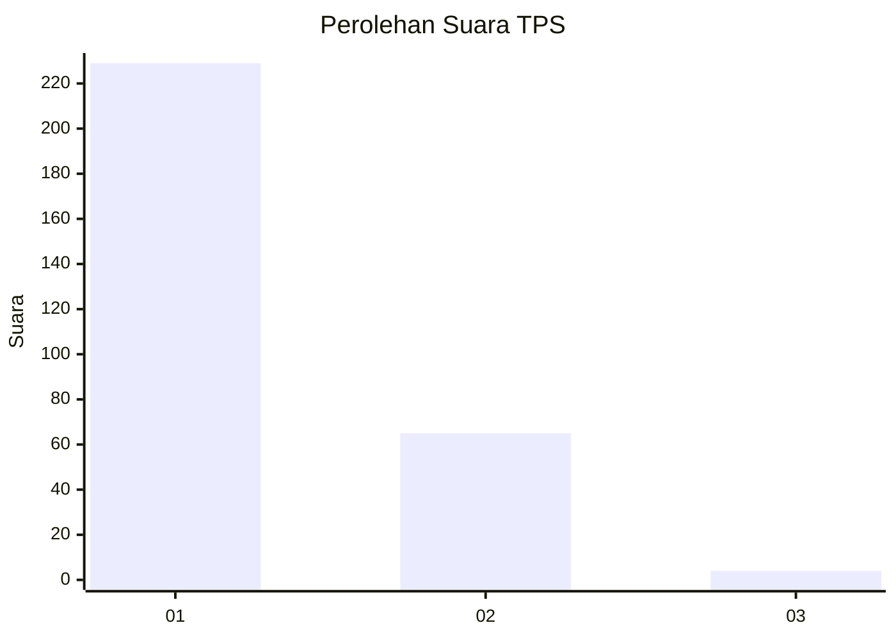
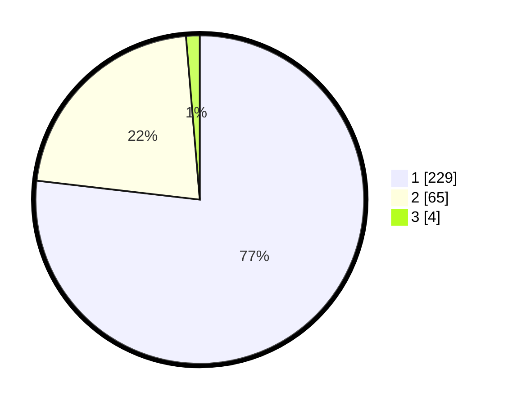

# Hasil

## Grafik

## Tabel

| No. | Nama Paslon    | Suara | Suara (raw) | Persentase |
|:--- |:-------------- | -----:| -----------:| ----------:|
| 1   | ANIES MUHAIMIN | 229   | [229][p-1]  | 76,85      |
| 2   | PRABOWO GIBRAN | 65    | [65][p-2]   | 21,81      |
| 3   | GANJAR MAHFUD  | 4     | [4][p-3]    | 1,34       |

[p-1]: https://github.com/gigit-pemilu/pemilu-2024-35-jawa-timur/blob/main/pilpres/hitung-suara/sub/35-jawa-timur/sub/28-pamekasan/sub/05-proppo/sub/2023-campor/sub/017-tps/sub/paslon-1.txt
[p-2]: https://github.com/gigit-pemilu/pemilu-2024-35-jawa-timur/blob/main/pilpres/hitung-suara/sub/35-jawa-timur/sub/28-pamekasan/sub/05-proppo/sub/2023-campor/sub/017-tps/sub/paslon-2.txt
[p-3]: https://github.com/gigit-pemilu/pemilu-2024-35-jawa-timur/blob/main/pilpres/hitung-suara/sub/35-jawa-timur/sub/28-pamekasan/sub/05-proppo/sub/2023-campor/sub/017-tps/sub/paslon-3.txt

## Foto C Plano

https://sirekap-obj-formc.kpu.go.id/d7bf/pemilu/ppwp/35/28/05/20/23/3528052023017-20240215-083140--e2d771f4-6b1c-4497-a0ed-5a47c106cae3.jpg

https://sirekap-obj-formc.kpu.go.id/d7bf/pemilu/ppwp/35/28/05/20/23/3528052023017-20240215-083225--95dc44c9-8d35-4621-ab21-8c265f553bc4.jpg

https://sirekap-obj-formc.kpu.go.id/d7bf/pemilu/ppwp/35/28/05/20/23/3528052023017-20240215-083639--d4ac0e70-0999-4da0-85b3-afd26b1c578b.jpg

## Metadata

| Key        | Value               |
| ---------- | ------------------- |
| Time Stamp | 2024-02-17 14:45:18 |

