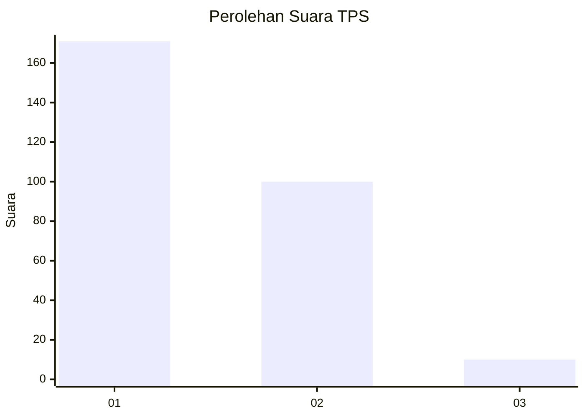
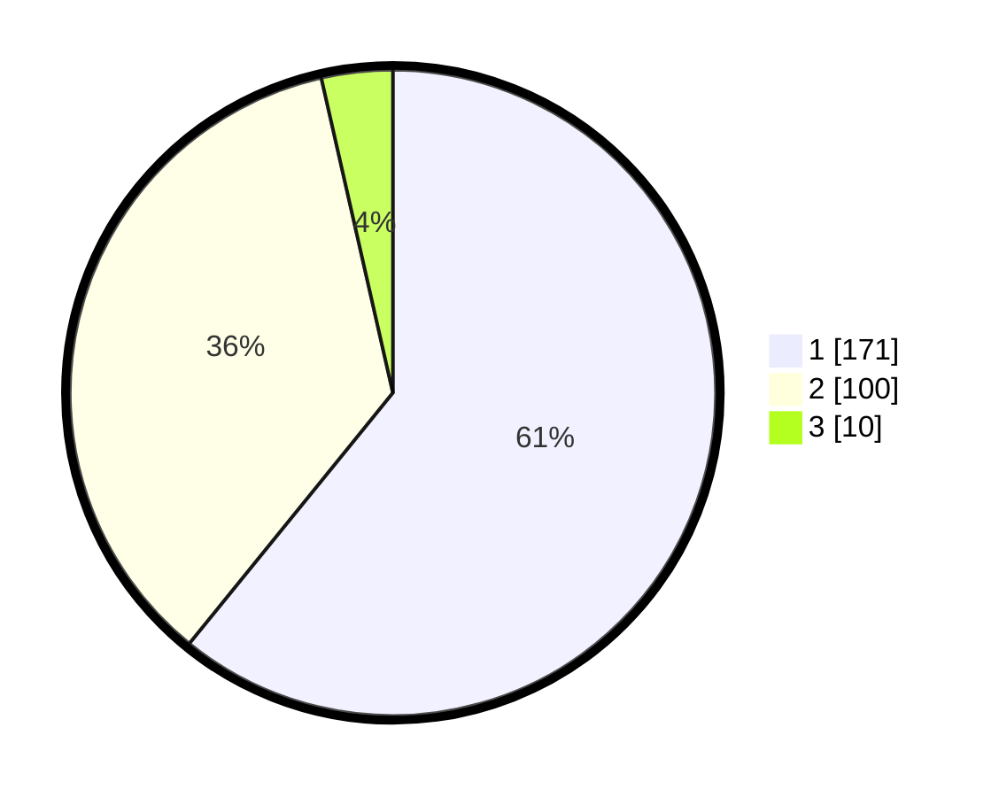

# Hasil

## Grafik

## Tabel

| No. | Nama Paslon    | Suara | Suara (raw) | Persentase |
|:--- |:-------------- | -----:| -----------:| ----------:|
| 1   | ANIES MUHAIMIN | 171   | [171][p-1]  | 60,85      |
| 2   | PRABOWO GIBRAN | 100   | [100][p-2]  | 35,59      |
| 3   | GANJAR MAHFUD  | 10    | [10][p-3]   | 3,56       |

[p-1]: https://github.com/gigit-pemilu/pemilu-2024/blob/main/pilpres/hitung-suara/sub/35-jawa-timur/sub/28-pamekasan/sub/05-proppo/sub/2023-campor/sub/019-tps/sub/paslon-1.txt
[p-2]: https://github.com/gigit-pemilu/pemilu-2024/blob/main/pilpres/hitung-suara/sub/35-jawa-timur/sub/28-pamekasan/sub/05-proppo/sub/2023-campor/sub/019-tps/sub/paslon-2.txt
[p-3]: https://github.com/gigit-pemilu/pemilu-2024/blob/main/pilpres/hitung-suara/sub/35-jawa-timur/sub/28-pamekasan/sub/05-proppo/sub/2023-campor/sub/019-tps/sub/paslon-3.txt

## Foto C Plano

https://sirekap-obj-formc.kpu.go.id/f894/pemilu/ppwp/35/28/05/20/23/3528052023019-20240215-145158--30f5e0a3-4509-43e4-82c3-edff8b2e9638.jpg

https://sirekap-obj-formc.kpu.go.id/f894/pemilu/ppwp/35/28/05/20/23/3528052023019-20240215-151107--c7017f16-e7d1-4679-9230-1455360554b5.jpg

https://sirekap-obj-formc.kpu.go.id/f894/pemilu/ppwp/35/28/05/20/23/3528052023019-20240215-095013--a8dea468-2cfc-4760-8bf1-d3f9afa2e397.jpg

## Metadata

| Key        | Value               |
| ---------- | ------------------- |
| Time Stamp | 2024-02-17 14:45:18 |

