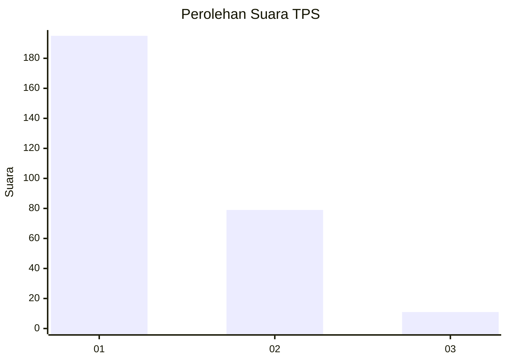
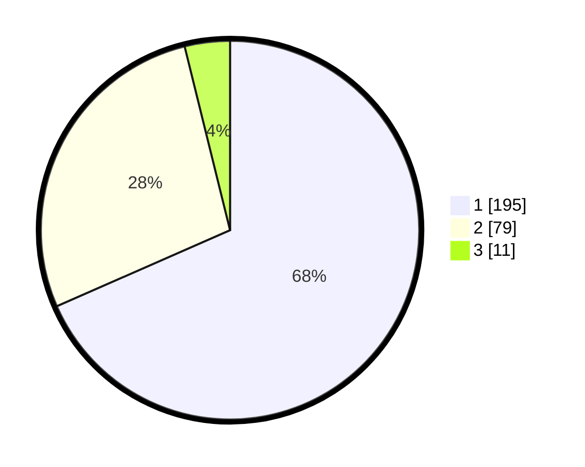

# Hasil

## Grafik

## Tabel

| No. | Nama Paslon    | Suara | Suara (raw) | Persentase |
|:--- |:-------------- | -----:| -----------:| ----------:|
| 1   | ANIES MUHAIMIN | 195   | [195][p-1]  | 68,42      |
| 2   | PRABOWO GIBRAN | 79    | [79][p-2]   | 27,72      |
| 3   | GANJAR MAHFUD  | 11    | [11][p-3]   | 3,86       |

[p-1]: https://github.com/gigit-pemilu/pemilu-2024/blob/main/pilpres/hitung-suara/sub/35-jawa-timur/sub/28-pamekasan/sub/05-proppo/sub/2023-campor/sub/020-tps/sub/paslon-1.txt
[p-2]: https://github.com/gigit-pemilu/pemilu-2024/blob/main/pilpres/hitung-suara/sub/35-jawa-timur/sub/28-pamekasan/sub/05-proppo/sub/2023-campor/sub/020-tps/sub/paslon-2.txt
[p-3]: https://github.com/gigit-pemilu/pemilu-2024/blob/main/pilpres/hitung-suara/sub/35-jawa-timur/sub/28-pamekasan/sub/05-proppo/sub/2023-campor/sub/020-tps/sub/paslon-3.txt

## Foto C Plano

https://sirekap-obj-formc.kpu.go.id/9168/pemilu/ppwp/35/28/05/20/23/3528052023020-20240214-214634--12f6173d-0ff9-471a-ae6d-3dfefc1a36ba.jpg

https://sirekap-obj-formc.kpu.go.id/9168/pemilu/ppwp/35/28/05/20/23/3528052023020-20240214-214753--7fce9e82-9d80-4941-98f9-ce52d8540a8b.jpg

https://sirekap-obj-formc.kpu.go.id/9168/pemilu/ppwp/35/28/05/20/23/3528052023020-20240214-214852--89b7ded7-14aa-428c-9855-001e00731cb3.jpg

## Metadata

| Key        | Value               |
| ---------- | ------------------- |
| Time Stamp | 2024-02-17 14:45:18 |

