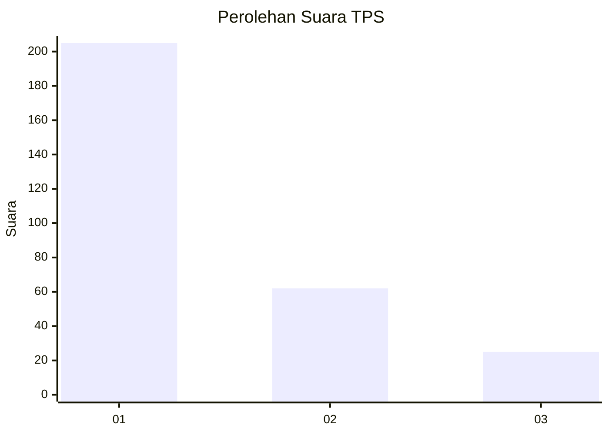
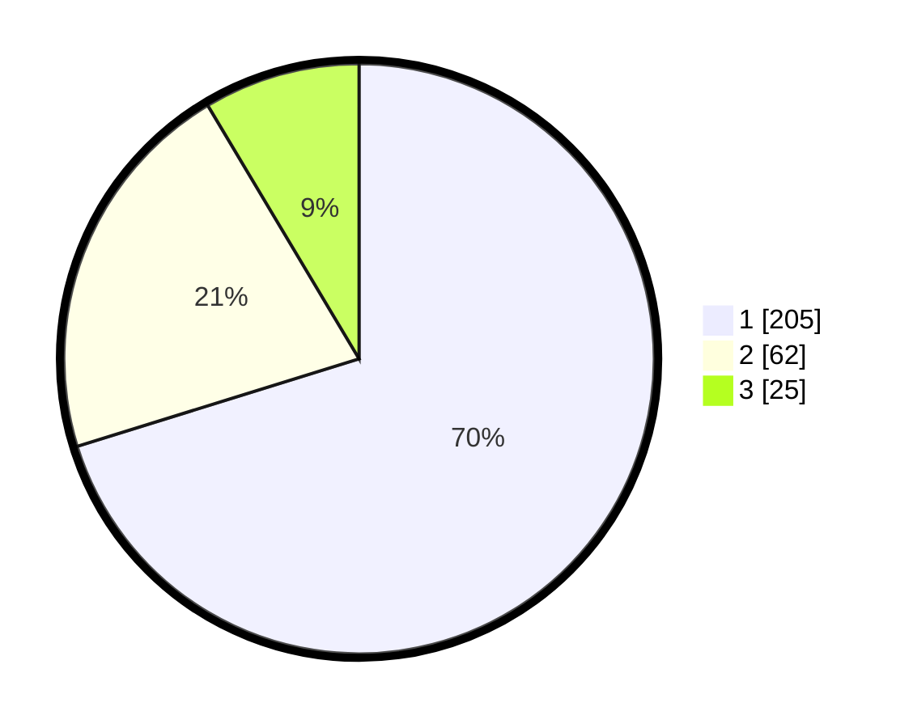

# Hasil

## Grafik

## Tabel

| No. | Nama Paslon    | Suara | Suara (raw) | Persentase |
|:--- |:-------------- | -----:| -----------:| ----------:|
| 1   | ANIES MUHAIMIN | 205   | [205][p-1]  | 70,21      |
| 2   | PRABOWO GIBRAN | 62    | [62][p-2]   | 21,23      |
| 3   | GANJAR MAHFUD  | 25    | [25][p-3]   | 8,56       |

[p-1]: https://github.com/gigit-pemilu/pemilu-2024-35-jawa-timur/blob/main/pilpres/hitung-suara/sub/35-jawa-timur/sub/28-pamekasan/sub/05-proppo/sub/2023-campor/sub/021-tps/sub/paslon-1.txt
[p-2]: https://github.com/gigit-pemilu/pemilu-2024-35-jawa-timur/blob/main/pilpres/hitung-suara/sub/35-jawa-timur/sub/28-pamekasan/sub/05-proppo/sub/2023-campor/sub/021-tps/sub/paslon-2.txt
[p-3]: https://github.com/gigit-pemilu/pemilu-2024-35-jawa-timur/blob/main/pilpres/hitung-suara/sub/35-jawa-timur/sub/28-pamekasan/sub/05-proppo/sub/2023-campor/sub/021-tps/sub/paslon-3.txt

## Foto C Plano

https://sirekap-obj-formc.kpu.go.id/bacd/pemilu/ppwp/35/28/05/20/23/3528052023021-20240215-124844--1fe14fb7-65c1-43ce-b43c-c1f4abd4a4bb.jpg

https://sirekap-obj-formc.kpu.go.id/bacd/pemilu/ppwp/35/28/05/20/23/3528052023021-20240215-124955--1f65a55b-06a8-4831-93cc-9bb5416576de.jpg

https://sirekap-obj-formc.kpu.go.id/bacd/pemilu/ppwp/35/28/05/20/23/3528052023021-20240215-125058--b2ec83c7-2087-4f85-9699-6b92dc924b74.jpg

## Metadata

| Key        | Value               |
| ---------- | ------------------- |
| Time Stamp | 2024-02-17 14:45:18 |

