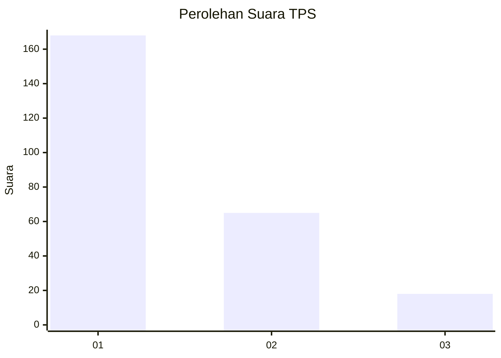
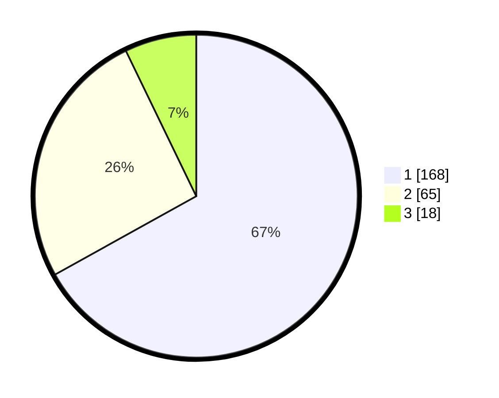

# Hasil

## Grafik

## Tabel

| No. | Nama Paslon    | Suara | Suara (raw) | Persentase |
|:--- |:-------------- | -----:| -----------:| ----------:|
| 1   | ANIES MUHAIMIN | 168   | [168][p-1]  | 66,93      |
| 2   | PRABOWO GIBRAN | 65    | [65][p-2]   | 25,90      |
| 3   | GANJAR MAHFUD  | 18    | [18][p-3]   | 7,17       |

[p-1]: https://github.com/gigit-pemilu/pemilu-2024-35-jawa-timur/blob/main/pilpres/hitung-suara/sub/35-jawa-timur/sub/28-pamekasan/sub/05-proppo/sub/2023-campor/sub/023-tps/sub/paslon-1.txt
[p-2]: https://github.com/gigit-pemilu/pemilu-2024-35-jawa-timur/blob/main/pilpres/hitung-suara/sub/35-jawa-timur/sub/28-pamekasan/sub/05-proppo/sub/2023-campor/sub/023-tps/sub/paslon-2.txt
[p-3]: https://github.com/gigit-pemilu/pemilu-2024-35-jawa-timur/blob/main/pilpres/hitung-suara/sub/35-jawa-timur/sub/28-pamekasan/sub/05-proppo/sub/2023-campor/sub/023-tps/sub/paslon-3.txt

## Foto C Plano

https://sirekap-obj-formc.kpu.go.id/ec51/pemilu/ppwp/35/28/05/20/23/3528052023023-20240215-143144--ef507b58-0778-4b6a-b468-687eac5f8a25.jpg

https://sirekap-obj-formc.kpu.go.id/ec51/pemilu/ppwp/35/28/05/20/23/3528052023023-20240215-143907--a5d772e8-efe2-4b96-912d-19fa2eb91738.jpg

https://sirekap-obj-formc.kpu.go.id/ec51/pemilu/ppwp/35/28/05/20/23/3528052023023-20240215-143456--1c4518e9-2306-40eb-8e02-d7879d41ee75.jpg

## Metadata

| Key        | Value               |
| ---------- | ------------------- |
| Time Stamp | 2024-02-17 14:45:18 |

