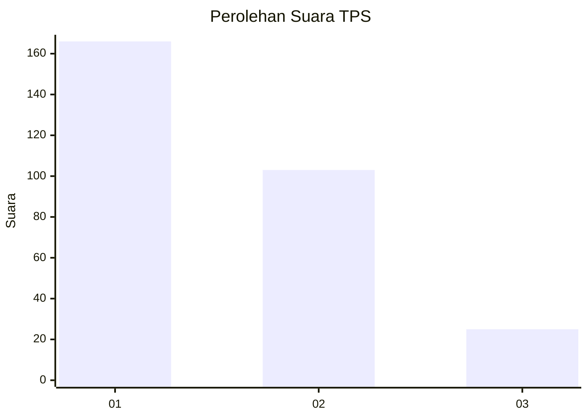
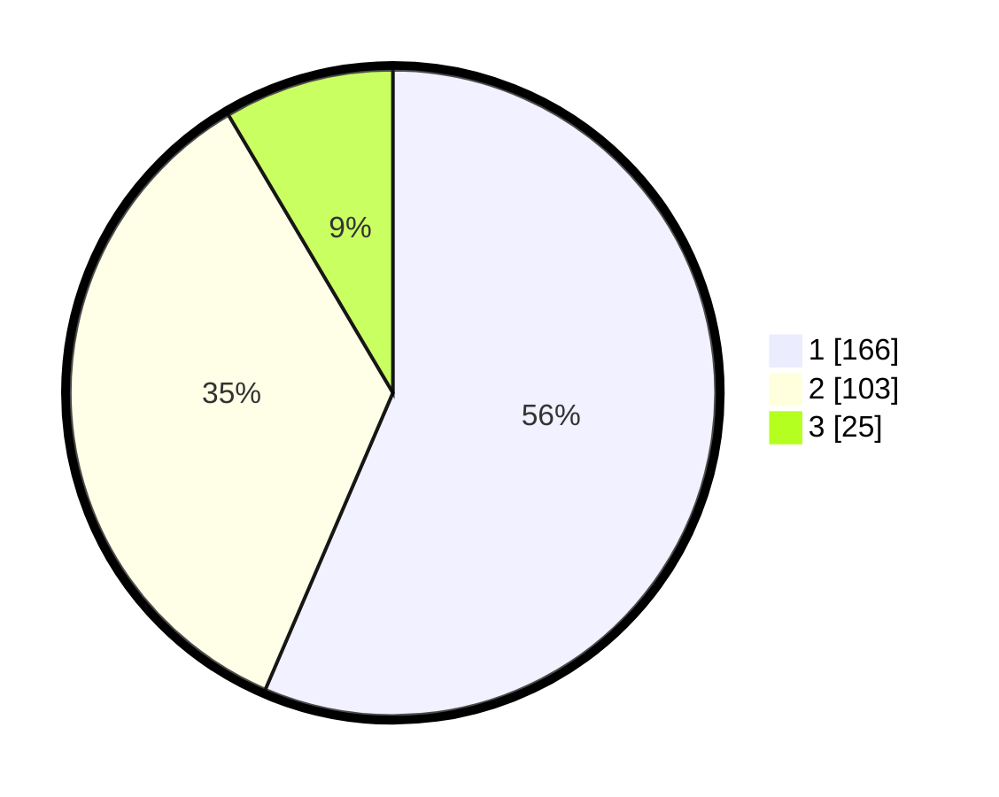

# Hasil

## Grafik

## Tabel

| No. | Nama Paslon    | Suara | Suara (raw) | Persentase |
|:--- |:-------------- | -----:| -----------:| ----------:|
| 1   | ANIES MUHAIMIN | 166   | [166][p-1]  | 56,46      |
| 2   | PRABOWO GIBRAN | 103   | [103][p-2]  | 35,03      |
| 3   | GANJAR MAHFUD  | 25    | [25][p-3]   | 8,50       |

[p-1]: https://github.com/gigit-pemilu/pemilu-2024/blob/main/pilpres/hitung-suara/sub/35-jawa-timur/sub/28-pamekasan/sub/05-proppo/sub/2023-campor/sub/025-tps/sub/paslon-1.txt
[p-2]: https://github.com/gigit-pemilu/pemilu-2024/blob/main/pilpres/hitung-suara/sub/35-jawa-timur/sub/28-pamekasan/sub/05-proppo/sub/2023-campor/sub/025-tps/sub/paslon-2.txt
[p-3]: https://github.com/gigit-pemilu/pemilu-2024/blob/main/pilpres/hitung-suara/sub/35-jawa-timur/sub/28-pamekasan/sub/05-proppo/sub/2023-campor/sub/025-tps/sub/paslon-3.txt

## Foto C Plano

https://sirekap-obj-formc.kpu.go.id/0750/pemilu/ppwp/35/28/05/20/23/3528052023025-20240215-150818--f6e50053-2f25-4a78-a951-b232d810071c.jpg

https://sirekap-obj-formc.kpu.go.id/0750/pemilu/ppwp/35/28/05/20/23/3528052023025-20240215-151127--0c5711aa-df72-4fff-a345-413ea4a7329c.jpg

https://sirekap-obj-formc.kpu.go.id/0750/pemilu/ppwp/35/28/05/20/23/3528052023025-20240215-151405--47133e64-2d4d-4aba-8333-154bdea7e3da.jpg

## Metadata

| Key        | Value               |
| ---------- | ------------------- |
| Time Stamp | 2024-02-17 14:45:18 |

