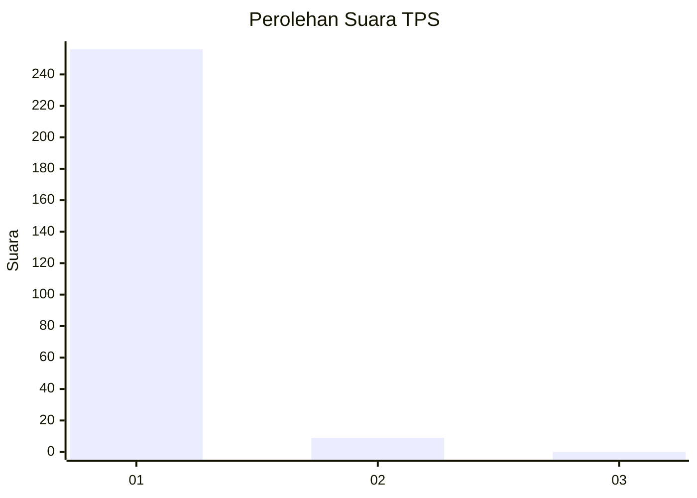
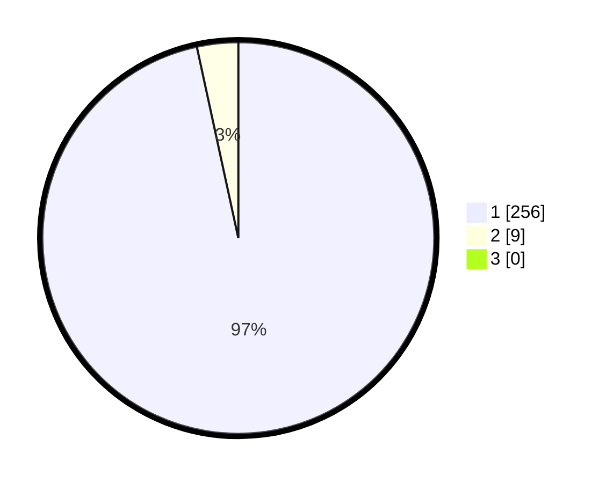

# Hasil

## Grafik

## Tabel

| No. | Nama Paslon    | Suara | Suara (raw) | Persentase |
|:--- |:-------------- | -----:| -----------:| ----------:|
| 1   | ANIES MUHAIMIN | 256   | [256][p-1]  | 96,60      |
| 2   | PRABOWO GIBRAN | 9     | [9][p-2]    | 3,40       |
| 3   | GANJAR MAHFUD  | 0     | [0][p-3]    | 0,00       |

[p-1]: https://github.com/gigit-pemilu/pemilu-2024-35-jawa-timur/blob/main/pilpres/hitung-suara/sub/35-jawa-timur/sub/28-pamekasan/sub/05-proppo/sub/2025-pangbatok/sub/001-tps/sub/paslon-1.txt
[p-2]: https://github.com/gigit-pemilu/pemilu-2024-35-jawa-timur/blob/main/pilpres/hitung-suara/sub/35-jawa-timur/sub/28-pamekasan/sub/05-proppo/sub/2025-pangbatok/sub/001-tps/sub/paslon-2.txt
[p-3]: https://github.com/gigit-pemilu/pemilu-2024-35-jawa-timur/blob/main/pilpres/hitung-suara/sub/35-jawa-timur/sub/28-pamekasan/sub/05-proppo/sub/2025-pangbatok/sub/001-tps/sub/paslon-3.txt

## Foto C Plano

https://sirekap-obj-formc.kpu.go.id/0055/pemilu/ppwp/35/28/05/20/25/3528052025001-20240215-083226--357455e5-bbcd-4740-a38b-7ec5e0617a5c.jpg

https://sirekap-obj-formc.kpu.go.id/0055/pemilu/ppwp/35/28/05/20/25/3528052025001-20240215-083447--ac2644e8-c379-479e-bb2a-d99ee8ea6889.jpg

https://sirekap-obj-formc.kpu.go.id/0055/pemilu/ppwp/35/28/05/20/25/3528052025001-20240215-083745--2423f9f7-ff54-483f-a8df-f486b5fca805.jpg

## Metadata

| Key        | Value               |
| ---------- | ------------------- |
| Time Stamp | 2024-02-17 14:45:18 |

