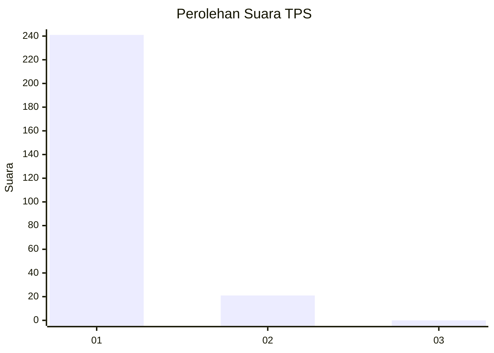
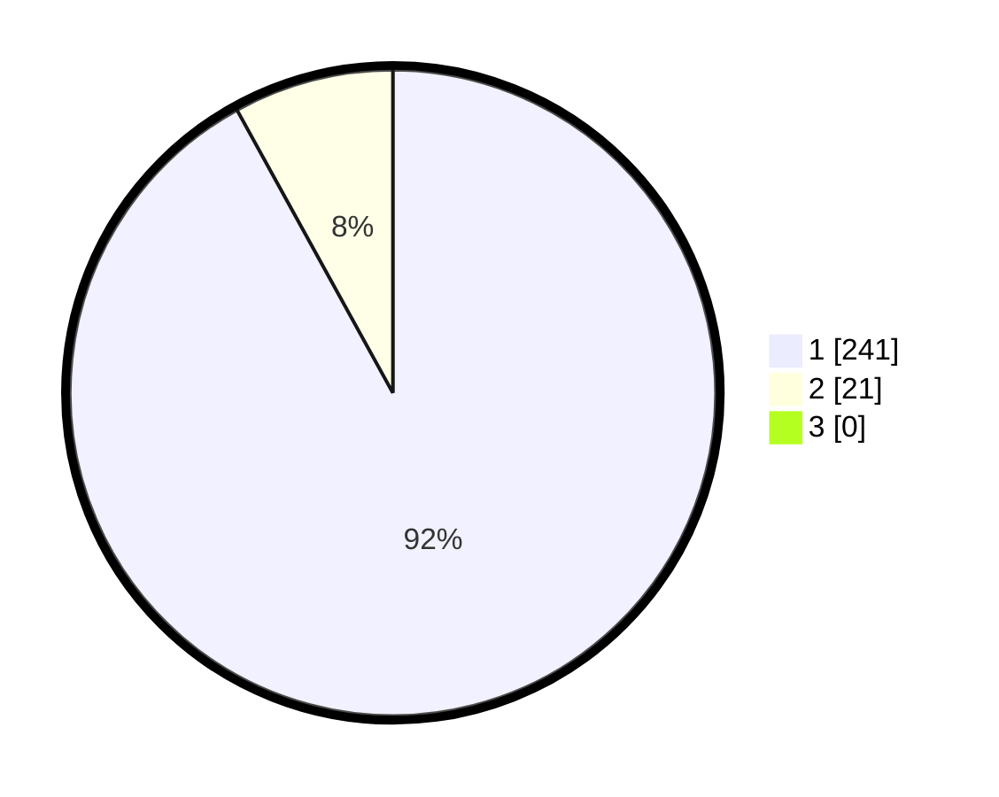

# Hasil

## Grafik

## Tabel

| No. | Nama Paslon    | Suara | Suara (raw) | Persentase |
|:--- |:-------------- | -----:| -----------:| ----------:|
| 1   | ANIES MUHAIMIN | 241   | [241][p-1]  | 91,98      |
| 2   | PRABOWO GIBRAN | 21    | [21][p-2]   | 8,02       |
| 3   | GANJAR MAHFUD  | 0     | [0][p-3]    | 0,00       |

[p-1]: https://github.com/gigit-pemilu/pemilu-2024/blob/main/pilpres/hitung-suara/sub/35-jawa-timur/sub/28-pamekasan/sub/05-proppo/sub/2025-pangbatok/sub/004-tps/sub/paslon-1.txt
[p-2]: https://github.com/gigit-pemilu/pemilu-2024/blob/main/pilpres/hitung-suara/sub/35-jawa-timur/sub/28-pamekasan/sub/05-proppo/sub/2025-pangbatok/sub/004-tps/sub/paslon-2.txt
[p-3]: https://github.com/gigit-pemilu/pemilu-2024/blob/main/pilpres/hitung-suara/sub/35-jawa-timur/sub/28-pamekasan/sub/05-proppo/sub/2025-pangbatok/sub/004-tps/sub/paslon-3.txt

## Foto C Plano

https://sirekap-obj-formc.kpu.go.id/826c/pemilu/ppwp/35/28/05/20/25/3528052025004-20240215-080351--828db579-f38d-4709-87d8-19a0f617bfb0.jpg

https://sirekap-obj-formc.kpu.go.id/826c/pemilu/ppwp/35/28/05/20/25/3528052025004-20240214-192921--bc9adb83-4972-49d7-a702-d64523ec4eb1.jpg

https://sirekap-obj-formc.kpu.go.id/826c/pemilu/ppwp/35/28/05/20/25/3528052025004-20240214-201302--23b38bc8-3aea-41ed-bcf4-f4a9704b130e.jpg

## Metadata

| Key        | Value               |
| ---------- | ------------------- |
| Time Stamp | 2024-02-15 15:00:29 |

