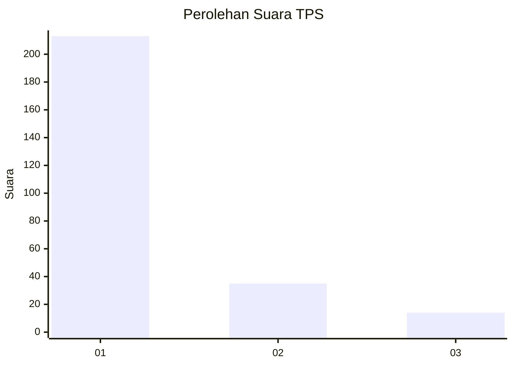
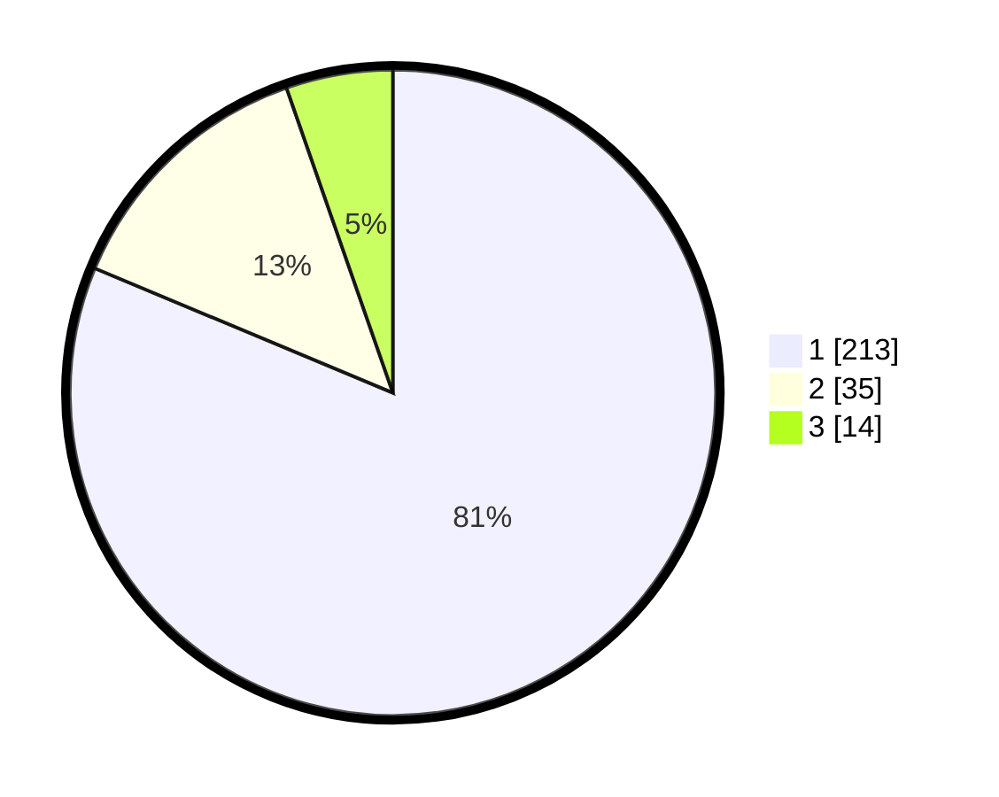

# Hasil

## Grafik

## Tabel

| No. | Nama Paslon    | Suara | Suara (raw) | Persentase |
|:--- |:-------------- | -----:| -----------:| ----------:|
| 1   | ANIES MUHAIMIN | 213   | [213][p-1]  | 81,30      |
| 2   | PRABOWO GIBRAN | 35    | [35][p-2]   | 13,36      |
| 3   | GANJAR MAHFUD  | 14    | [14][p-3]   | 5,34       |

[p-1]: https://github.com/gigit-pemilu/pemilu-2024-35-jawa-timur/blob/main/pilpres/hitung-suara/sub/35-jawa-timur/sub/28-pamekasan/sub/05-proppo/sub/2025-pangbatok/sub/007-tps/sub/paslon-1.txt
[p-2]: https://github.com/gigit-pemilu/pemilu-2024-35-jawa-timur/blob/main/pilpres/hitung-suara/sub/35-jawa-timur/sub/28-pamekasan/sub/05-proppo/sub/2025-pangbatok/sub/007-tps/sub/paslon-2.txt
[p-3]: https://github.com/gigit-pemilu/pemilu-2024-35-jawa-timur/blob/main/pilpres/hitung-suara/sub/35-jawa-timur/sub/28-pamekasan/sub/05-proppo/sub/2025-pangbatok/sub/007-tps/sub/paslon-3.txt

## Foto C Plano

https://sirekap-obj-formc.kpu.go.id/eb64/pemilu/ppwp/35/28/05/20/25/3528052025007-20240215-000653--43cc70bf-b402-41df-a9f3-44b51afe4dfe.jpg

https://sirekap-obj-formc.kpu.go.id/eb64/pemilu/ppwp/35/28/05/20/25/3528052025007-20240215-000758--9cebedb4-b2cf-4017-9c30-9d26780865f9.jpg

https://sirekap-obj-formc.kpu.go.id/eb64/pemilu/ppwp/35/28/05/20/25/3528052025007-20240214-214848--ada071ba-42ba-4a46-aa6c-369a6a1d172e.jpg

## Metadata

| Key        | Value               |
| ---------- | ------------------- |
| Time Stamp | 2024-02-17 14:45:18 |

