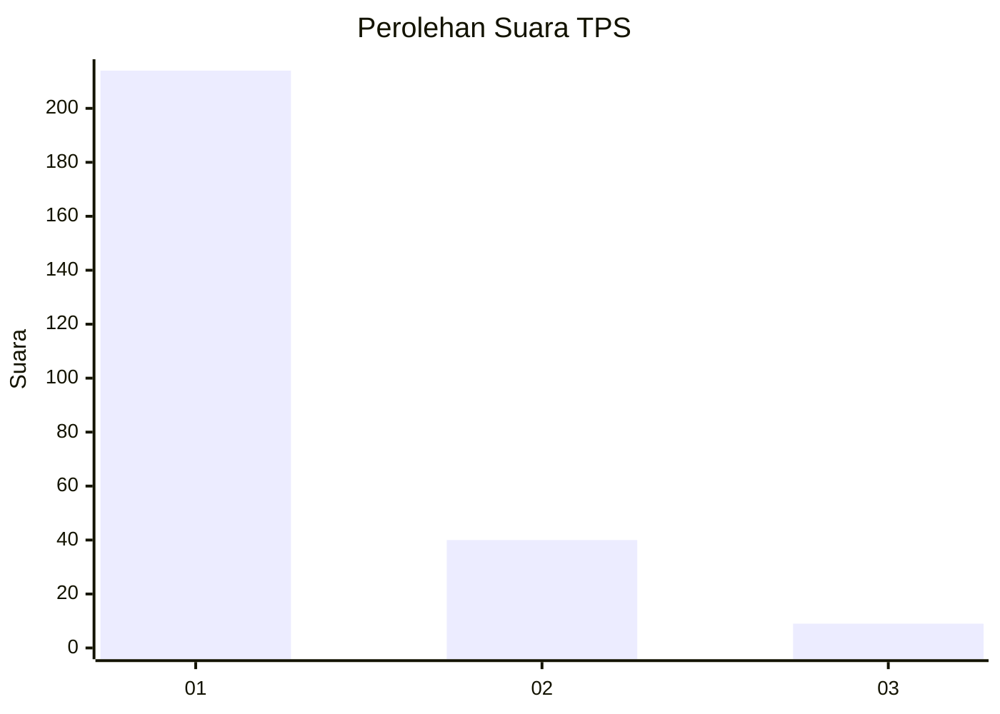
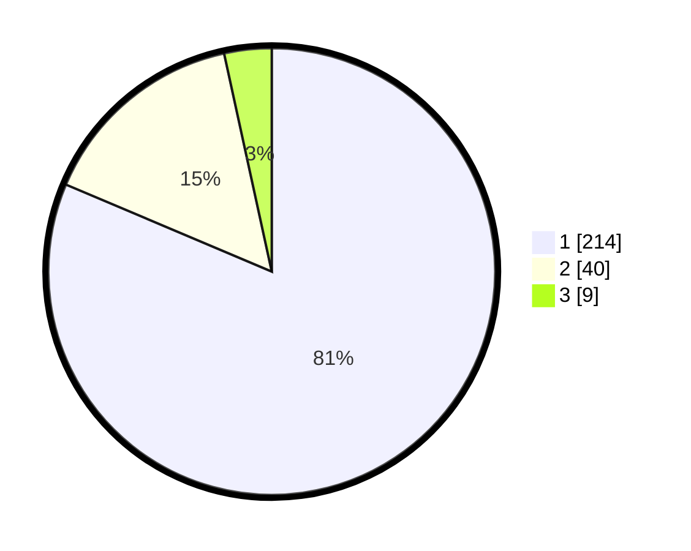

# Hasil

## Grafik

## Tabel

| No. | Nama Paslon    | Suara | Suara (raw) | Persentase |
|:--- |:-------------- | -----:| -----------:| ----------:|
| 1   | ANIES MUHAIMIN | 214   | [214][p-1]  | 81,37      |
| 2   | PRABOWO GIBRAN | 40    | [40][p-2]   | 15,21      |
| 3   | GANJAR MAHFUD  | 9     | [9][p-3]    | 3,42       |

[p-1]: https://github.com/gigit-pemilu/pemilu-2024/blob/main/pilpres/hitung-suara/sub/35-jawa-timur/sub/28-pamekasan/sub/05-proppo/sub/2025-pangbatok/sub/008-tps/sub/paslon-1.txt
[p-2]: https://github.com/gigit-pemilu/pemilu-2024/blob/main/pilpres/hitung-suara/sub/35-jawa-timur/sub/28-pamekasan/sub/05-proppo/sub/2025-pangbatok/sub/008-tps/sub/paslon-2.txt
[p-3]: https://github.com/gigit-pemilu/pemilu-2024/blob/main/pilpres/hitung-suara/sub/35-jawa-timur/sub/28-pamekasan/sub/05-proppo/sub/2025-pangbatok/sub/008-tps/sub/paslon-3.txt

## Foto C Plano

https://sirekap-obj-formc.kpu.go.id/34e6/pemilu/ppwp/35/28/05/20/25/3528052025008-20240215-014229--6bc43a66-4215-42bb-8f2b-effa4e3a6942.jpg

https://sirekap-obj-formc.kpu.go.id/34e6/pemilu/ppwp/35/28/05/20/25/3528052025008-20240215-014409--173ef9a7-a524-4074-b38a-7a3f284da393.jpg

https://sirekap-obj-formc.kpu.go.id/34e6/pemilu/ppwp/35/28/05/20/25/3528052025008-20240215-013847--aea30d16-aba3-40f1-a972-f4614bc9c22c.jpg

## Metadata

| Key        | Value               |
| ---------- | ------------------- |
| Time Stamp | 2024-02-17 14:45:18 |

