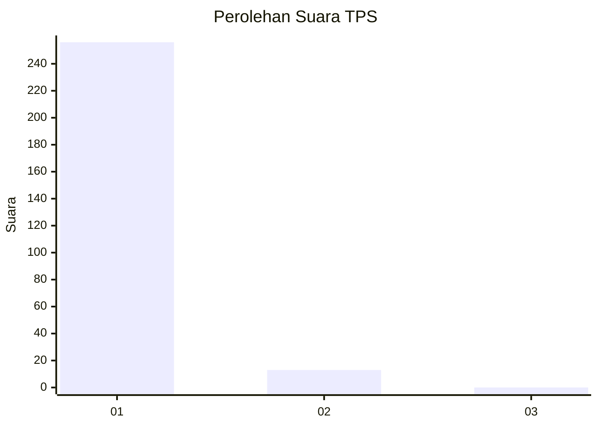
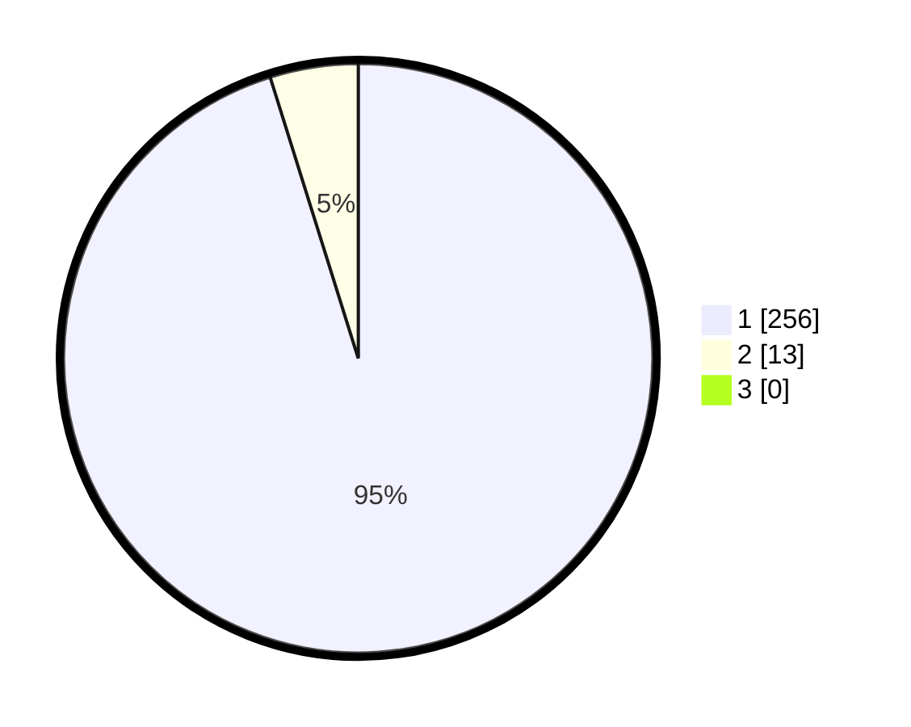

# Hasil

## Grafik

## Tabel

| No. | Nama Paslon    | Suara | Suara (raw) | Persentase |
|:--- |:-------------- | -----:| -----------:| ----------:|
| 1   | ANIES MUHAIMIN | 256   | [256][p-1]  | 95,17      |
| 2   | PRABOWO GIBRAN | 13    | [13][p-2]   | 4,83       |
| 3   | GANJAR MAHFUD  | 0     | [0][p-3]    | 0,00       |

[p-1]: https://github.com/gigit-pemilu/pemilu-2024/blob/main/pilpres/hitung-suara/sub/35-jawa-timur/sub/28-pamekasan/sub/05-proppo/sub/2025-pangbatok/sub/009-tps/sub/paslon-1.txt
[p-2]: https://github.com/gigit-pemilu/pemilu-2024/blob/main/pilpres/hitung-suara/sub/35-jawa-timur/sub/28-pamekasan/sub/05-proppo/sub/2025-pangbatok/sub/009-tps/sub/paslon-2.txt
[p-3]: https://github.com/gigit-pemilu/pemilu-2024/blob/main/pilpres/hitung-suara/sub/35-jawa-timur/sub/28-pamekasan/sub/05-proppo/sub/2025-pangbatok/sub/009-tps/sub/paslon-3.txt

## Foto C Plano

https://sirekap-obj-formc.kpu.go.id/94c3/pemilu/ppwp/35/28/05/20/25/3528052025009-20240215-053238--680cfe33-32fb-4522-9918-ec808fc0cad8.jpg

https://sirekap-obj-formc.kpu.go.id/94c3/pemilu/ppwp/35/28/05/20/25/3528052025009-20240215-053507--ecd446a4-2111-4f2a-bad2-725034643c4f.jpg

https://sirekap-obj-formc.kpu.go.id/94c3/pemilu/ppwp/35/28/05/20/25/3528052025009-20240215-053552--dd3f3d65-ee37-49f0-87e0-ed1c4fbde7b2.jpg

## Metadata

| Key        | Value               |
| ---------- | ------------------- |
| Time Stamp | 2024-02-17 14:45:18 |

