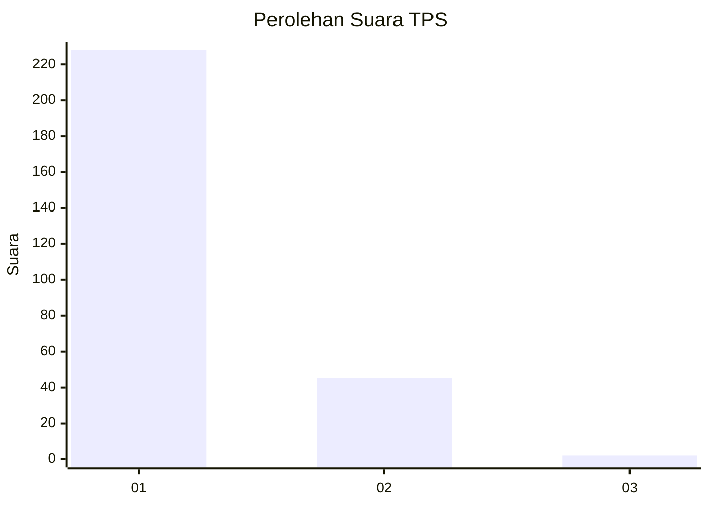
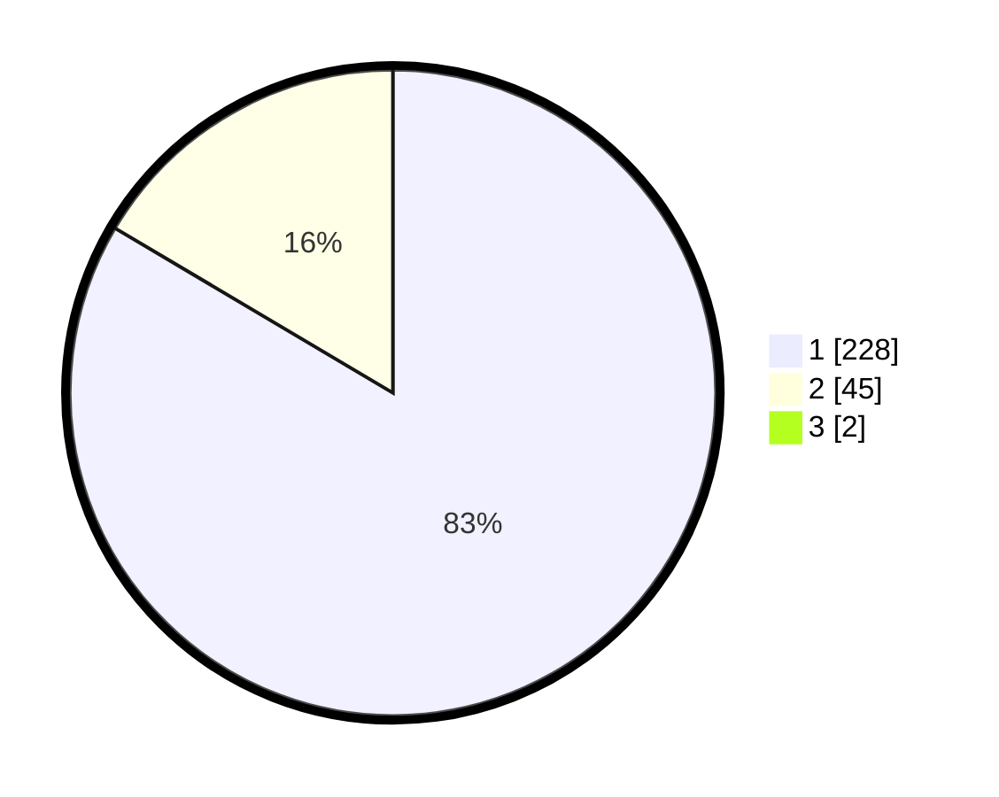

# Hasil

## Grafik

## Tabel

| No. | Nama Paslon    | Suara | Suara (raw) | Persentase |
|:--- |:-------------- | -----:| -----------:| ----------:|
| 1   | ANIES MUHAIMIN | 228   | [228][p-1]  | 82,91      |
| 2   | PRABOWO GIBRAN | 45    | [45][p-2]   | 16,36      |
| 3   | GANJAR MAHFUD  | 2     | [2][p-3]    | 0,73       |

[p-1]: https://github.com/gigit-pemilu/pemilu-2024/blob/main/pilpres/hitung-suara/sub/35-jawa-timur/sub/28-pamekasan/sub/05-proppo/sub/2026-tattangoh/sub/003-tps/sub/paslon-1.txt
[p-2]: https://github.com/gigit-pemilu/pemilu-2024/blob/main/pilpres/hitung-suara/sub/35-jawa-timur/sub/28-pamekasan/sub/05-proppo/sub/2026-tattangoh/sub/003-tps/sub/paslon-2.txt
[p-3]: https://github.com/gigit-pemilu/pemilu-2024/blob/main/pilpres/hitung-suara/sub/35-jawa-timur/sub/28-pamekasan/sub/05-proppo/sub/2026-tattangoh/sub/003-tps/sub/paslon-3.txt

## Foto C Plano

https://sirekap-obj-formc.kpu.go.id/3d1a/pemilu/ppwp/35/28/05/20/26/3528052026003-20240214-194801--b7ad131d-54d9-4b79-b677-682893188bdf.jpg

https://sirekap-obj-formc.kpu.go.id/3d1a/pemilu/ppwp/35/28/05/20/26/3528052026003-20240214-195122--8a190919-4bc4-4b67-9156-e25eb40eadc9.jpg

https://sirekap-obj-formc.kpu.go.id/3d1a/pemilu/ppwp/35/28/05/20/26/3528052026003-20240214-201455--c93ee0fd-50cc-4cbf-8e99-13b975486a83.jpg

## Metadata

| Key        | Value               |
| ---------- | ------------------- |
| Time Stamp | 2024-02-17 14:45:18 |

