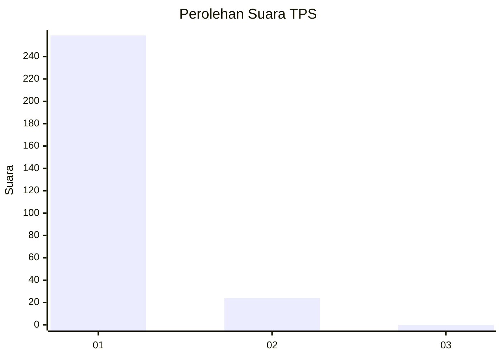
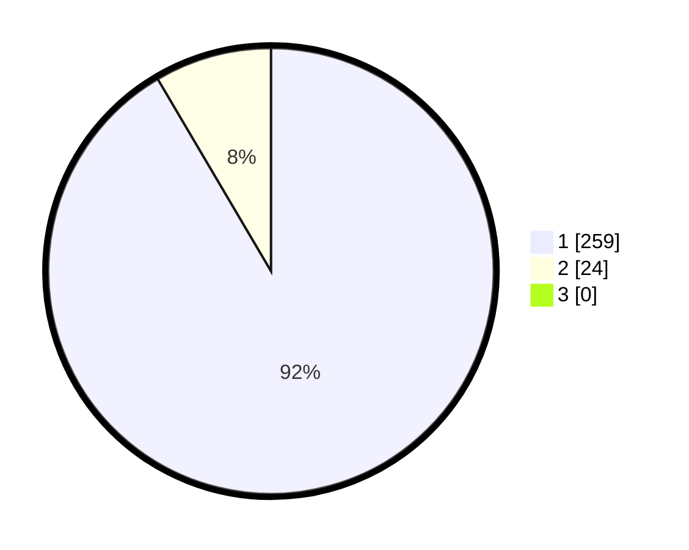

# Hasil

## Grafik

## Tabel

| No. | Nama Paslon    | Suara | Suara (raw) | Persentase |
|:--- |:-------------- | -----:| -----------:| ----------:|
| 1   | ANIES MUHAIMIN | 259   | [259][p-1]  | 91,52      |
| 2   | PRABOWO GIBRAN | 24    | [24][p-2]   | 8,48       |
| 3   | GANJAR MAHFUD  | 0     | [0][p-3]    | 0,00       |

[p-1]: https://github.com/gigit-pemilu/pemilu-2024-35-jawa-timur/blob/main/pilpres/hitung-suara/sub/35-jawa-timur/sub/28-pamekasan/sub/05-proppo/sub/2026-tattangoh/sub/004-tps/sub/paslon-1.txt
[p-2]: https://github.com/gigit-pemilu/pemilu-2024-35-jawa-timur/blob/main/pilpres/hitung-suara/sub/35-jawa-timur/sub/28-pamekasan/sub/05-proppo/sub/2026-tattangoh/sub/004-tps/sub/paslon-2.txt
[p-3]: https://github.com/gigit-pemilu/pemilu-2024-35-jawa-timur/blob/main/pilpres/hitung-suara/sub/35-jawa-timur/sub/28-pamekasan/sub/05-proppo/sub/2026-tattangoh/sub/004-tps/sub/paslon-3.txt

## Foto C Plano

https://sirekap-obj-formc.kpu.go.id/f272/pemilu/ppwp/35/28/05/20/26/3528052026004-20240215-114116--f7183908-4812-4664-94d7-b2cf624657a2.jpg

https://sirekap-obj-formc.kpu.go.id/f272/pemilu/ppwp/35/28/05/20/26/3528052026004-20240214-221247--2d6c729a-1f20-4d4b-964c-350b457e6fc2.jpg

https://sirekap-obj-formc.kpu.go.id/f272/pemilu/ppwp/35/28/05/20/26/3528052026004-20240215-114202--97265ea1-4844-4210-ad3a-2ed66734150c.jpg

## Metadata

| Key        | Value               |
| ---------- | ------------------- |
| Time Stamp | 2024-02-17 14:45:18 |

