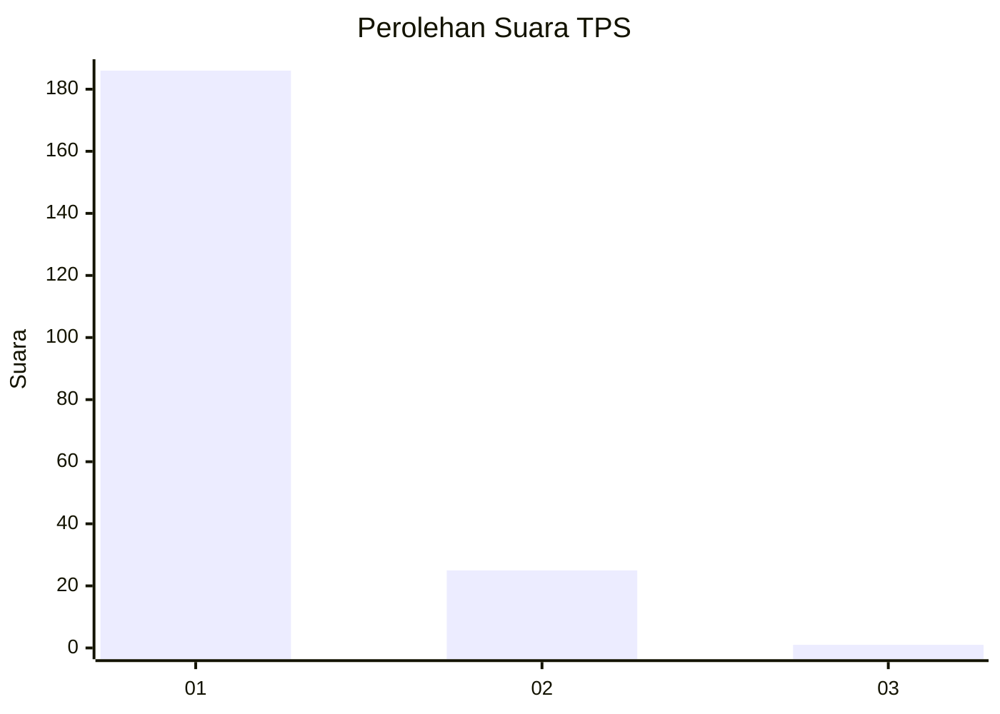
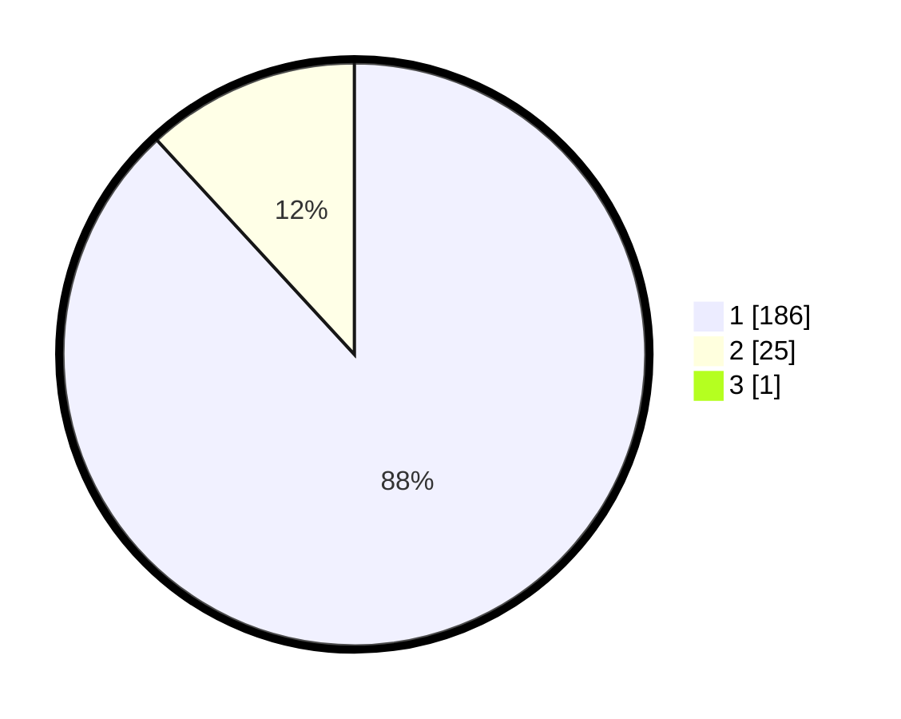

# Hasil

## Grafik

## Tabel

| No. | Nama Paslon    | Suara | Suara (raw) | Persentase |
|:--- |:-------------- | -----:| -----------:| ----------:|
| 1   | ANIES MUHAIMIN | 186   | [186][p-1]  | 87,74      |
| 2   | PRABOWO GIBRAN | 25    | [25][p-2]   | 11,79      |
| 3   | GANJAR MAHFUD  | 1     | [1][p-3]    | 0,47       |

[p-1]: https://github.com/gigit-pemilu/pemilu-2024-35-jawa-timur/blob/main/pilpres/hitung-suara/sub/35-jawa-timur/sub/28-pamekasan/sub/05-proppo/sub/2026-tattangoh/sub/006-tps/sub/paslon-1.txt
[p-2]: https://github.com/gigit-pemilu/pemilu-2024-35-jawa-timur/blob/main/pilpres/hitung-suara/sub/35-jawa-timur/sub/28-pamekasan/sub/05-proppo/sub/2026-tattangoh/sub/006-tps/sub/paslon-2.txt
[p-3]: https://github.com/gigit-pemilu/pemilu-2024-35-jawa-timur/blob/main/pilpres/hitung-suara/sub/35-jawa-timur/sub/28-pamekasan/sub/05-proppo/sub/2026-tattangoh/sub/006-tps/sub/paslon-3.txt

## Foto C Plano

https://sirekap-obj-formc.kpu.go.id/7ab9/pemilu/ppwp/35/28/05/20/26/3528052026006-20240214-210005--c4aeaa8f-b404-47e1-9ad3-50cdb33da511.jpg

https://sirekap-obj-formc.kpu.go.id/7ab9/pemilu/ppwp/35/28/05/20/26/3528052026006-20240214-210901--29f23e9d-0fbc-4429-b02e-f0edc6f8a96d.jpg

https://sirekap-obj-formc.kpu.go.id/7ab9/pemilu/ppwp/35/28/05/20/26/3528052026006-20240214-211034--e359e6ab-a26c-4e6e-b72e-e4fa1d5c8e9d.jpg

## Metadata

| Key        | Value               |
| ---------- | ------------------- |
| Time Stamp | 2024-02-24 22:31:28 |

