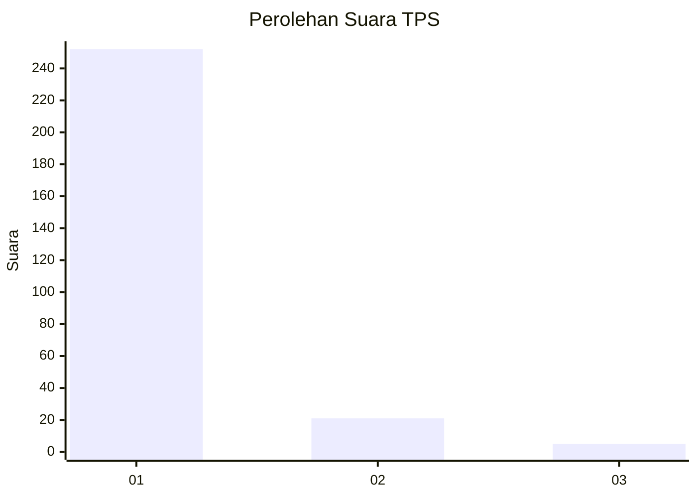
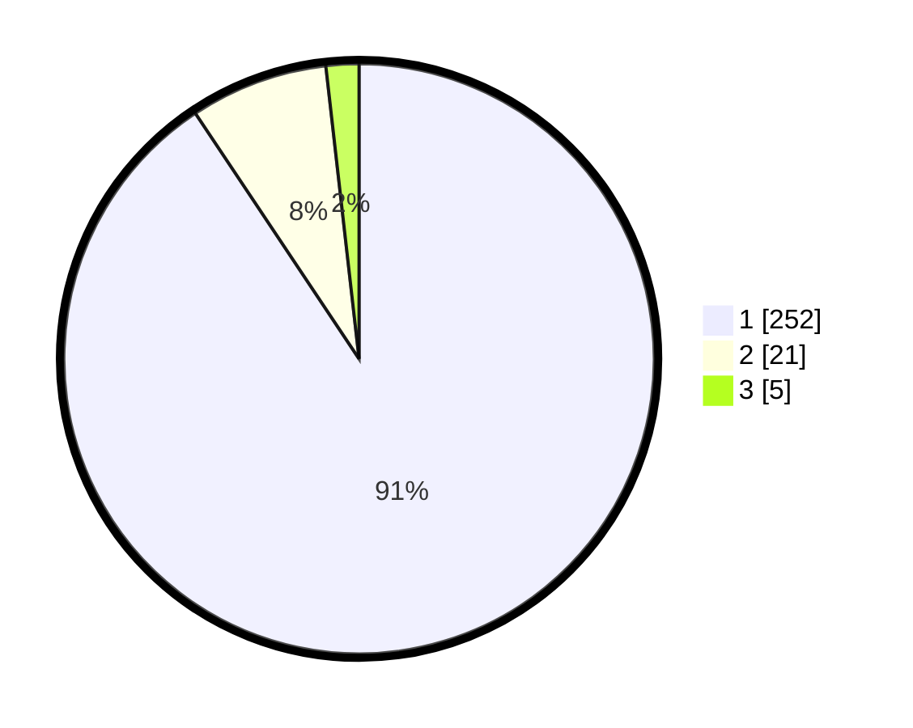

# Hasil

## Grafik

## Tabel

| No. | Nama Paslon    | Suara | Suara (raw) | Persentase |
|:--- |:-------------- | -----:| -----------:| ----------:|
| 1   | ANIES MUHAIMIN | 252   | [252][p-1]  | 90,65      |
| 2   | PRABOWO GIBRAN | 21    | [21][p-2]   | 7,55       |
| 3   | GANJAR MAHFUD  | 5     | [5][p-3]    | 1,80       |

[p-1]: https://github.com/gigit-pemilu/pemilu-2024/blob/main/pilpres/hitung-suara/sub/35-jawa-timur/sub/28-pamekasan/sub/06-palengaan/sub/2001-banyupelle/sub/005-tps/sub/paslon-1.txt
[p-2]: https://github.com/gigit-pemilu/pemilu-2024/blob/main/pilpres/hitung-suara/sub/35-jawa-timur/sub/28-pamekasan/sub/06-palengaan/sub/2001-banyupelle/sub/005-tps/sub/paslon-2.txt
[p-3]: https://github.com/gigit-pemilu/pemilu-2024/blob/main/pilpres/hitung-suara/sub/35-jawa-timur/sub/28-pamekasan/sub/06-palengaan/sub/2001-banyupelle/sub/005-tps/sub/paslon-3.txt

## Foto C Plano

https://sirekap-obj-formc.kpu.go.id/7623/pemilu/ppwp/35/28/06/20/01/3528062001005-20240214-230814--573a262c-7d0a-4448-9be7-b692767ea807.jpg

https://sirekap-obj-formc.kpu.go.id/7623/pemilu/ppwp/35/28/06/20/01/3528062001005-20240214-230851--17318730-0617-4a98-8d8b-ef6df54f2137.jpg

https://sirekap-obj-formc.kpu.go.id/7623/pemilu/ppwp/35/28/06/20/01/3528062001005-20240214-230931--3239f6a8-00eb-4ae3-996b-396688150ca7.jpg

## Metadata

| Key        | Value               |
| ---------- | ------------------- |
| Time Stamp | 2024-02-19 09:00:00 |

