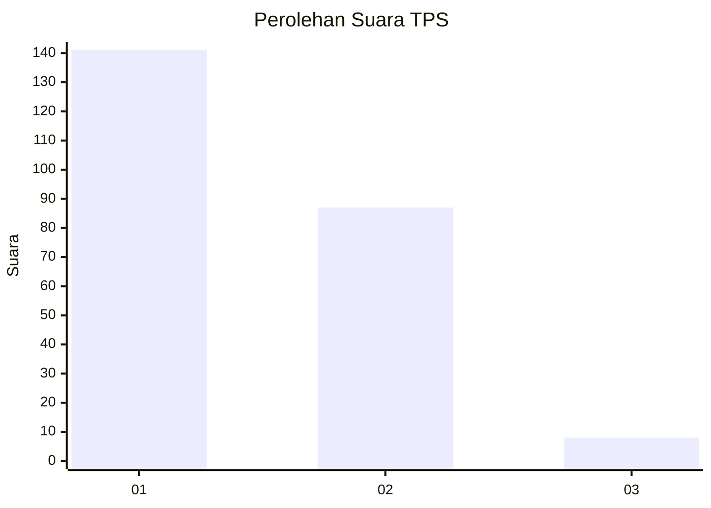
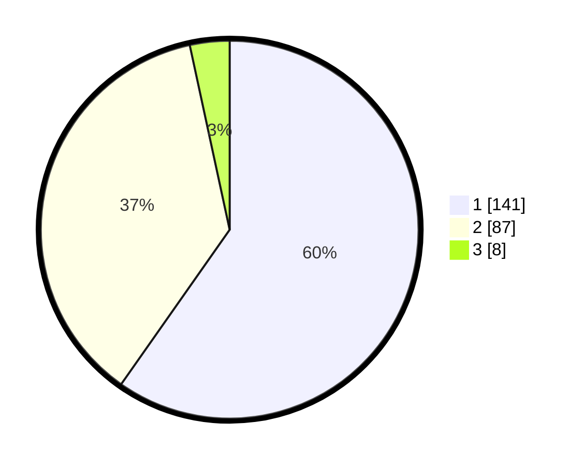

# Hasil

## Grafik

## Tabel

| No. | Nama Paslon    | Suara | Suara (raw) | Persentase |
|:--- |:-------------- | -----:| -----------:| ----------:|
| 1   | ANIES MUHAIMIN | 141   | [141][p-1]  | 59,75      |
| 2   | PRABOWO GIBRAN | 87    | [87][p-2]   | 36,86      |
| 3   | GANJAR MAHFUD  | 8     | [8][p-3]    | 3,39       |

[p-1]: https://github.com/gigit-pemilu/pemilu-2024/blob/main/pilpres/hitung-suara/sub/35-jawa-timur/sub/28-pamekasan/sub/06-palengaan/sub/2001-banyupelle/sub/010-tps/sub/paslon-1.txt
[p-2]: https://github.com/gigit-pemilu/pemilu-2024/blob/main/pilpres/hitung-suara/sub/35-jawa-timur/sub/28-pamekasan/sub/06-palengaan/sub/2001-banyupelle/sub/010-tps/sub/paslon-2.txt
[p-3]: https://github.com/gigit-pemilu/pemilu-2024/blob/main/pilpres/hitung-suara/sub/35-jawa-timur/sub/28-pamekasan/sub/06-palengaan/sub/2001-banyupelle/sub/010-tps/sub/paslon-3.txt

## Foto C Plano

https://sirekap-obj-formc.kpu.go.id/d3e2/pemilu/ppwp/35/28/06/20/01/3528062001010-20240214-195319--29b1b2a1-50e2-4ba5-8a37-f33609f1313b.jpg

https://sirekap-obj-formc.kpu.go.id/d3e2/pemilu/ppwp/35/28/06/20/01/3528062001010-20240214-195504--97bab462-ca0c-4eda-bb72-7d6dc325aa6b.jpg

## Metadata

| Key        | Value               |
| ---------- | ------------------- |
| Time Stamp | 2024-02-25 21:00:00 |

