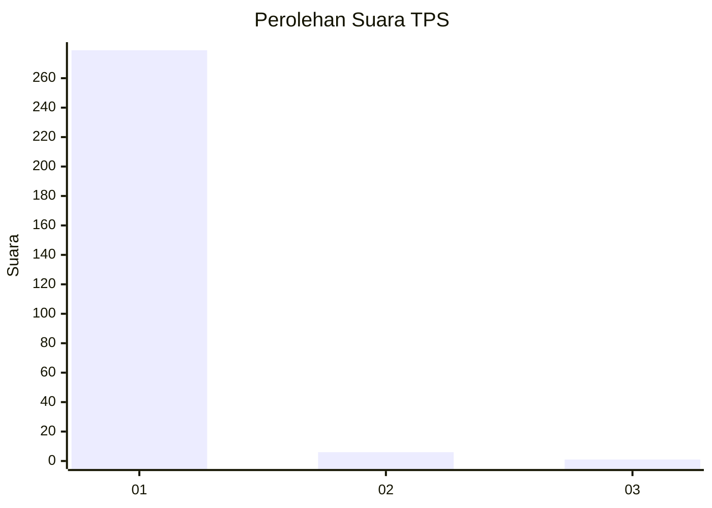
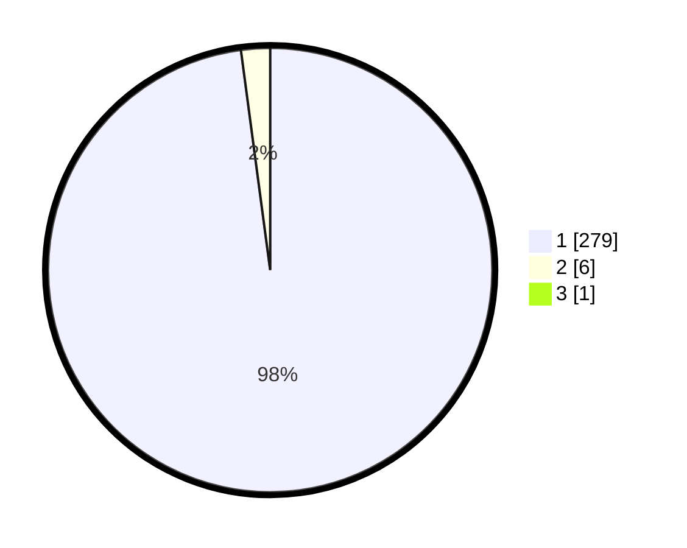

# Hasil

## Grafik

## Tabel

| No. | Nama Paslon    | Suara | Suara (raw) | Persentase |
|:--- |:-------------- | -----:| -----------:| ----------:|
| 1   | ANIES MUHAIMIN | 279   | [279][p-1]  | 97,55      |
| 2   | PRABOWO GIBRAN | 6     | [6][p-2]    | 2,10       |
| 3   | GANJAR MAHFUD  | 1     | [1][p-3]    | 0,35       |

[p-1]: https://github.com/gigit-pemilu/pemilu-2024-35-jawa-timur/blob/main/pilpres/hitung-suara/sub/35-jawa-timur/sub/28-pamekasan/sub/06-palengaan/sub/2002-rek-kerrek/sub/004-tps/sub/paslon-1.txt
[p-2]: https://github.com/gigit-pemilu/pemilu-2024-35-jawa-timur/blob/main/pilpres/hitung-suara/sub/35-jawa-timur/sub/28-pamekasan/sub/06-palengaan/sub/2002-rek-kerrek/sub/004-tps/sub/paslon-2.txt
[p-3]: https://github.com/gigit-pemilu/pemilu-2024-35-jawa-timur/blob/main/pilpres/hitung-suara/sub/35-jawa-timur/sub/28-pamekasan/sub/06-palengaan/sub/2002-rek-kerrek/sub/004-tps/sub/paslon-3.txt

## Foto C Plano

https://sirekap-obj-formc.kpu.go.id/521d/pemilu/ppwp/35/28/06/20/02/3528062002004-20240215-080749--0aafbe7a-086b-4d24-b36b-c881e29a3e63.jpg

https://sirekap-obj-formc.kpu.go.id/521d/pemilu/ppwp/35/28/06/20/02/3528062002004-20240215-081125--a235c273-2bd9-4cff-97ba-cfbafdd23dc1.jpg

https://sirekap-obj-formc.kpu.go.id/521d/pemilu/ppwp/35/28/06/20/02/3528062002004-20240215-081448--d4b94f90-7867-4e53-93e8-d43d0b8d2b73.jpg

## Metadata

| Key        | Value               |
| ---------- | ------------------- |
| Time Stamp | 2024-02-17 16:00:02 |

