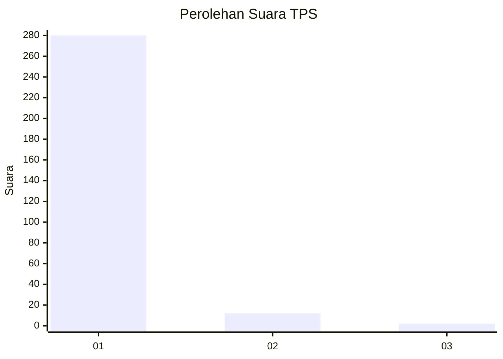
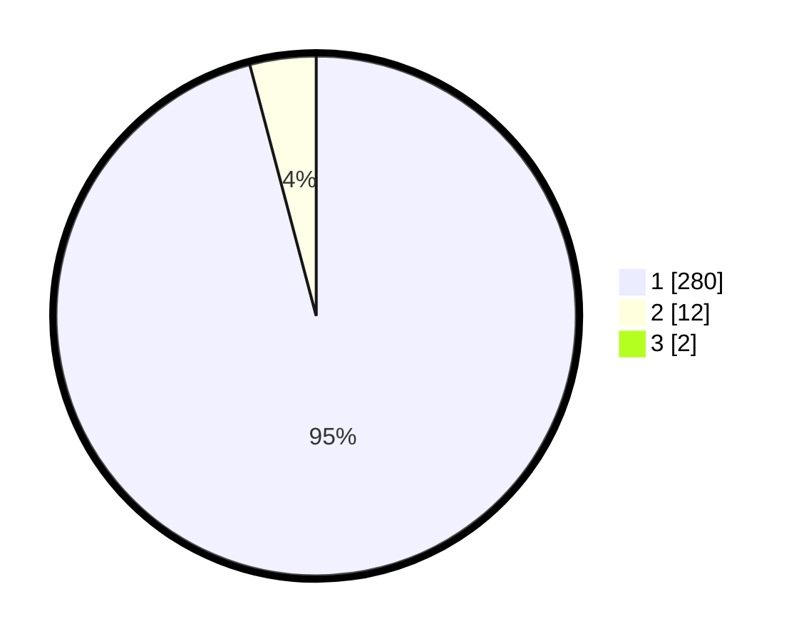

# Hasil

## Grafik

## Tabel

| No. | Nama Paslon    | Suara | Suara (raw) | Persentase |
|:--- |:-------------- | -----:| -----------:| ----------:|
| 1   | ANIES MUHAIMIN | 280   | [280][p-1]  | 95,24      |
| 2   | PRABOWO GIBRAN | 12    | [12][p-2]   | 4,08       |
| 3   | GANJAR MAHFUD  | 2     | [2][p-3]    | 0,68       |

[p-1]: https://github.com/gigit-pemilu/pemilu-2024/blob/main/pilpres/hitung-suara/sub/35-jawa-timur/sub/28-pamekasan/sub/06-palengaan/sub/2002-rek-kerrek/sub/005-tps/sub/paslon-1.txt
[p-2]: https://github.com/gigit-pemilu/pemilu-2024/blob/main/pilpres/hitung-suara/sub/35-jawa-timur/sub/28-pamekasan/sub/06-palengaan/sub/2002-rek-kerrek/sub/005-tps/sub/paslon-2.txt
[p-3]: https://github.com/gigit-pemilu/pemilu-2024/blob/main/pilpres/hitung-suara/sub/35-jawa-timur/sub/28-pamekasan/sub/06-palengaan/sub/2002-rek-kerrek/sub/005-tps/sub/paslon-3.txt

## Foto C Plano

https://sirekap-obj-formc.kpu.go.id/2204/pemilu/ppwp/35/28/06/20/02/3528062002005-20240215-082249--79151cd1-a3b8-4faa-bcea-980e2649e604.jpg

https://sirekap-obj-formc.kpu.go.id/2204/pemilu/ppwp/35/28/06/20/02/3528062002005-20240215-082418--e5b6bbcd-28ad-46fb-b24c-7d0895ca47a2.jpg

https://sirekap-obj-formc.kpu.go.id/2204/pemilu/ppwp/35/28/06/20/02/3528062002005-20240215-082531--b860ed4a-69d8-4a41-bf64-3051fd3b019e.jpg

## Metadata

| Key        | Value               |
| ---------- | ------------------- |
| Time Stamp | 2024-02-15 22:00:27 |

