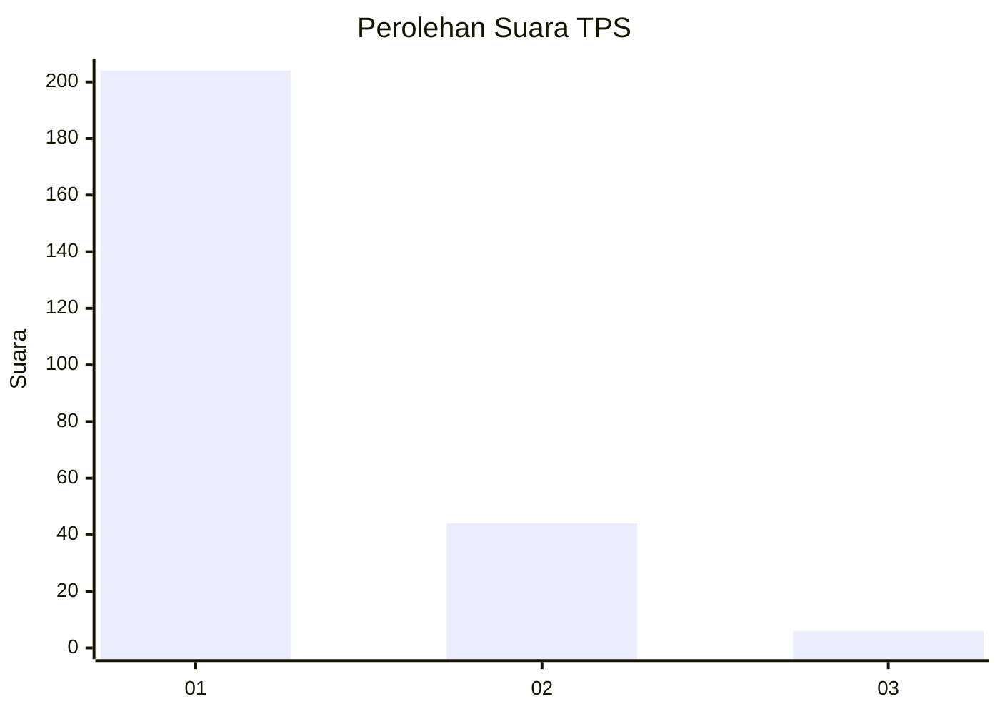
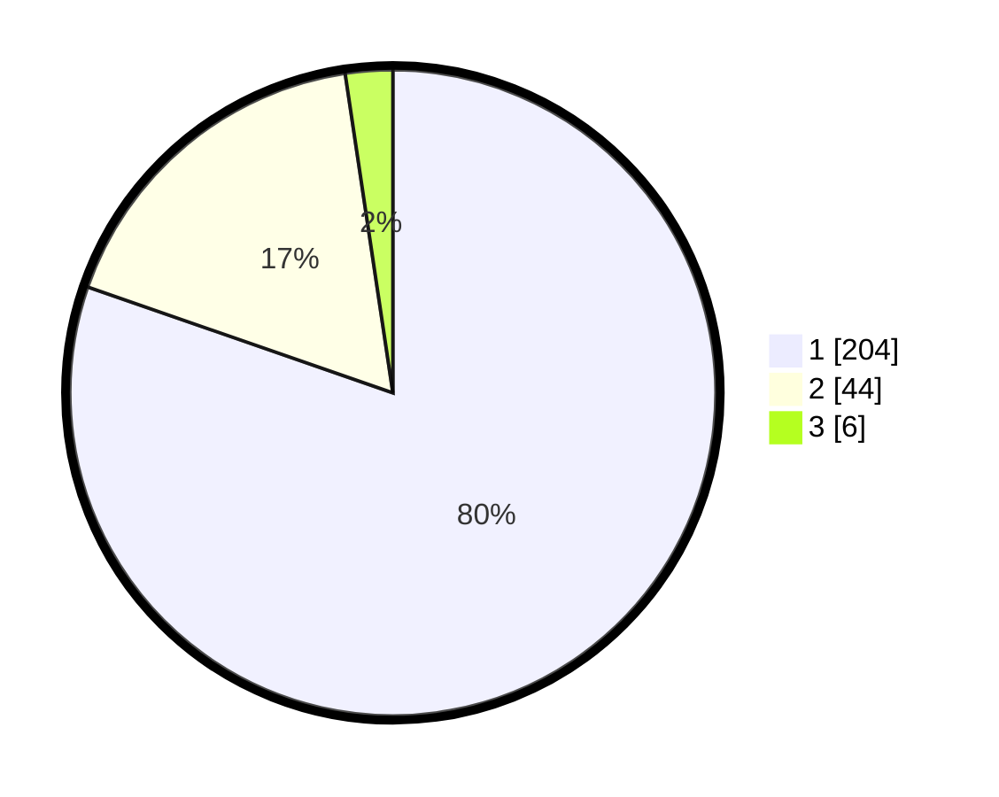

# Hasil

## Grafik

## Tabel

| No. | Nama Paslon    | Suara | Suara (raw) | Persentase |
|:--- |:-------------- | -----:| -----------:| ----------:|
| 1   | ANIES MUHAIMIN | 204   | [204][p-1]  | 80,31      |
| 2   | PRABOWO GIBRAN | 44    | [44][p-2]   | 17,32      |
| 3   | GANJAR MAHFUD  | 6     | [6][p-3]    | 2,36       |

[p-1]: https://github.com/gigit-pemilu/pemilu-2024-35-jawa-timur/blob/main/pilpres/hitung-suara/sub/35-jawa-timur/sub/28-pamekasan/sub/06-palengaan/sub/2002-rek-kerrek/sub/012-tps/sub/paslon-1.txt
[p-2]: https://github.com/gigit-pemilu/pemilu-2024-35-jawa-timur/blob/main/pilpres/hitung-suara/sub/35-jawa-timur/sub/28-pamekasan/sub/06-palengaan/sub/2002-rek-kerrek/sub/012-tps/sub/paslon-2.txt
[p-3]: https://github.com/gigit-pemilu/pemilu-2024-35-jawa-timur/blob/main/pilpres/hitung-suara/sub/35-jawa-timur/sub/28-pamekasan/sub/06-palengaan/sub/2002-rek-kerrek/sub/012-tps/sub/paslon-3.txt

## Foto C Plano

https://sirekap-obj-formc.kpu.go.id/383d/pemilu/ppwp/35/28/06/20/02/3528062002012-20240214-224319--7d5cc960-34c9-4ae5-889a-8e579659b9c4.jpg

https://sirekap-obj-formc.kpu.go.id/383d/pemilu/ppwp/35/28/06/20/02/3528062002012-20240214-224423--431c4c13-1729-4d9c-a02d-4755dd9a71bb.jpg

https://sirekap-obj-formc.kpu.go.id/383d/pemilu/ppwp/35/28/06/20/02/3528062002012-20240214-224607--1d7abbae-d4ba-407c-81da-90a82ed1e3db.jpg

## Metadata

| Key        | Value               |
| ---------- | ------------------- |
| Time Stamp | 2024-02-24 22:31:28 |

