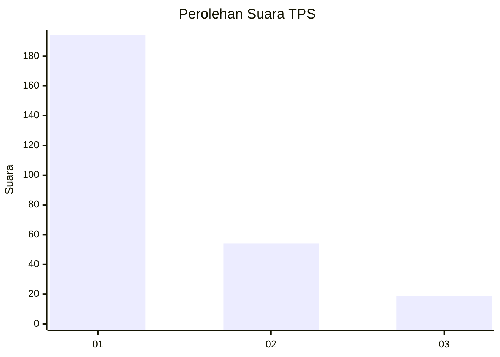
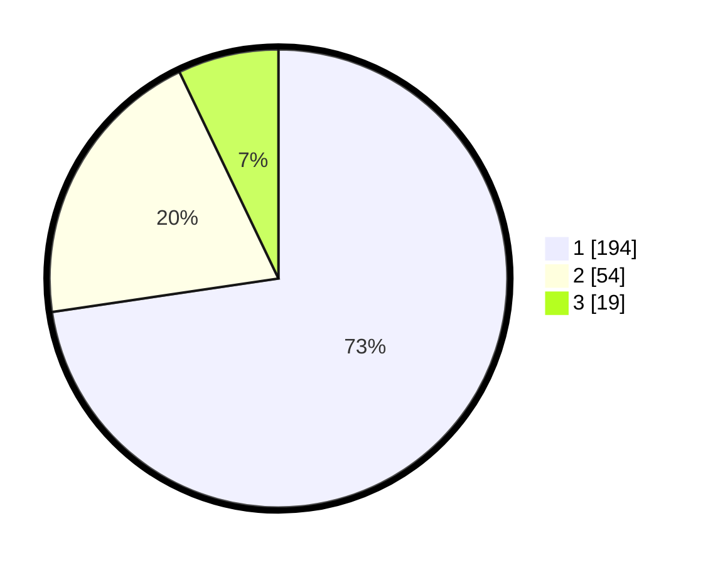

# Hasil

## Grafik

## Tabel

| No. | Nama Paslon    | Suara | Suara (raw) | Persentase |
|:--- |:-------------- | -----:| -----------:| ----------:|
| 1   | ANIES MUHAIMIN | 194   | [194][p-1]  | 72,66      |
| 2   | PRABOWO GIBRAN | 54    | [54][p-2]   | 20,22      |
| 3   | GANJAR MAHFUD  | 19    | [19][p-3]   | 7,12       |

[p-1]: https://github.com/gigit-pemilu/pemilu-2024/blob/main/pilpres/hitung-suara/sub/35-jawa-timur/sub/28-pamekasan/sub/06-palengaan/sub/2002-rek-kerrek/sub/013-tps/sub/paslon-1.txt
[p-2]: https://github.com/gigit-pemilu/pemilu-2024/blob/main/pilpres/hitung-suara/sub/35-jawa-timur/sub/28-pamekasan/sub/06-palengaan/sub/2002-rek-kerrek/sub/013-tps/sub/paslon-2.txt
[p-3]: https://github.com/gigit-pemilu/pemilu-2024/blob/main/pilpres/hitung-suara/sub/35-jawa-timur/sub/28-pamekasan/sub/06-palengaan/sub/2002-rek-kerrek/sub/013-tps/sub/paslon-3.txt

## Foto C Plano

https://sirekap-obj-formc.kpu.go.id/0e1d/pemilu/ppwp/35/28/06/20/02/3528062002013-20240215-092457--e8b4e02c-f003-4bd3-b4f2-4cb347eda1bd.jpg

https://sirekap-obj-formc.kpu.go.id/0e1d/pemilu/ppwp/35/28/06/20/02/3528062002013-20240215-092726--66e86485-bd18-4147-a305-ee1b8d8e3ebe.jpg

## Metadata

| Key        | Value               |
| ---------- | ------------------- |
| Time Stamp | 2024-02-25 11:00:00 |

