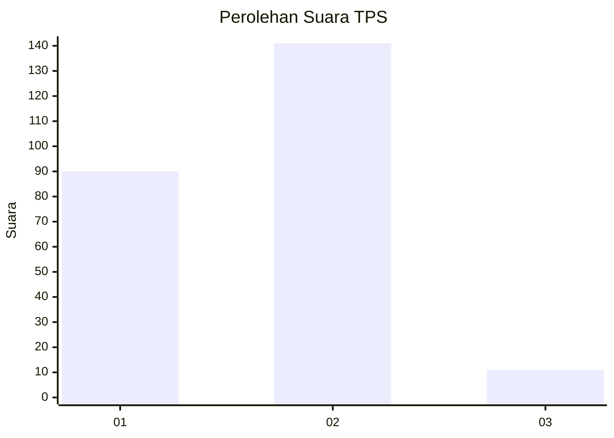
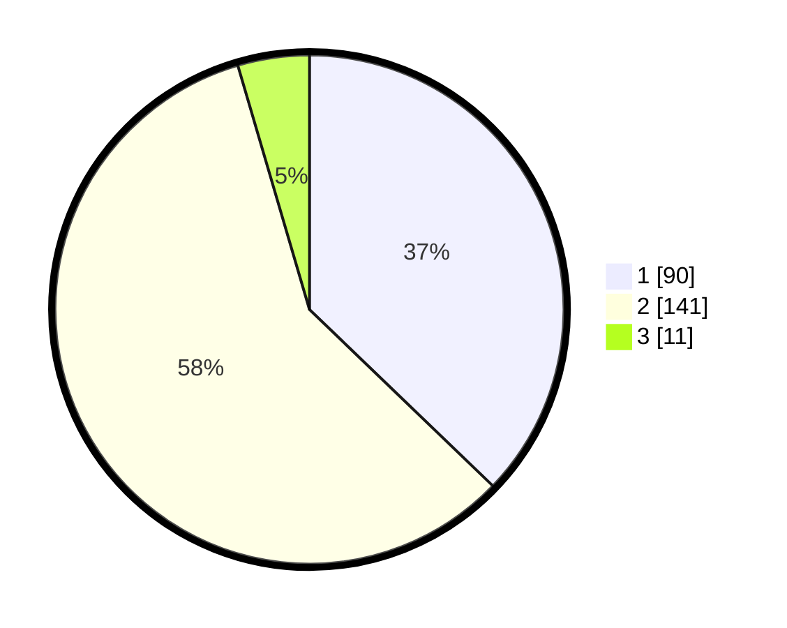

# Hasil

## Grafik

## Tabel

| No. | Nama Paslon    | Suara | Suara (raw) | Persentase |
|:--- |:-------------- | -----:| -----------:| ----------:|
| 1   | ANIES MUHAIMIN | 90    | [90][p-1]   | 37,19      |
| 2   | PRABOWO GIBRAN | 141   | [141][p-2]  | 58,26      |
| 3   | GANJAR MAHFUD  | 11    | [11][p-3]   | 4,55       |

[p-1]: https://github.com/gigit-pemilu/pemilu-2024-35-jawa-timur/blob/main/pilpres/hitung-suara/sub/35-jawa-timur/sub/28-pamekasan/sub/06-palengaan/sub/2002-rek-kerrek/sub/019-tps/sub/paslon-1.txt
[p-2]: https://github.com/gigit-pemilu/pemilu-2024-35-jawa-timur/blob/main/pilpres/hitung-suara/sub/35-jawa-timur/sub/28-pamekasan/sub/06-palengaan/sub/2002-rek-kerrek/sub/019-tps/sub/paslon-2.txt
[p-3]: https://github.com/gigit-pemilu/pemilu-2024-35-jawa-timur/blob/main/pilpres/hitung-suara/sub/35-jawa-timur/sub/28-pamekasan/sub/06-palengaan/sub/2002-rek-kerrek/sub/019-tps/sub/paslon-3.txt

## Foto C Plano

https://sirekap-obj-formc.kpu.go.id/ae45/pemilu/ppwp/35/28/06/20/02/3528062002019-20240215-124745--67537a53-7acd-4aed-8bb8-b4ad3e6de035.jpg

https://sirekap-obj-formc.kpu.go.id/ae45/pemilu/ppwp/35/28/06/20/02/3528062002019-20240215-160133--bc3300c2-e4bc-4002-b4ce-e9ffbf5f748a.jpg

https://sirekap-obj-formc.kpu.go.id/ae45/pemilu/ppwp/35/28/06/20/02/3528062002019-20240215-153809--0347efd7-8fa3-4032-8460-e40f1457ec5a.jpg

## Metadata

| Key        | Value               |
| ---------- | ------------------- |
| Time Stamp | 2024-02-24 22:31:28 |

