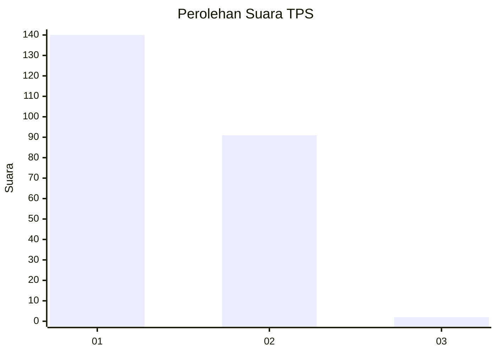
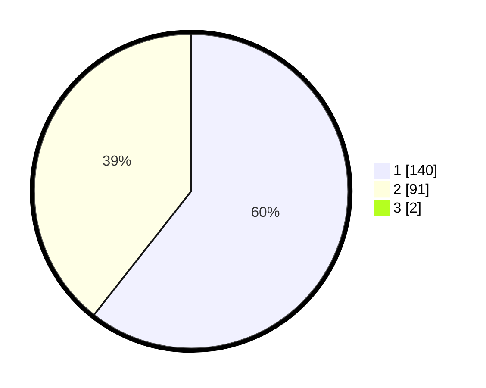

# Hasil

## Grafik

## Tabel

| No. | Nama Paslon    | Suara | Suara (raw) | Persentase |
|:--- |:-------------- | -----:| -----------:| ----------:|
| 1   | ANIES MUHAIMIN | 140   | [140][p-1]  | 60,09      |
| 2   | PRABOWO GIBRAN | 91    | [91][p-2]   | 39,06      |
| 3   | GANJAR MAHFUD  | 2     | [2][p-3]    | 0,86       |

[p-1]: https://github.com/gigit-pemilu/pemilu-2024/blob/main/pilpres/hitung-suara/sub/35-jawa-timur/sub/28-pamekasan/sub/06-palengaan/sub/2002-rek-kerrek/sub/031-tps/sub/paslon-1.txt
[p-2]: https://github.com/gigit-pemilu/pemilu-2024/blob/main/pilpres/hitung-suara/sub/35-jawa-timur/sub/28-pamekasan/sub/06-palengaan/sub/2002-rek-kerrek/sub/031-tps/sub/paslon-2.txt
[p-3]: https://github.com/gigit-pemilu/pemilu-2024/blob/main/pilpres/hitung-suara/sub/35-jawa-timur/sub/28-pamekasan/sub/06-palengaan/sub/2002-rek-kerrek/sub/031-tps/sub/paslon-3.txt

## Foto C Plano

https://sirekap-obj-formc.kpu.go.id/5135/pemilu/ppwp/35/28/06/20/02/3528062002031-20240214-221814--a9c71e90-5ea2-4912-b736-f568d627ad90.jpg

https://sirekap-obj-formc.kpu.go.id/5135/pemilu/ppwp/35/28/06/20/02/3528062002031-20240214-221912--7adaca44-fa7b-4bd5-ab5c-6742692f1a1f.jpg

https://sirekap-obj-formc.kpu.go.id/5135/pemilu/ppwp/35/28/06/20/02/3528062002031-20240214-222158--887d6460-4dbf-421c-afd7-5dfce03b241f.jpg

## Metadata

| Key        | Value               |
| ---------- | ------------------- |
| Time Stamp | 2024-02-25 18:00:00 |

