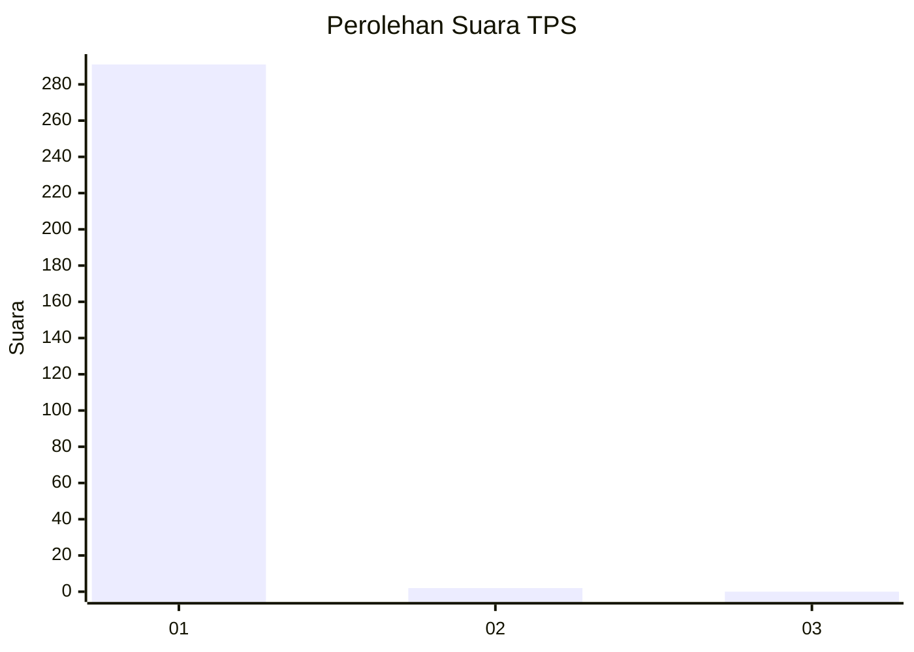
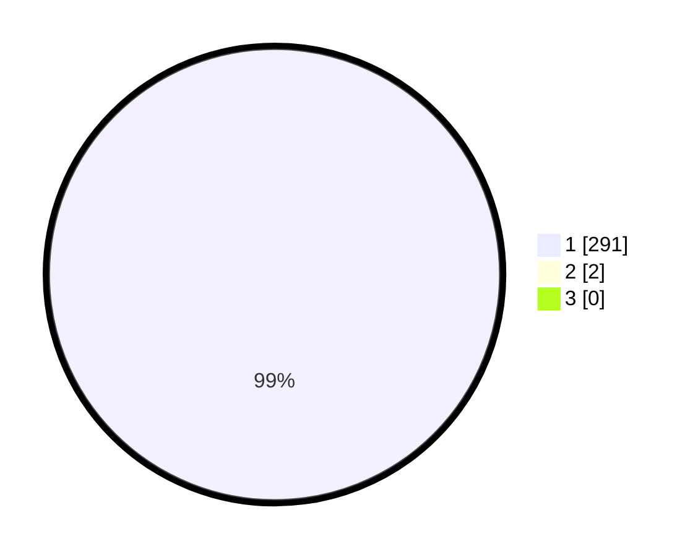

# Hasil

## Grafik

## Tabel

| No. | Nama Paslon    | Suara | Suara (raw) | Persentase |
|:--- |:-------------- | -----:| -----------:| ----------:|
| 1   | ANIES MUHAIMIN | 291   | [291][p-1]  | 99,32      |
| 2   | PRABOWO GIBRAN | 2     | [2][p-2]    | 0,68       |
| 3   | GANJAR MAHFUD  | 0     | [0][p-3]    | 0,00       |

[p-1]: https://github.com/gigit-pemilu/pemilu-2024/blob/main/pilpres/hitung-suara/sub/35-jawa-timur/sub/28-pamekasan/sub/06-palengaan/sub/2003-angsanah/sub/001-tps/sub/paslon-1.txt
[p-2]: https://github.com/gigit-pemilu/pemilu-2024/blob/main/pilpres/hitung-suara/sub/35-jawa-timur/sub/28-pamekasan/sub/06-palengaan/sub/2003-angsanah/sub/001-tps/sub/paslon-2.txt
[p-3]: https://github.com/gigit-pemilu/pemilu-2024/blob/main/pilpres/hitung-suara/sub/35-jawa-timur/sub/28-pamekasan/sub/06-palengaan/sub/2003-angsanah/sub/001-tps/sub/paslon-3.txt

## Foto C Plano

https://sirekap-obj-formc.kpu.go.id/72fd/pemilu/ppwp/35/28/06/20/03/3528062003001-20240214-230654--d6f6c51a-8401-43a8-b325-7c3590fa3694.jpg

https://sirekap-obj-formc.kpu.go.id/72fd/pemilu/ppwp/35/28/06/20/03/3528062003001-20240214-230928--c07cae8d-f07d-4679-86e2-b2a130d6d54f.jpg

https://sirekap-obj-formc.kpu.go.id/72fd/pemilu/ppwp/35/28/06/20/03/3528062003001-20240214-231236--549a5c2b-b6f4-4287-941e-35102c941e64.jpg

## Metadata

| Key        | Value               |
| ---------- | ------------------- |
| Time Stamp | 2024-02-17 11:00:02 |

