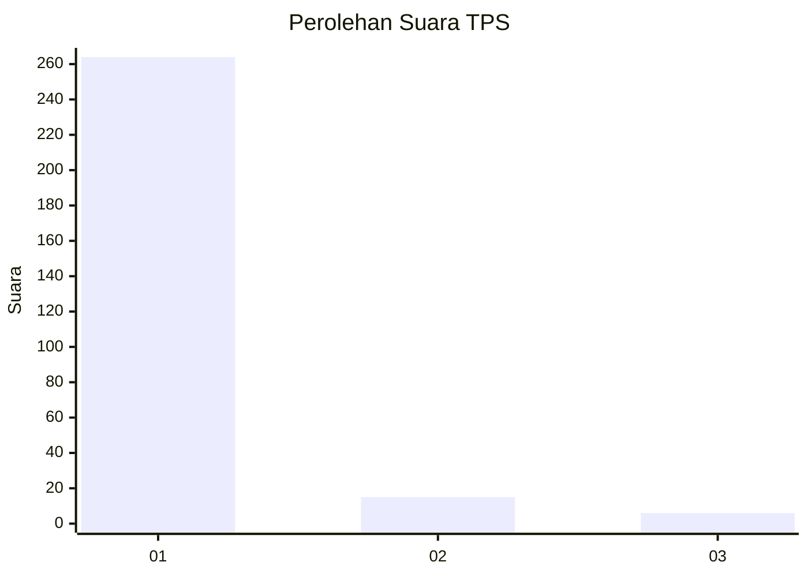
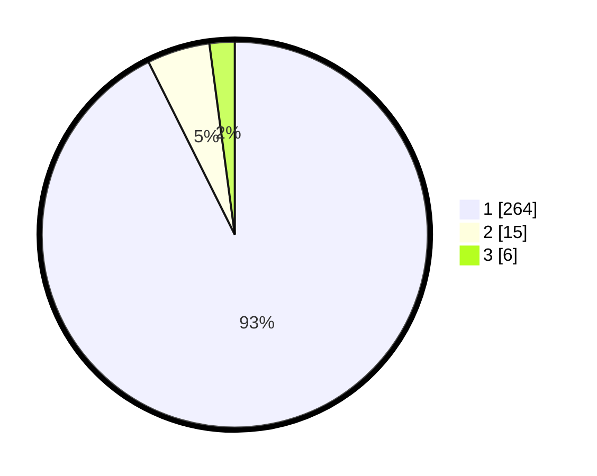

# Hasil

## Grafik

## Tabel

| No. | Nama Paslon    | Suara | Suara (raw) | Persentase |
|:--- |:-------------- | -----:| -----------:| ----------:|
| 1   | ANIES MUHAIMIN | 264   | [264][p-1]  | 92,63      |
| 2   | PRABOWO GIBRAN | 15    | [15][p-2]   | 5,26       |
| 3   | GANJAR MAHFUD  | 6     | [6][p-3]    | 2,11       |

[p-1]: https://github.com/gigit-pemilu/pemilu-2024-35-jawa-timur/blob/main/pilpres/hitung-suara/sub/35-jawa-timur/sub/28-pamekasan/sub/06-palengaan/sub/2003-angsanah/sub/002-tps/sub/paslon-1.txt
[p-2]: https://github.com/gigit-pemilu/pemilu-2024-35-jawa-timur/blob/main/pilpres/hitung-suara/sub/35-jawa-timur/sub/28-pamekasan/sub/06-palengaan/sub/2003-angsanah/sub/002-tps/sub/paslon-2.txt
[p-3]: https://github.com/gigit-pemilu/pemilu-2024-35-jawa-timur/blob/main/pilpres/hitung-suara/sub/35-jawa-timur/sub/28-pamekasan/sub/06-palengaan/sub/2003-angsanah/sub/002-tps/sub/paslon-3.txt

## Foto C Plano

https://sirekap-obj-formc.kpu.go.id/31f7/pemilu/ppwp/35/28/06/20/03/3528062003002-20240214-212959--52961fc4-1eb0-4a03-9f73-1e4e561e7a74.jpg

https://sirekap-obj-formc.kpu.go.id/31f7/pemilu/ppwp/35/28/06/20/03/3528062003002-20240214-212937--d022b2e0-16f0-4177-8eac-90abfc2648a4.jpg

https://sirekap-obj-formc.kpu.go.id/31f7/pemilu/ppwp/35/28/06/20/03/3528062003002-20240214-212704--d6ce402a-379f-4642-acd9-5b35a24d874c.jpg

## Metadata

| Key        | Value               |
| ---------- | ------------------- |
| Time Stamp | 2024-02-17 16:00:02 |

