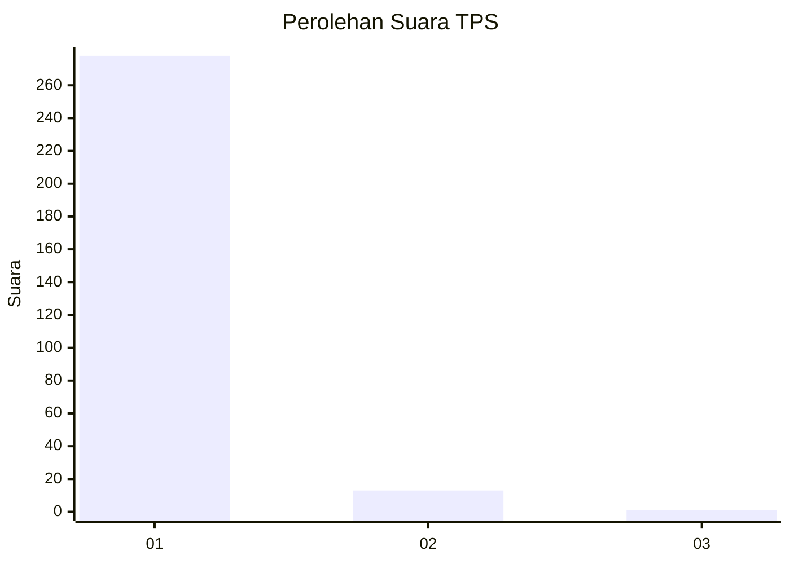
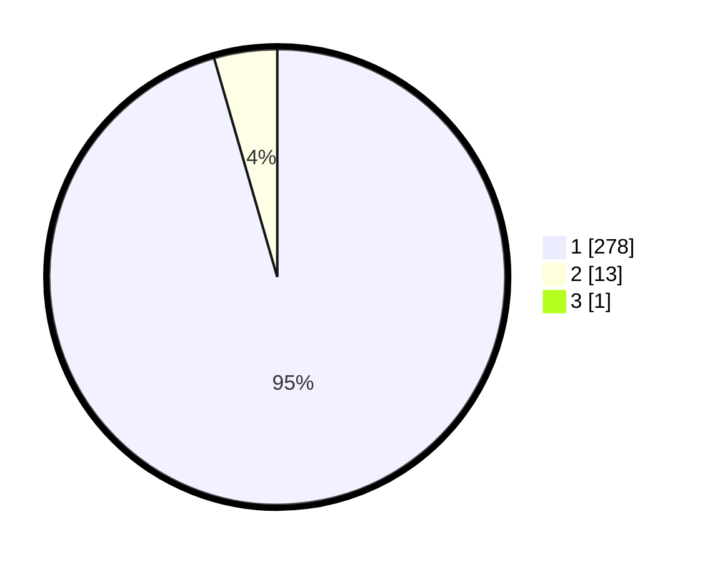

# Hasil

## Grafik

## Tabel

| No. | Nama Paslon    | Suara | Suara (raw) | Persentase |
|:--- |:-------------- | -----:| -----------:| ----------:|
| 1   | ANIES MUHAIMIN | 278   | [278][p-1]  | 95,21      |
| 2   | PRABOWO GIBRAN | 13    | [13][p-2]   | 4,45       |
| 3   | GANJAR MAHFUD  | 1     | [1][p-3]    | 0,34       |

[p-1]: https://github.com/gigit-pemilu/pemilu-2024/blob/main/pilpres/hitung-suara/sub/35-jawa-timur/sub/28-pamekasan/sub/06-palengaan/sub/2003-angsanah/sub/005-tps/sub/paslon-1.txt
[p-2]: https://github.com/gigit-pemilu/pemilu-2024/blob/main/pilpres/hitung-suara/sub/35-jawa-timur/sub/28-pamekasan/sub/06-palengaan/sub/2003-angsanah/sub/005-tps/sub/paslon-2.txt
[p-3]: https://github.com/gigit-pemilu/pemilu-2024/blob/main/pilpres/hitung-suara/sub/35-jawa-timur/sub/28-pamekasan/sub/06-palengaan/sub/2003-angsanah/sub/005-tps/sub/paslon-3.txt

## Foto C Plano

https://sirekap-obj-formc.kpu.go.id/9da0/pemilu/ppwp/35/28/06/20/03/3528062003005-20240215-055149--09cc1f4b-6381-4e8a-8f33-65dffe59ce81.jpg

https://sirekap-obj-formc.kpu.go.id/9da0/pemilu/ppwp/35/28/06/20/03/3528062003005-20240215-055250--4b2df59e-4d2a-42e7-9ddf-866695d92734.jpg

https://sirekap-obj-formc.kpu.go.id/9da0/pemilu/ppwp/35/28/06/20/03/3528062003005-20240215-055330--59760a79-cd3b-4839-aee2-6962d90998c8.jpg

## Metadata

| Key        | Value               |
| ---------- | ------------------- |
| Time Stamp | 2024-02-15 17:00:25 |

## DATA PEMILIH TETAP

Jumlah pemilih dalam DPT: **295**.
 * L: **132**.
 * P: **163**.

## DATA PENGGUNA HAK PILIH

Jumlah pengguna hak pilih dalam DPT: **295**.
 * L: **132**.
 * P: **163**.

Jumlah pengguna hak pilih dalam DPTb: **295**.
 * L: **132**.
 * P: **163**.

Jumlah pengguna hak pilih dalam DPK: **0**.
 * L: **0**.
 * P: **0**.

Jumlah pengguna hak pilih: **295**.
 * L: **132**.
 * P: **163**.

## JUMLAH SUARA SAH DAN TIDAK SAH

JUMLAH SELURUH SUARA SAH: **292**.

JUMLAH SUARA TIDAK SAH: **3**.

JUMLAH SELURUH SUARA SAH DAN SUARA TIDAK SAH: **295**.

