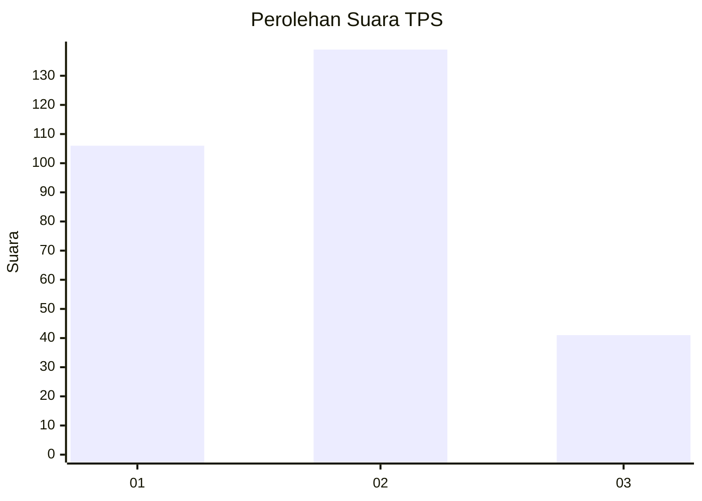
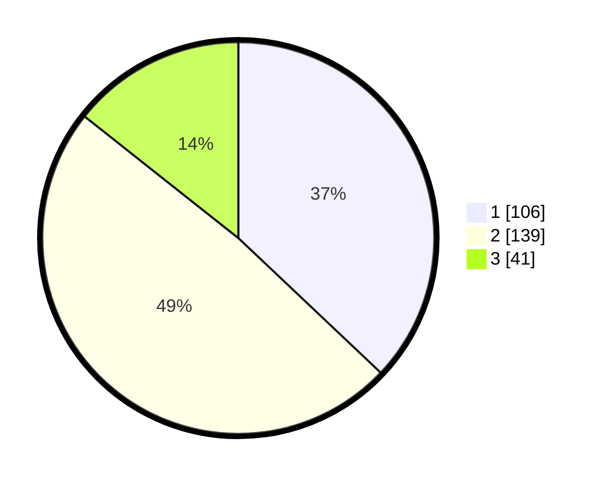

# Hasil

## Grafik

## Tabel

| No. | Nama Paslon    | Suara | Suara (raw) | Persentase |
|:--- |:-------------- | -----:| -----------:| ----------:|
| 1   | ANIES MUHAIMIN | 106   | [106][p-1]  | 37,06      |
| 2   | PRABOWO GIBRAN | 139   | [139][p-2]  | 48,60      |
| 3   | GANJAR MAHFUD  | 41    | [41][p-3]   | 14,34      |

[p-1]: https://github.com/gigit-pemilu/pemilu-2024-35-jawa-timur/blob/main/pilpres/hitung-suara/sub/35-jawa-timur/sub/28-pamekasan/sub/06-palengaan/sub/2003-angsanah/sub/008-tps/sub/paslon-1.txt
[p-2]: https://github.com/gigit-pemilu/pemilu-2024-35-jawa-timur/blob/main/pilpres/hitung-suara/sub/35-jawa-timur/sub/28-pamekasan/sub/06-palengaan/sub/2003-angsanah/sub/008-tps/sub/paslon-2.txt
[p-3]: https://github.com/gigit-pemilu/pemilu-2024-35-jawa-timur/blob/main/pilpres/hitung-suara/sub/35-jawa-timur/sub/28-pamekasan/sub/06-palengaan/sub/2003-angsanah/sub/008-tps/sub/paslon-3.txt

## Foto C Plano

https://sirekap-obj-formc.kpu.go.id/2112/pemilu/ppwp/35/28/06/20/03/3528062003008-20240215-073752--0c2e010f-0af6-442f-b34a-a04e4279f2e2.jpg

https://sirekap-obj-formc.kpu.go.id/2112/pemilu/ppwp/35/28/06/20/03/3528062003008-20240214-185922--e9149b83-781c-453e-b9a2-4b7b063d6cb8.jpg

https://sirekap-obj-formc.kpu.go.id/2112/pemilu/ppwp/35/28/06/20/03/3528062003008-20240215-074058--445517a6-33fe-4087-883d-79d7b80bce17.jpg

## Metadata

| Key        | Value               |
| ---------- | ------------------- |
| Time Stamp | 2024-02-15 19:00:26 |

