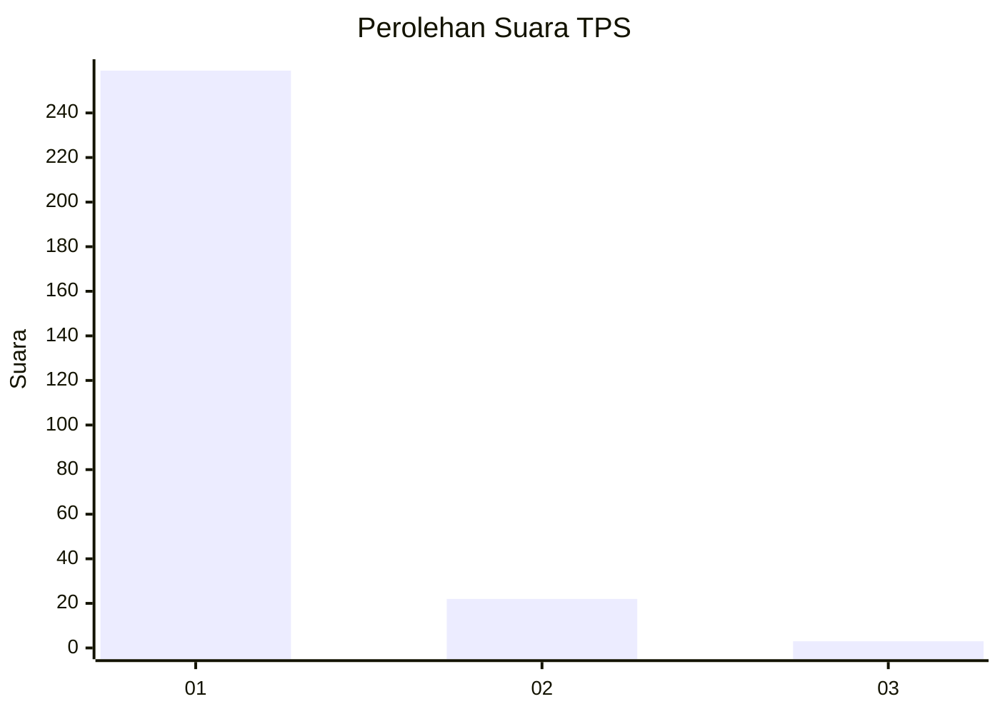
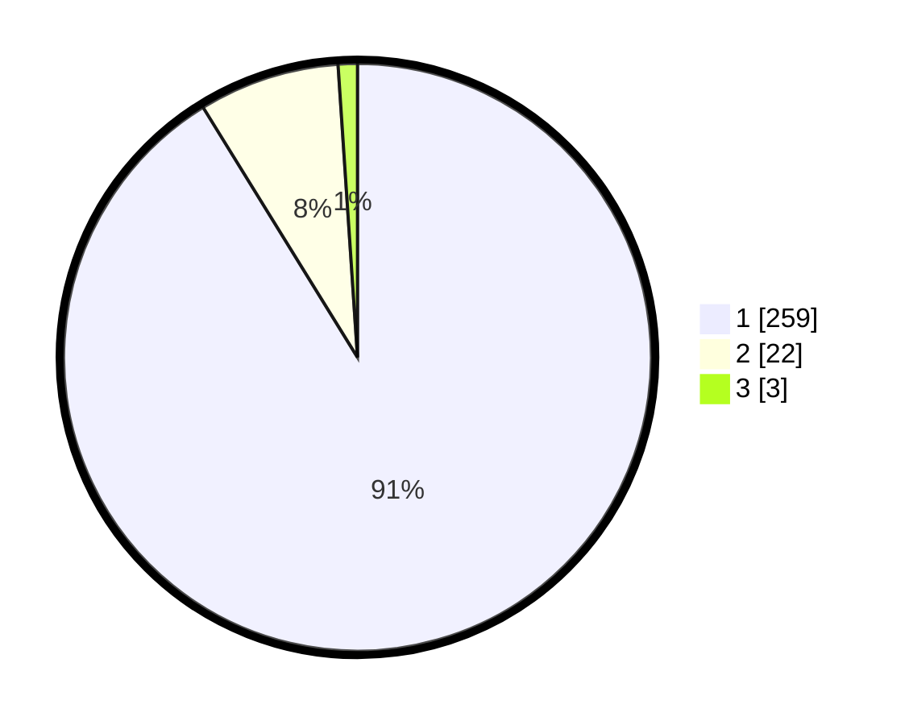

# Hasil

## Grafik

## Tabel

| No. | Nama Paslon    | Suara | Suara (raw) | Persentase |
|:--- |:-------------- | -----:| -----------:| ----------:|
| 1   | ANIES MUHAIMIN | 259   | [259][p-1]  | 91,20      |
| 2   | PRABOWO GIBRAN | 22    | [22][p-2]   | 7,75       |
| 3   | GANJAR MAHFUD  | 3     | [3][p-3]    | 1,06       |

[p-1]: https://github.com/gigit-pemilu/pemilu-2024/blob/main/pilpres/hitung-suara/sub/35-jawa-timur/sub/28-pamekasan/sub/06-palengaan/sub/2004-akkor/sub/001-tps/sub/paslon-1.txt
[p-2]: https://github.com/gigit-pemilu/pemilu-2024/blob/main/pilpres/hitung-suara/sub/35-jawa-timur/sub/28-pamekasan/sub/06-palengaan/sub/2004-akkor/sub/001-tps/sub/paslon-2.txt
[p-3]: https://github.com/gigit-pemilu/pemilu-2024/blob/main/pilpres/hitung-suara/sub/35-jawa-timur/sub/28-pamekasan/sub/06-palengaan/sub/2004-akkor/sub/001-tps/sub/paslon-3.txt

## Foto C Plano

https://sirekap-obj-formc.kpu.go.id/f774/pemilu/ppwp/35/28/06/20/04/3528062004001-20240215-014136--0f5db2da-d6b5-46ff-b32e-a45285b566ab.jpg

https://sirekap-obj-formc.kpu.go.id/f774/pemilu/ppwp/35/28/06/20/04/3528062004001-20240215-015018--003542a6-8ea4-47a8-aac1-b437e56692bb.jpg

https://sirekap-obj-formc.kpu.go.id/f774/pemilu/ppwp/35/28/06/20/04/3528062004001-20240215-015203--4522c6ea-a55f-4ecd-841b-606422a2008d.jpg

## Metadata

| Key        | Value               |
| ---------- | ------------------- |
| Time Stamp | 2024-02-17 16:00:02 |

