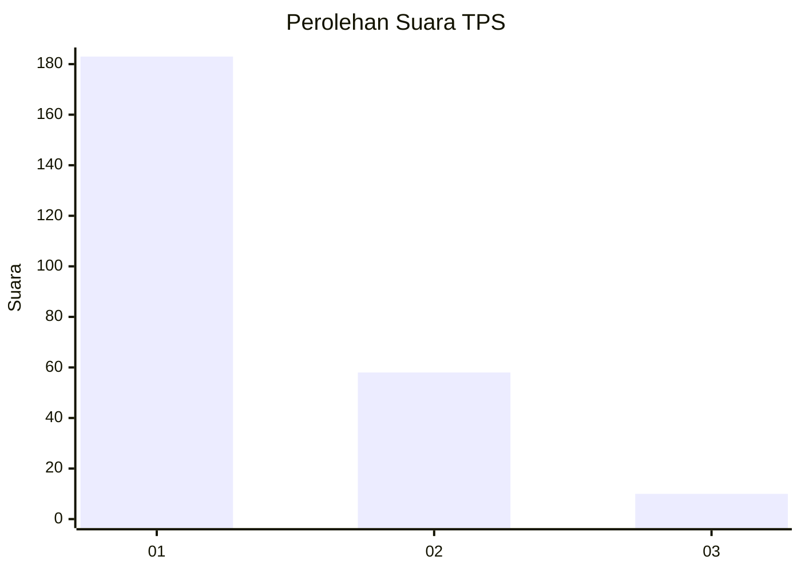
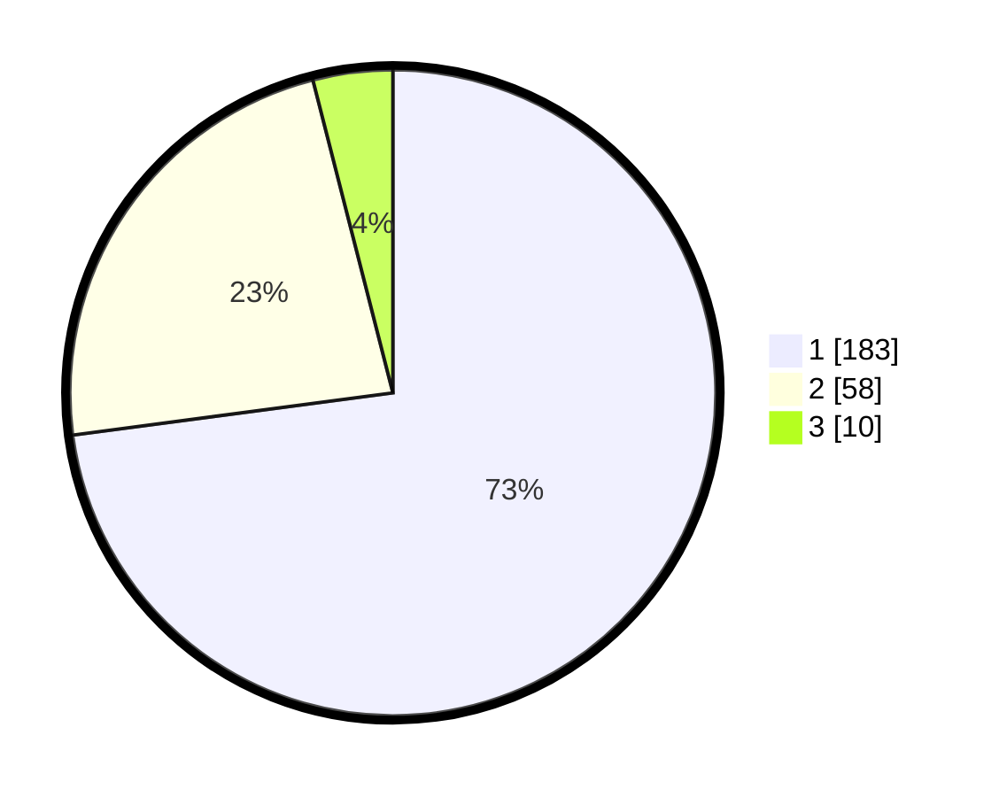

# Hasil

## Grafik

## Tabel

| No. | Nama Paslon    | Suara | Suara (raw) | Persentase |
|:--- |:-------------- | -----:| -----------:| ----------:|
| 1   | ANIES MUHAIMIN | 183   | [183][p-1]  | 72,91      |
| 2   | PRABOWO GIBRAN | 58    | [58][p-2]   | 23,11      |
| 3   | GANJAR MAHFUD  | 10    | [10][p-3]   | 3,98       |

[p-1]: https://github.com/gigit-pemilu/pemilu-2024-35-jawa-timur/blob/main/pilpres/hitung-suara/sub/35-jawa-timur/sub/28-pamekasan/sub/06-palengaan/sub/2004-akkor/sub/008-tps/sub/paslon-1.txt
[p-2]: https://github.com/gigit-pemilu/pemilu-2024-35-jawa-timur/blob/main/pilpres/hitung-suara/sub/35-jawa-timur/sub/28-pamekasan/sub/06-palengaan/sub/2004-akkor/sub/008-tps/sub/paslon-2.txt
[p-3]: https://github.com/gigit-pemilu/pemilu-2024-35-jawa-timur/blob/main/pilpres/hitung-suara/sub/35-jawa-timur/sub/28-pamekasan/sub/06-palengaan/sub/2004-akkor/sub/008-tps/sub/paslon-3.txt

## Foto C Plano

https://sirekap-obj-formc.kpu.go.id/bddf/pemilu/ppwp/35/28/06/20/04/3528062004008-20240215-065523--77b91acb-abf4-47ce-80e9-448fbdf201d3.jpg

https://sirekap-obj-formc.kpu.go.id/bddf/pemilu/ppwp/35/28/06/20/04/3528062004008-20240215-065809--63bc4449-5bfe-4e16-91d2-e7c2a82726a4.jpg

https://sirekap-obj-formc.kpu.go.id/bddf/pemilu/ppwp/35/28/06/20/04/3528062004008-20240215-065956--f2b88de0-9124-42a2-b491-630176d68357.jpg

## Metadata

| Key        | Value               |
| ---------- | ------------------- |
| Time Stamp | 2024-02-17 16:00:02 |

