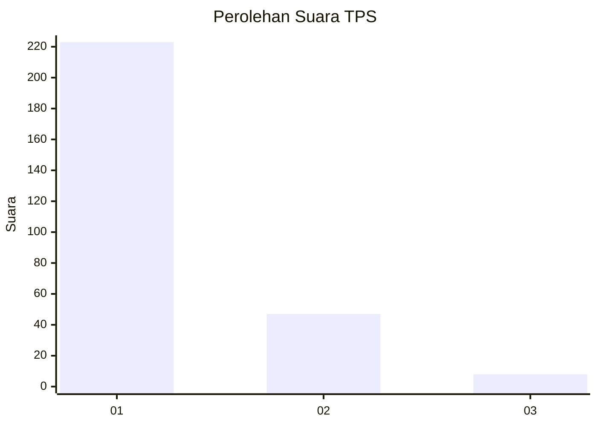
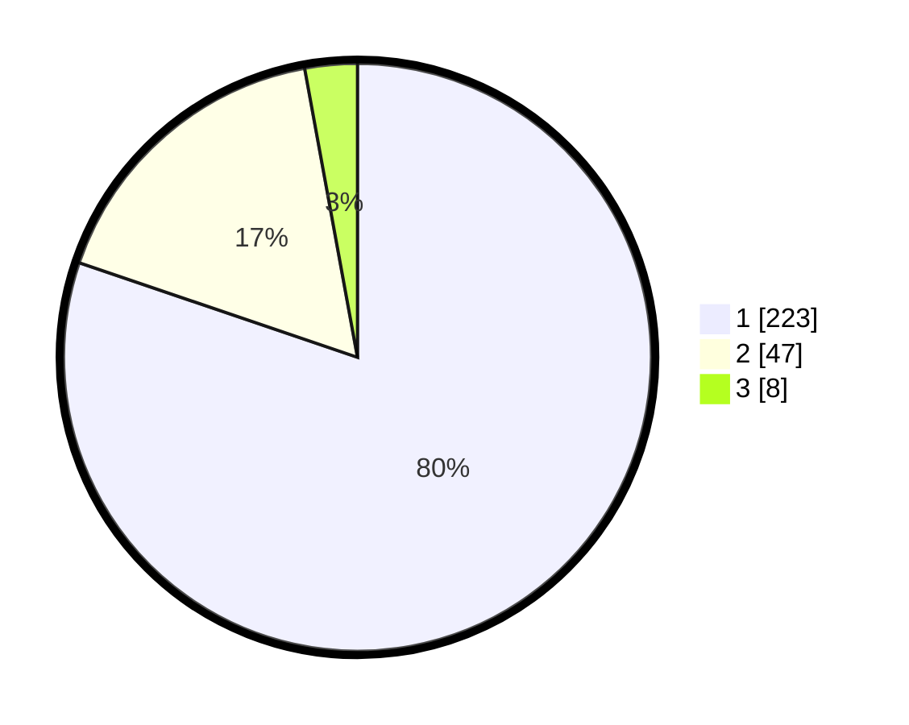

# Hasil

## Grafik

## Tabel

| No. | Nama Paslon    | Suara | Suara (raw) | Persentase |
|:--- |:-------------- | -----:| -----------:| ----------:|
| 1   | ANIES MUHAIMIN | 223   | [223][p-1]  | 80,22      |
| 2   | PRABOWO GIBRAN | 47    | [47][p-2]   | 16,91      |
| 3   | GANJAR MAHFUD  | 8     | [8][p-3]    | 2,88       |

[p-1]: https://github.com/gigit-pemilu/pemilu-2024-35-jawa-timur/blob/main/pilpres/hitung-suara/sub/35-jawa-timur/sub/28-pamekasan/sub/06-palengaan/sub/2004-akkor/sub/009-tps/sub/paslon-1.txt
[p-2]: https://github.com/gigit-pemilu/pemilu-2024-35-jawa-timur/blob/main/pilpres/hitung-suara/sub/35-jawa-timur/sub/28-pamekasan/sub/06-palengaan/sub/2004-akkor/sub/009-tps/sub/paslon-2.txt
[p-3]: https://github.com/gigit-pemilu/pemilu-2024-35-jawa-timur/blob/main/pilpres/hitung-suara/sub/35-jawa-timur/sub/28-pamekasan/sub/06-palengaan/sub/2004-akkor/sub/009-tps/sub/paslon-3.txt

## Foto C Plano

https://sirekap-obj-formc.kpu.go.id/cf86/pemilu/ppwp/35/28/06/20/04/3528062004009-20240215-081211--bcdbed54-e47e-48ac-b419-900d3f5b0946.jpg

https://sirekap-obj-formc.kpu.go.id/cf86/pemilu/ppwp/35/28/06/20/04/3528062004009-20240215-081420--e3e77244-2312-4108-b59a-d5d6589bc99b.jpg

https://sirekap-obj-formc.kpu.go.id/cf86/pemilu/ppwp/35/28/06/20/04/3528062004009-20240215-081654--32e89708-53af-41e9-ac01-9bf7b74b48b7.jpg

## Metadata

| Key        | Value               |
| ---------- | ------------------- |
| Time Stamp | 2024-02-17 16:00:02 |

