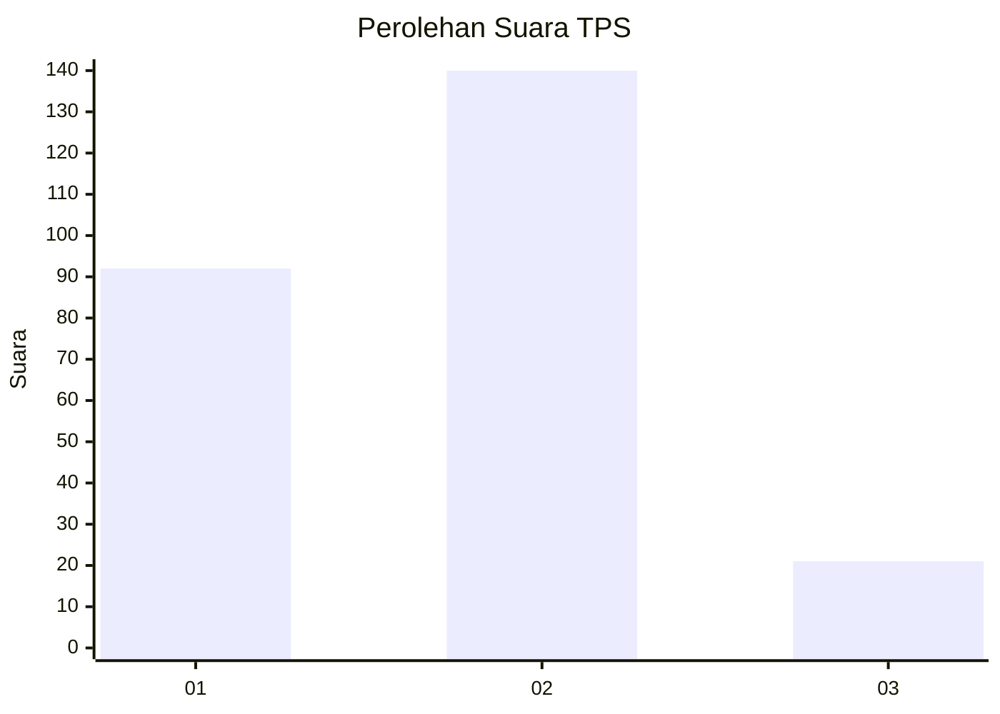

# Hasil

## Grafik

## Tabel

| No. | Nama Paslon    | Suara | Suara (raw) | Persentase |
|:--- |:-------------- | -----:| -----------:| ----------:|
| 1   | ANIES MUHAIMIN | 92    | [92][p-1]   | 36,36      |
| 2   | PRABOWO GIBRAN | 140   | [140][p-2]  | 55,34      |
| 3   | GANJAR MAHFUD  | 21    | [21][p-3]   | 8,30       |

[p-1]: https://github.com/gigit-pemilu/pemilu-2024/blob/main/pilpres/hitung-suara/sub/35-jawa-timur/sub/28-pamekasan/sub/06-palengaan/sub/2005-larangan-badung/sub/001-tps/sub/paslon-1.txt
[p-2]: https://github.com/gigit-pemilu/pemilu-2024/blob/main/pilpres/hitung-suara/sub/35-jawa-timur/sub/28-pamekasan/sub/06-palengaan/sub/2005-larangan-badung/sub/001-tps/sub/paslon-2.txt
[p-3]: https://github.com/gigit-pemilu/pemilu-2024/blob/main/pilpres/hitung-suara/sub/35-jawa-timur/sub/28-pamekasan/sub/06-palengaan/sub/2005-larangan-badung/sub/001-tps/sub/paslon-3.txt

## Foto C Plano

https://sirekap-obj-formc.kpu.go.id/3e5a/pemilu/ppwp/35/28/06/20/05/3528062005001-20240214-220231--cd985d7b-162e-4d6c-b025-f024444f3262.jpg

https://sirekap-obj-formc.kpu.go.id/3e5a/pemilu/ppwp/35/28/06/20/05/3528062005001-20240214-220355--f550391f-99d7-4908-ab64-771e4cb09422.jpg

https://sirekap-obj-formc.kpu.go.id/3e5a/pemilu/ppwp/35/28/06/20/05/3528062005001-20240214-220529--c66f0b5f-7e26-4d04-9f3a-29f7f4ceb1fc.jpg

## Metadata

| Key        | Value               |
| ---------- | ------------------- |
| Time Stamp | 2024-02-17 16:00:02 |

