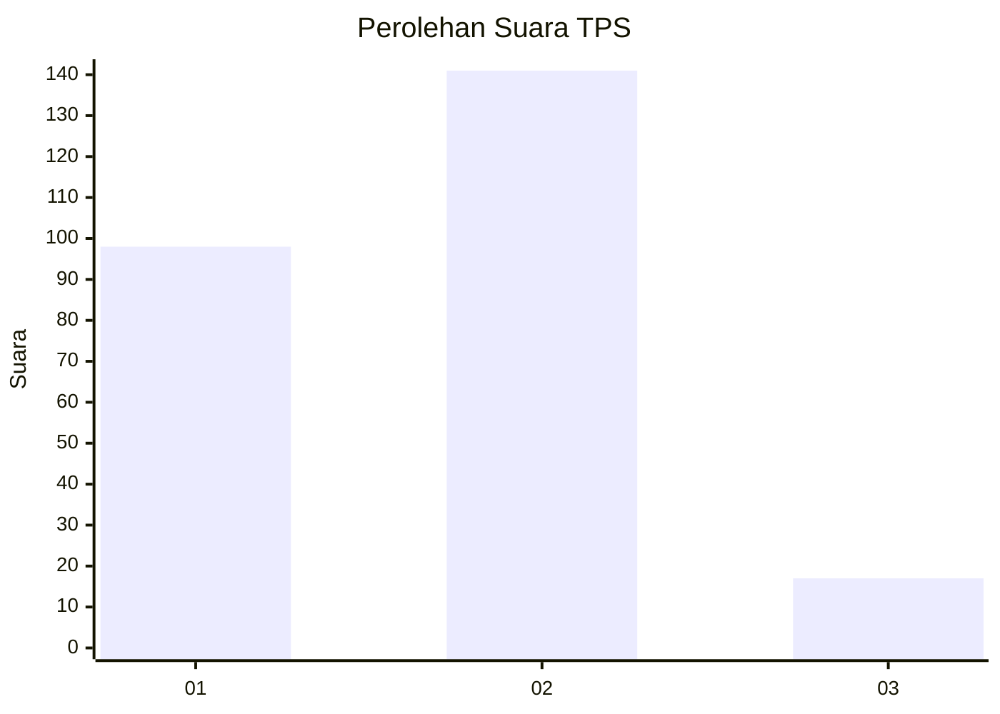

# Hasil

## Grafik

## Tabel

| No. | Nama Paslon    | Suara | Suara (raw) | Persentase |
|:--- |:-------------- | -----:| -----------:| ----------:|
| 1   | ANIES MUHAIMIN | 98    | [98][p-1]   | 38,28      |
| 2   | PRABOWO GIBRAN | 141   | [141][p-2]  | 55,08      |
| 3   | GANJAR MAHFUD  | 17    | [17][p-3]   | 6,64       |

[p-1]: https://github.com/gigit-pemilu/pemilu-2024-35-jawa-timur/blob/main/pilpres/hitung-suara/sub/35-jawa-timur/sub/28-pamekasan/sub/06-palengaan/sub/2005-larangan-badung/sub/002-tps/sub/paslon-1.txt
[p-2]: https://github.com/gigit-pemilu/pemilu-2024-35-jawa-timur/blob/main/pilpres/hitung-suara/sub/35-jawa-timur/sub/28-pamekasan/sub/06-palengaan/sub/2005-larangan-badung/sub/002-tps/sub/paslon-2.txt
[p-3]: https://github.com/gigit-pemilu/pemilu-2024-35-jawa-timur/blob/main/pilpres/hitung-suara/sub/35-jawa-timur/sub/28-pamekasan/sub/06-palengaan/sub/2005-larangan-badung/sub/002-tps/sub/paslon-3.txt

## Foto C Plano

https://sirekap-obj-formc.kpu.go.id/0f51/pemilu/ppwp/35/28/06/20/05/3528062005002-20240215-002315--2e74797b-4622-4642-b0ad-111fed33b9b5.jpg

https://sirekap-obj-formc.kpu.go.id/0f51/pemilu/ppwp/35/28/06/20/05/3528062005002-20240215-002506--50059353-34d5-4c86-b1a7-07bff1e32a52.jpg

https://sirekap-obj-formc.kpu.go.id/0f51/pemilu/ppwp/35/28/06/20/05/3528062005002-20240215-002625--9e3953ac-8a12-4e45-ab8d-b9835ec15517.jpg

## Metadata

| Key        | Value               |
| ---------- | ------------------- |
| Time Stamp | 2024-02-17 11:00:02 |

