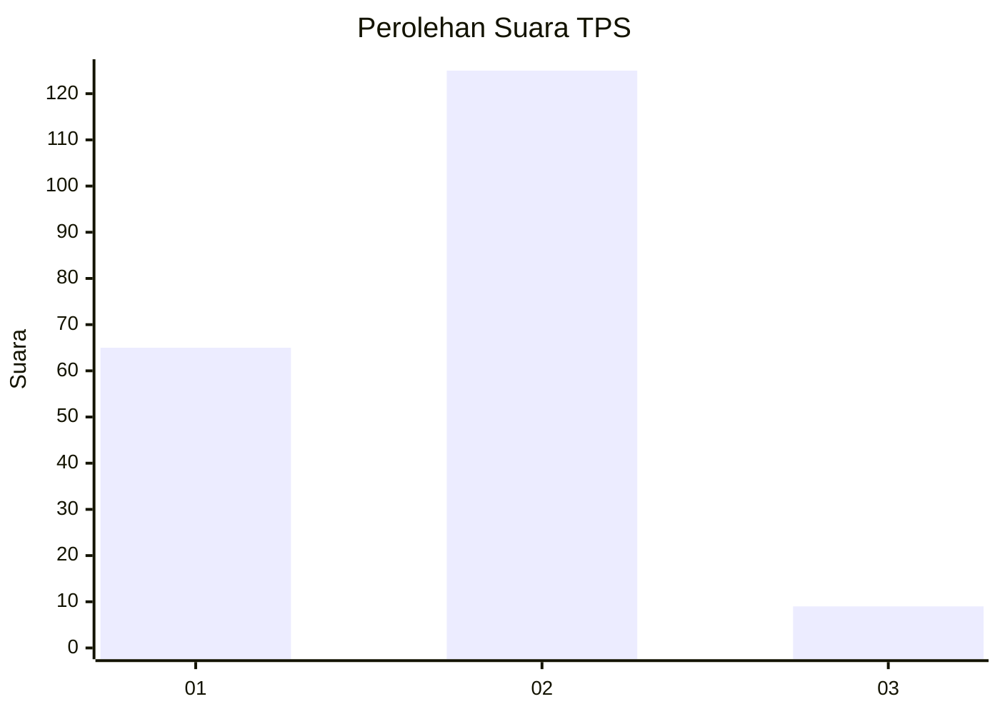
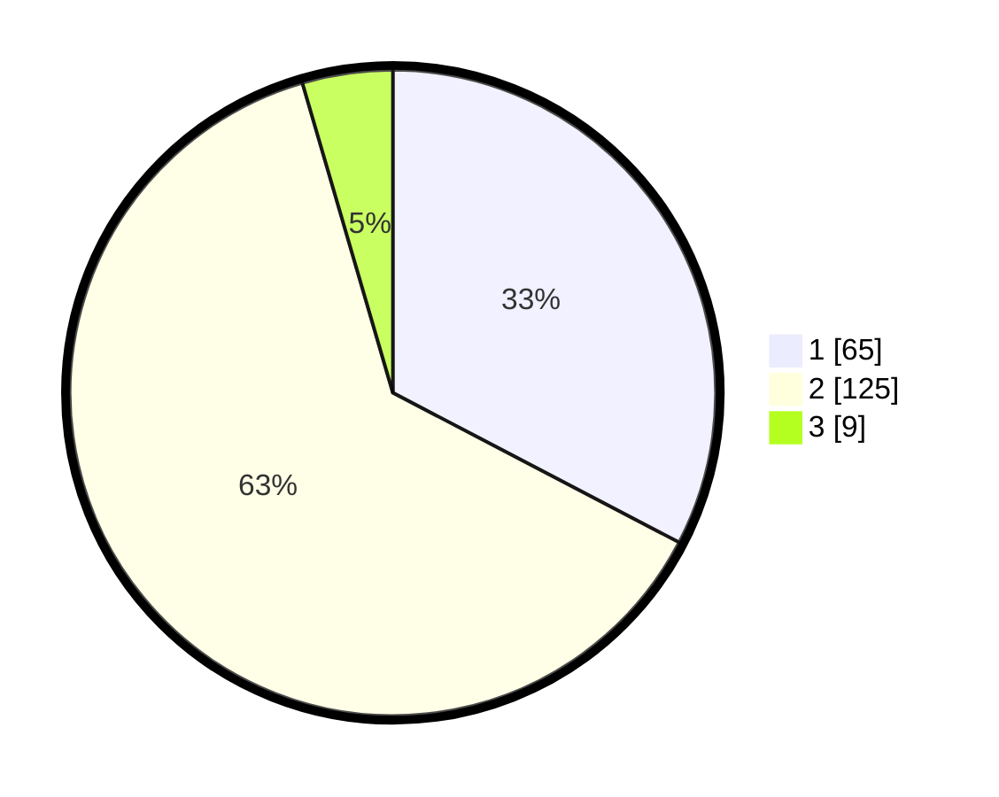

# Hasil

## Grafik

## Tabel

| No. | Nama Paslon    | Suara | Suara (raw) | Persentase |
|:--- |:-------------- | -----:| -----------:| ----------:|
| 1   | ANIES MUHAIMIN | 65    | [65][p-1]   | 32,66      |
| 2   | PRABOWO GIBRAN | 125   | [125][p-2]  | 62,81      |
| 3   | GANJAR MAHFUD  | 9     | [9][p-3]    | 4,52       |

[p-1]: https://github.com/gigit-pemilu/pemilu-2024/blob/main/pilpres/hitung-suara/sub/35-jawa-timur/sub/28-pamekasan/sub/06-palengaan/sub/2005-larangan-badung/sub/004-tps/sub/paslon-1.txt
[p-2]: https://github.com/gigit-pemilu/pemilu-2024/blob/main/pilpres/hitung-suara/sub/35-jawa-timur/sub/28-pamekasan/sub/06-palengaan/sub/2005-larangan-badung/sub/004-tps/sub/paslon-2.txt
[p-3]: https://github.com/gigit-pemilu/pemilu-2024/blob/main/pilpres/hitung-suara/sub/35-jawa-timur/sub/28-pamekasan/sub/06-palengaan/sub/2005-larangan-badung/sub/004-tps/sub/paslon-3.txt

## Foto C Plano

https://sirekap-obj-formc.kpu.go.id/6161/pemilu/ppwp/35/28/06/20/05/3528062005004-20240214-212826--a994a749-26a7-42bb-ac36-44ee59ed390c.jpg

https://sirekap-obj-formc.kpu.go.id/6161/pemilu/ppwp/35/28/06/20/05/3528062005004-20240214-212941--3b89cf32-f8c2-47f3-b1b9-0ed8141a1d3f.jpg

https://sirekap-obj-formc.kpu.go.id/6161/pemilu/ppwp/35/28/06/20/05/3528062005004-20240214-204831--0f9f2de3-f1f1-4d00-b34d-758bc9b5e89d.jpg

## Metadata

| Key        | Value               |
| ---------- | ------------------- |
| Time Stamp | 2024-02-26 22:00:00 |

