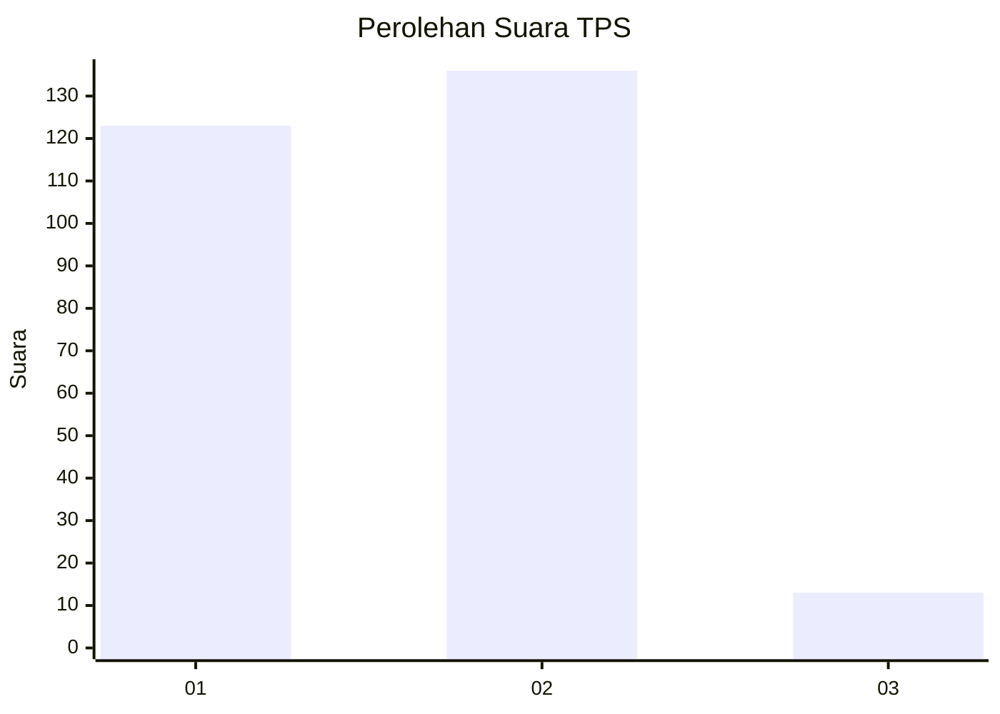
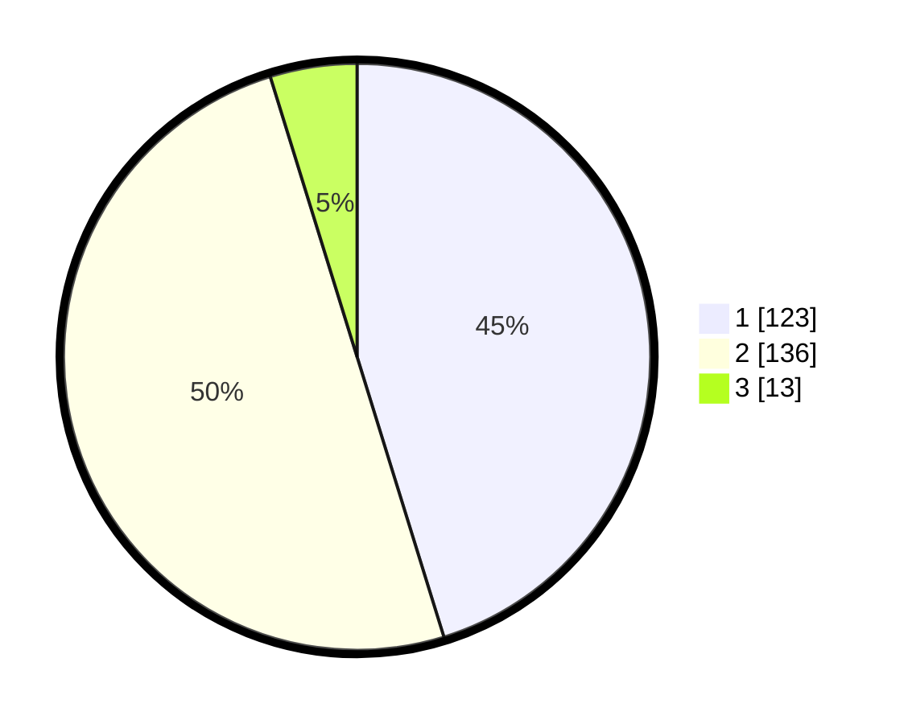

# Hasil

## Grafik

## Tabel

| No. | Nama Paslon    | Suara | Suara (raw) | Persentase |
|:--- |:-------------- | -----:| -----------:| ----------:|
| 1   | ANIES MUHAIMIN | 123   | [123][p-1]  | 45,22      |
| 2   | PRABOWO GIBRAN | 136   | [136][p-2]  | 50,00      |
| 3   | GANJAR MAHFUD  | 13    | [13][p-3]   | 4,78       |

[p-1]: https://github.com/gigit-pemilu/pemilu-2024-35-jawa-timur/blob/main/pilpres/hitung-suara/sub/35-jawa-timur/sub/28-pamekasan/sub/06-palengaan/sub/2005-larangan-badung/sub/009-tps/sub/paslon-1.txt
[p-2]: https://github.com/gigit-pemilu/pemilu-2024-35-jawa-timur/blob/main/pilpres/hitung-suara/sub/35-jawa-timur/sub/28-pamekasan/sub/06-palengaan/sub/2005-larangan-badung/sub/009-tps/sub/paslon-2.txt
[p-3]: https://github.com/gigit-pemilu/pemilu-2024-35-jawa-timur/blob/main/pilpres/hitung-suara/sub/35-jawa-timur/sub/28-pamekasan/sub/06-palengaan/sub/2005-larangan-badung/sub/009-tps/sub/paslon-3.txt

## Foto C Plano

https://sirekap-obj-formc.kpu.go.id/0509/pemilu/ppwp/35/28/06/20/05/3528062005009-20240214-221213--0a434caf-9a9a-4255-8b61-93c001623457.jpg

https://sirekap-obj-formc.kpu.go.id/0509/pemilu/ppwp/35/28/06/20/05/3528062005009-20240214-221224--329f4c3f-4467-430e-bb7f-813321278036.jpg

https://sirekap-obj-formc.kpu.go.id/0509/pemilu/ppwp/35/28/06/20/05/3528062005009-20240214-221233--15c658e7-42ba-4620-b1d5-4c29e31907cf.jpg

## Metadata

| Key        | Value               |
| ---------- | ------------------- |
| Time Stamp | 2024-02-17 16:00:02 |

