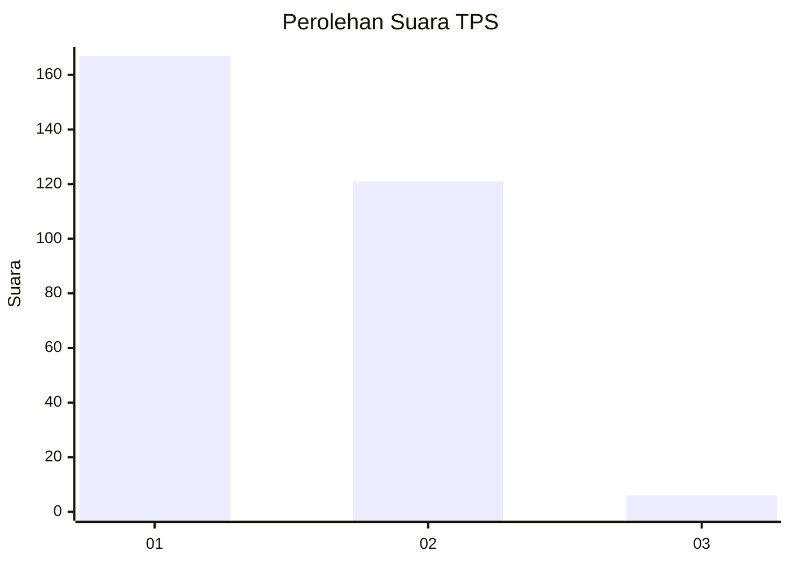
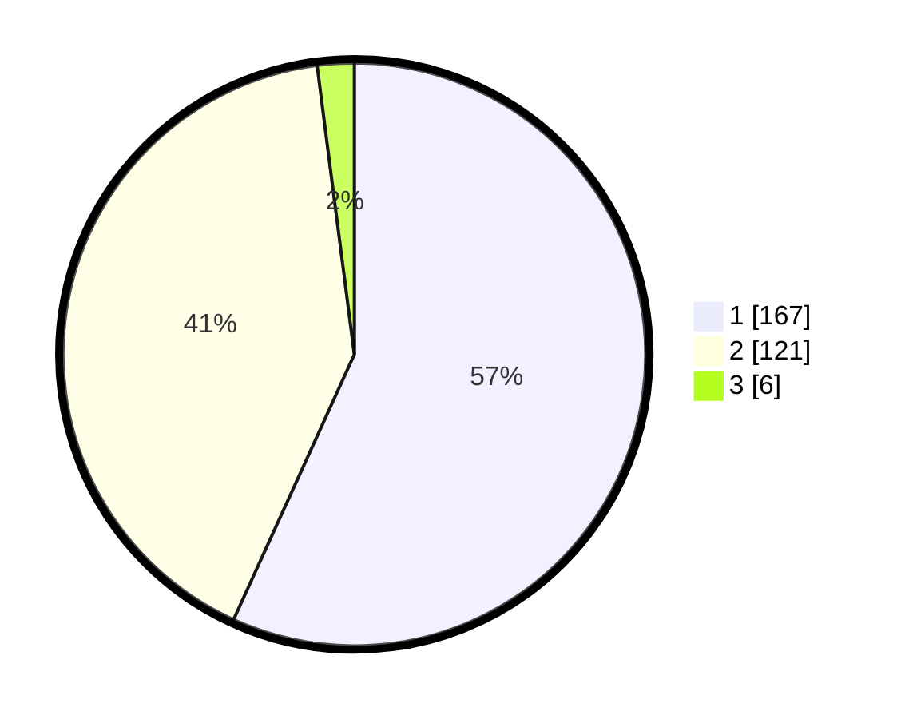

# Hasil

## Grafik

## Tabel

| No. | Nama Paslon    | Suara | Suara (raw) | Persentase |
|:--- |:-------------- | -----:| -----------:| ----------:|
| 1   | ANIES MUHAIMIN | 167   | [167][p-1]  | 56,80      |
| 2   | PRABOWO GIBRAN | 121   | [121][p-2]  | 41,16      |
| 3   | GANJAR MAHFUD  | 6     | [6][p-3]    | 2,04       |

[p-1]: https://github.com/gigit-pemilu/pemilu-2024-35-jawa-timur/blob/main/pilpres/hitung-suara/sub/35-jawa-timur/sub/28-pamekasan/sub/06-palengaan/sub/2005-larangan-badung/sub/013-tps/sub/paslon-1.txt
[p-2]: https://github.com/gigit-pemilu/pemilu-2024-35-jawa-timur/blob/main/pilpres/hitung-suara/sub/35-jawa-timur/sub/28-pamekasan/sub/06-palengaan/sub/2005-larangan-badung/sub/013-tps/sub/paslon-2.txt
[p-3]: https://github.com/gigit-pemilu/pemilu-2024-35-jawa-timur/blob/main/pilpres/hitung-suara/sub/35-jawa-timur/sub/28-pamekasan/sub/06-palengaan/sub/2005-larangan-badung/sub/013-tps/sub/paslon-3.txt

## Foto C Plano

https://sirekap-obj-formc.kpu.go.id/e2fc/pemilu/ppwp/35/28/06/20/05/3528062005013-20240214-220557--a9b43bf1-b4a5-43b4-8461-b67165dff65a.jpg

https://sirekap-obj-formc.kpu.go.id/e2fc/pemilu/ppwp/35/28/06/20/05/3528062005013-20240214-220920--19f4fc9d-3402-4b1a-b80b-e93395d5b876.jpg

https://sirekap-obj-formc.kpu.go.id/e2fc/pemilu/ppwp/35/28/06/20/05/3528062005013-20240214-220836--81e27bb0-4dbd-43d0-86b0-a386a6b1675c.jpg

## Metadata

| Key        | Value               |
| ---------- | ------------------- |
| Time Stamp | 2024-02-26 13:00:00 |

