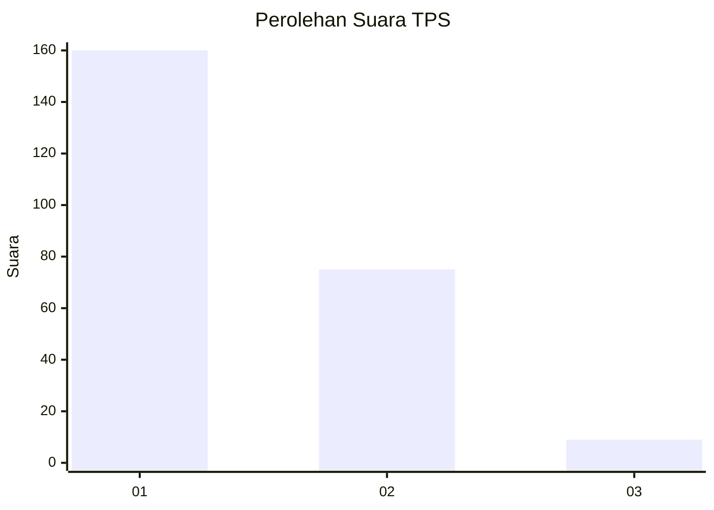
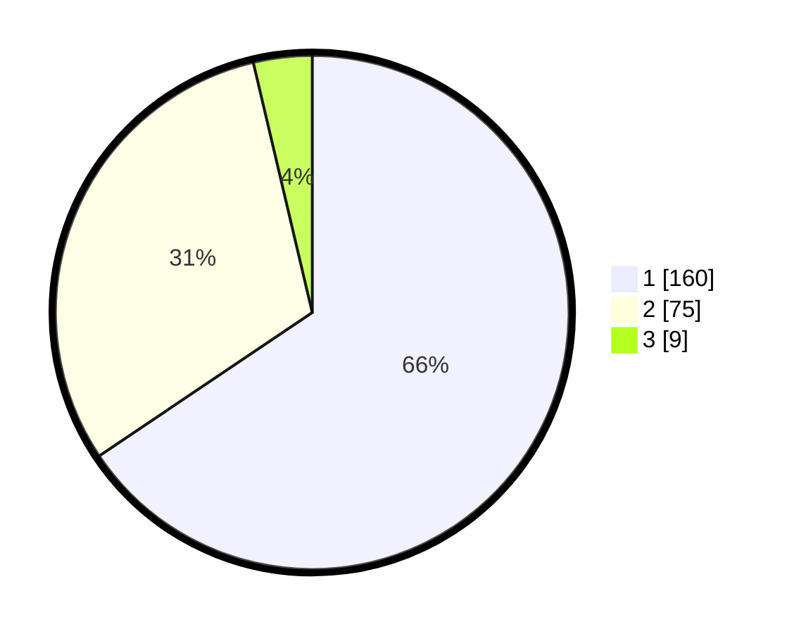

# Hasil

## Grafik

## Tabel

| No. | Nama Paslon    | Suara | Suara (raw) | Persentase |
|:--- |:-------------- | -----:| -----------:| ----------:|
| 1   | ANIES MUHAIMIN | 160   | [160][p-1]  | 65,57      |
| 2   | PRABOWO GIBRAN | 75    | [75][p-2]   | 30,74      |
| 3   | GANJAR MAHFUD  | 9     | [9][p-3]    | 3,69       |

[p-1]: https://github.com/gigit-pemilu/pemilu-2024-35-jawa-timur/blob/main/pilpres/hitung-suara/sub/35-jawa-timur/sub/28-pamekasan/sub/06-palengaan/sub/2005-larangan-badung/sub/018-tps/sub/paslon-1.txt
[p-2]: https://github.com/gigit-pemilu/pemilu-2024-35-jawa-timur/blob/main/pilpres/hitung-suara/sub/35-jawa-timur/sub/28-pamekasan/sub/06-palengaan/sub/2005-larangan-badung/sub/018-tps/sub/paslon-2.txt
[p-3]: https://github.com/gigit-pemilu/pemilu-2024-35-jawa-timur/blob/main/pilpres/hitung-suara/sub/35-jawa-timur/sub/28-pamekasan/sub/06-palengaan/sub/2005-larangan-badung/sub/018-tps/sub/paslon-3.txt

## Foto C Plano

https://sirekap-obj-formc.kpu.go.id/cd8c/pemilu/ppwp/35/28/06/20/05/3528062005018-20240214-212050--7ea216db-da82-44ab-90cd-b79b836d9bdd.jpg

https://sirekap-obj-formc.kpu.go.id/cd8c/pemilu/ppwp/35/28/06/20/05/3528062005018-20240214-212100--3adca946-d61e-4fff-a565-54c0a6c71206.jpg

https://sirekap-obj-formc.kpu.go.id/cd8c/pemilu/ppwp/35/28/06/20/05/3528062005018-20240214-212109--d4d195da-0bb2-460d-8cf0-4a0718e9d974.jpg

## Metadata

| Key        | Value               |
| ---------- | ------------------- |
| Time Stamp | 2024-02-15 05:00:24 |

