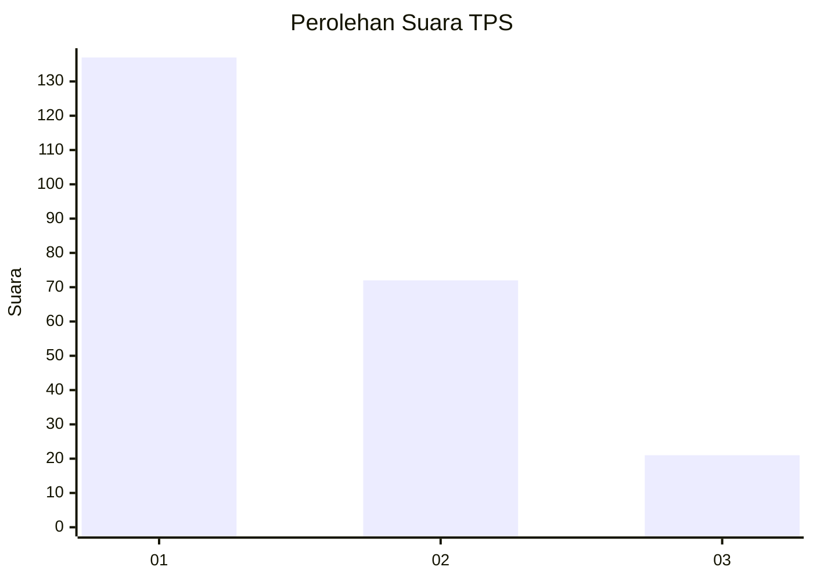
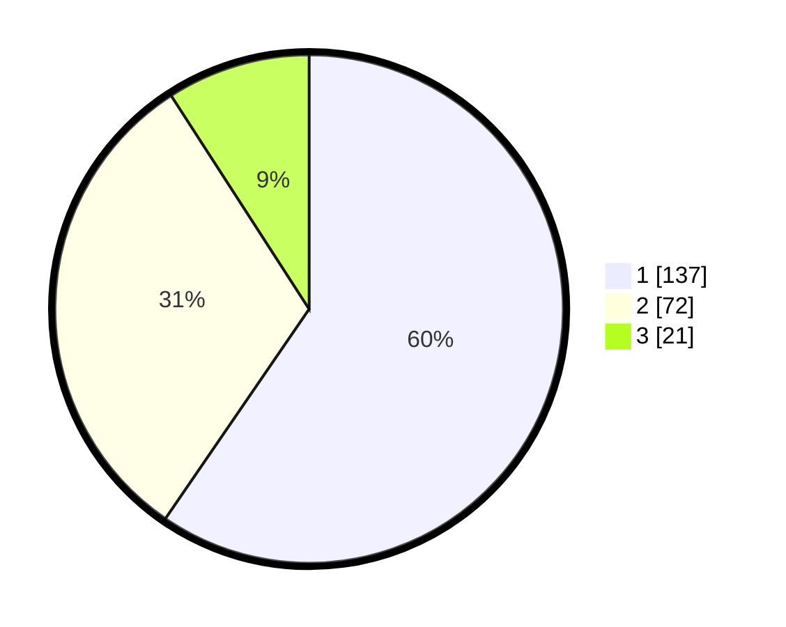

# Hasil

## Grafik

## Tabel

| No. | Nama Paslon    | Suara | Suara (raw) | Persentase |
|:--- |:-------------- | -----:| -----------:| ----------:|
| 1   | ANIES MUHAIMIN | 137   | [137][p-1]  | 59,57      |
| 2   | PRABOWO GIBRAN | 72    | [72][p-2]   | 31,30      |
| 3   | GANJAR MAHFUD  | 21    | [21][p-3]   | 9,13       |

[p-1]: https://github.com/gigit-pemilu/pemilu-2024-35-jawa-timur/blob/main/pilpres/hitung-suara/sub/35-jawa-timur/sub/28-pamekasan/sub/06-palengaan/sub/2005-larangan-badung/sub/020-tps/sub/paslon-1.txt
[p-2]: https://github.com/gigit-pemilu/pemilu-2024-35-jawa-timur/blob/main/pilpres/hitung-suara/sub/35-jawa-timur/sub/28-pamekasan/sub/06-palengaan/sub/2005-larangan-badung/sub/020-tps/sub/paslon-2.txt
[p-3]: https://github.com/gigit-pemilu/pemilu-2024-35-jawa-timur/blob/main/pilpres/hitung-suara/sub/35-jawa-timur/sub/28-pamekasan/sub/06-palengaan/sub/2005-larangan-badung/sub/020-tps/sub/paslon-3.txt

## Foto C Plano

https://sirekap-obj-formc.kpu.go.id/ba96/pemilu/ppwp/35/28/06/20/05/3528062005020-20240214-215220--34556afb-19d6-48cf-b50b-172121063ce7.jpg

https://sirekap-obj-formc.kpu.go.id/ba96/pemilu/ppwp/35/28/06/20/05/3528062005020-20240214-203522--3ed4517a-f86b-4542-8282-15260313e1b6.jpg

https://sirekap-obj-formc.kpu.go.id/ba96/pemilu/ppwp/35/28/06/20/05/3528062005020-20240214-215522--6ef58177-c206-48fc-93c1-bc9e3fdbf8cd.jpg

## Metadata

| Key        | Value               |
| ---------- | ------------------- |
| Time Stamp | 2024-02-17 16:00:02 |

