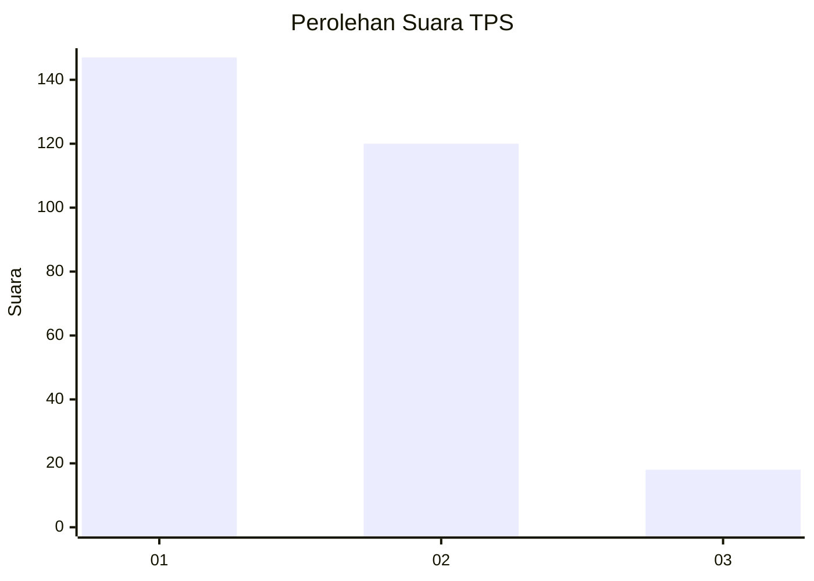
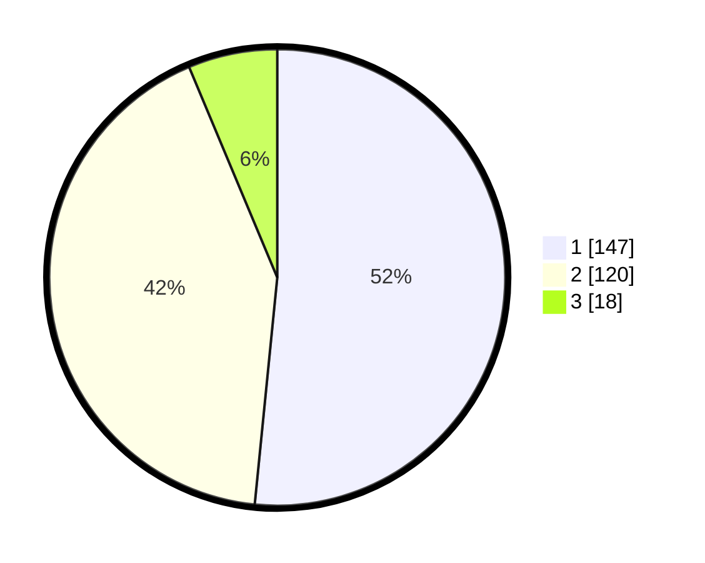

# Hasil

## Grafik

## Tabel

| No. | Nama Paslon    | Suara | Suara (raw) | Persentase |
|:--- |:-------------- | -----:| -----------:| ----------:|
| 1   | ANIES MUHAIMIN | 147   | [147][p-1]  | 51,58      |
| 2   | PRABOWO GIBRAN | 120   | [120][p-2]  | 42,11      |
| 3   | GANJAR MAHFUD  | 18    | [18][p-3]   | 6,32       |

[p-1]: https://github.com/gigit-pemilu/pemilu-2024/blob/main/pilpres/hitung-suara/sub/35-jawa-timur/sub/28-pamekasan/sub/06-palengaan/sub/2005-larangan-badung/sub/023-tps/sub/paslon-1.txt
[p-2]: https://github.com/gigit-pemilu/pemilu-2024/blob/main/pilpres/hitung-suara/sub/35-jawa-timur/sub/28-pamekasan/sub/06-palengaan/sub/2005-larangan-badung/sub/023-tps/sub/paslon-2.txt
[p-3]: https://github.com/gigit-pemilu/pemilu-2024/blob/main/pilpres/hitung-suara/sub/35-jawa-timur/sub/28-pamekasan/sub/06-palengaan/sub/2005-larangan-badung/sub/023-tps/sub/paslon-3.txt

## Foto C Plano

https://sirekap-obj-formc.kpu.go.id/ecbb/pemilu/ppwp/35/28/06/20/05/3528062005023-20240214-212010--b5d93398-2368-4047-84c7-1c348b255978.jpg

https://sirekap-obj-formc.kpu.go.id/ecbb/pemilu/ppwp/35/28/06/20/05/3528062005023-20240214-212122--55e1c43f-dd62-4d20-9e8b-b9a7e42552f6.jpg

https://sirekap-obj-formc.kpu.go.id/ecbb/pemilu/ppwp/35/28/06/20/05/3528062005023-20240214-212214--ee4d19b8-7584-41c5-86e2-06d219173016.jpg

## Metadata

| Key        | Value               |
| ---------- | ------------------- |
| Time Stamp | 2024-02-17 16:00:02 |

