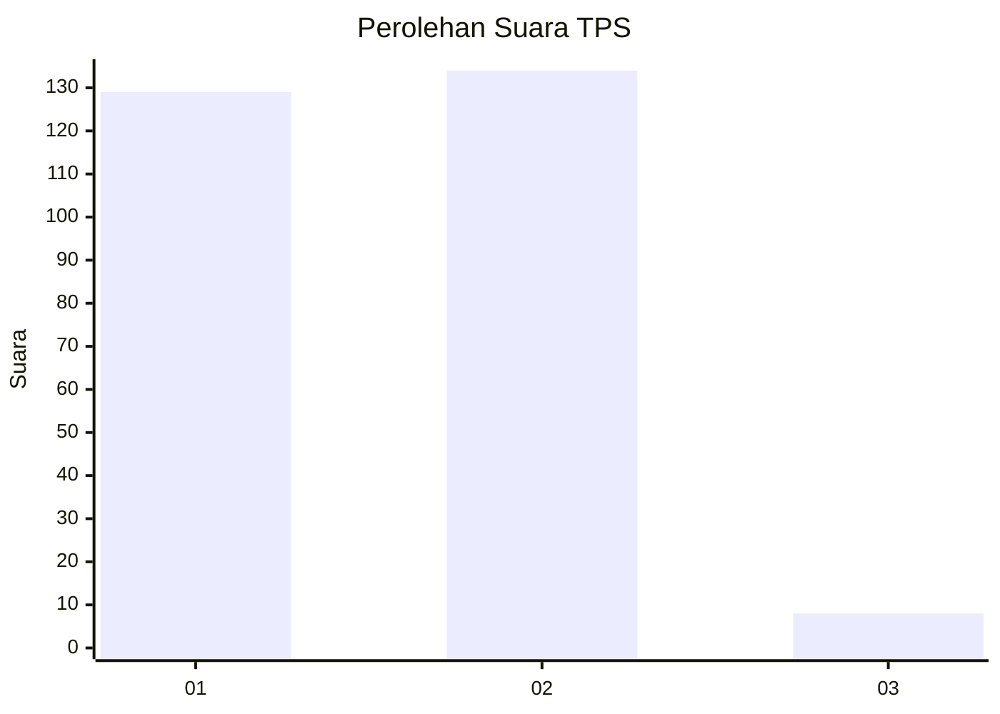
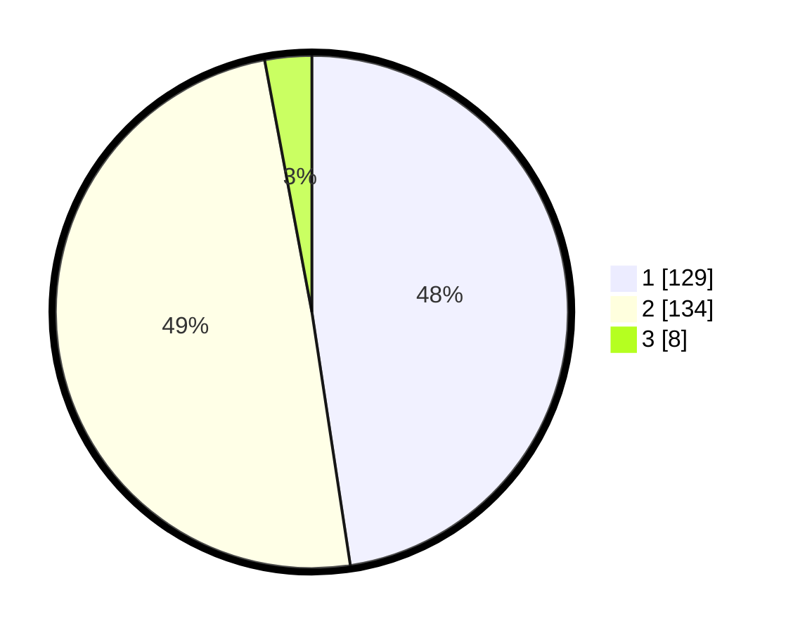

# Hasil

## Grafik

## Tabel

| No. | Nama Paslon    | Suara | Suara (raw) | Persentase |
|:--- |:-------------- | -----:| -----------:| ----------:|
| 1   | ANIES MUHAIMIN | 129   | [129][p-1]  | 47,60      |
| 2   | PRABOWO GIBRAN | 134   | [134][p-2]  | 49,45      |
| 3   | GANJAR MAHFUD  | 8     | [8][p-3]    | 2,95       |

[p-1]: https://github.com/gigit-pemilu/pemilu-2024/blob/main/pilpres/hitung-suara/sub/35-jawa-timur/sub/28-pamekasan/sub/06-palengaan/sub/2005-larangan-badung/sub/024-tps/sub/paslon-1.txt
[p-2]: https://github.com/gigit-pemilu/pemilu-2024/blob/main/pilpres/hitung-suara/sub/35-jawa-timur/sub/28-pamekasan/sub/06-palengaan/sub/2005-larangan-badung/sub/024-tps/sub/paslon-2.txt
[p-3]: https://github.com/gigit-pemilu/pemilu-2024/blob/main/pilpres/hitung-suara/sub/35-jawa-timur/sub/28-pamekasan/sub/06-palengaan/sub/2005-larangan-badung/sub/024-tps/sub/paslon-3.txt

## Foto C Plano

https://sirekap-obj-formc.kpu.go.id/453e/pemilu/ppwp/35/28/06/20/05/3528062005024-20240219-172857--16af2c13-3d9f-4f9f-ac68-2ecaf57ff991.jpg

https://sirekap-obj-formc.kpu.go.id/453e/pemilu/ppwp/35/28/06/20/05/3528062005024-20240219-172919--076ab0d8-84ec-456e-a871-f42a5d8dc2ff.jpg

https://sirekap-obj-formc.kpu.go.id/453e/pemilu/ppwp/35/28/06/20/05/3528062005024-20240219-172934--cf5dbf50-9590-4c25-b428-e269d67d15fa.jpg

## Metadata

| Key        | Value               |
| ---------- | ------------------- |
| Time Stamp | 2024-02-25 18:00:00 |

