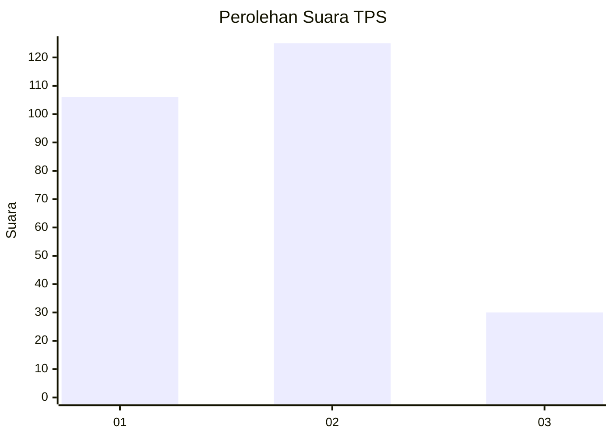
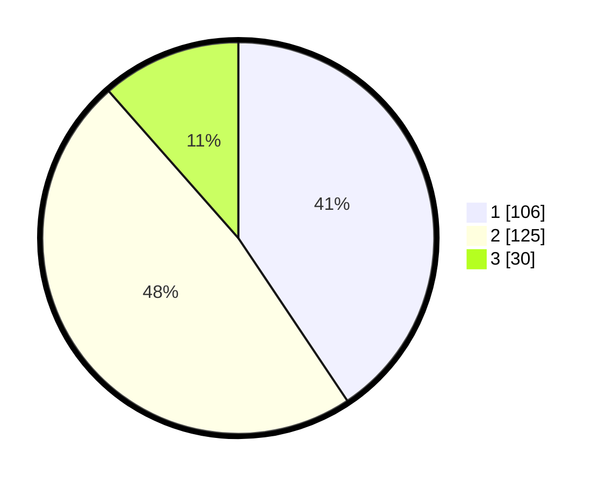

# Hasil

## Grafik

## Tabel

| No. | Nama Paslon    | Suara | Suara (raw) | Persentase |
|:--- |:-------------- | -----:| -----------:| ----------:|
| 1   | ANIES MUHAIMIN | 106   | [106][p-1]  | 40,61      |
| 2   | PRABOWO GIBRAN | 125   | [125][p-2]  | 47,89      |
| 3   | GANJAR MAHFUD  | 30    | [30][p-3]   | 11,49      |

[p-1]: https://github.com/gigit-pemilu/pemilu-2024/blob/main/pilpres/hitung-suara/sub/35-jawa-timur/sub/28-pamekasan/sub/06-palengaan/sub/2005-larangan-badung/sub/025-tps/sub/paslon-1.txt
[p-2]: https://github.com/gigit-pemilu/pemilu-2024/blob/main/pilpres/hitung-suara/sub/35-jawa-timur/sub/28-pamekasan/sub/06-palengaan/sub/2005-larangan-badung/sub/025-tps/sub/paslon-2.txt
[p-3]: https://github.com/gigit-pemilu/pemilu-2024/blob/main/pilpres/hitung-suara/sub/35-jawa-timur/sub/28-pamekasan/sub/06-palengaan/sub/2005-larangan-badung/sub/025-tps/sub/paslon-3.txt

## Foto C Plano

https://sirekap-obj-formc.kpu.go.id/7f50/pemilu/ppwp/35/28/06/20/05/3528062005025-20240214-191906--614a6705-11d5-44e2-8572-ab91aab37623.jpg

https://sirekap-obj-formc.kpu.go.id/7f50/pemilu/ppwp/35/28/06/20/05/3528062005025-20240214-191955--d55f8688-0209-406d-ac5d-074a8f6a5b63.jpg

https://sirekap-obj-formc.kpu.go.id/7f50/pemilu/ppwp/35/28/06/20/05/3528062005025-20240214-192019--89841b42-4efb-4178-a855-b4d8851a54ae.jpg

## Metadata

| Key        | Value               |
| ---------- | ------------------- |
| Time Stamp | 2024-02-17 16:00:02 |

