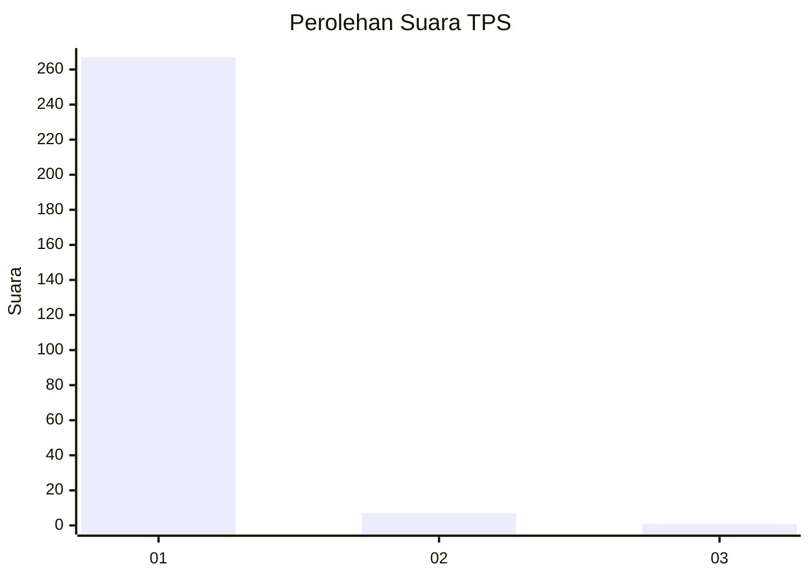
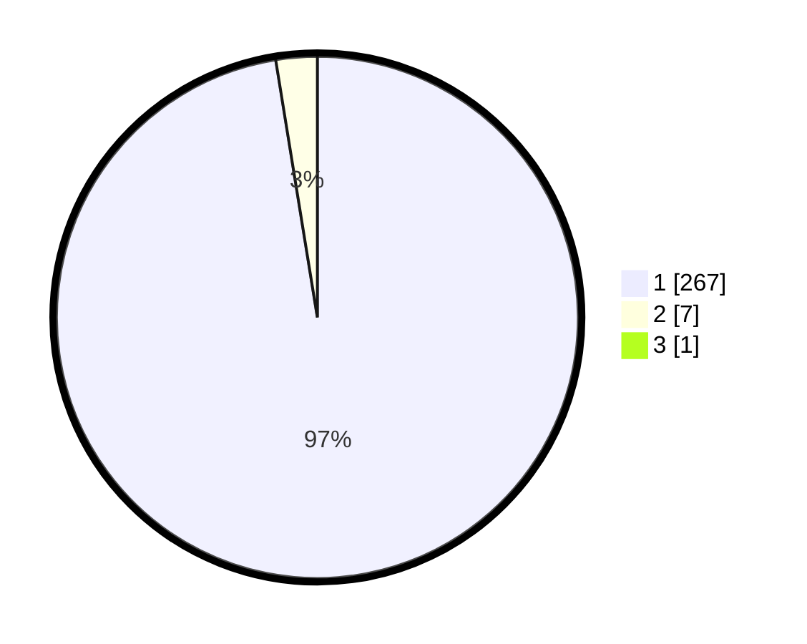

# Hasil

## Grafik

## Tabel

| No. | Nama Paslon    | Suara | Suara (raw) | Persentase |
|:--- |:-------------- | -----:| -----------:| ----------:|
| 1   | ANIES MUHAIMIN | 267   | [267][p-1]  | 97,09      |
| 2   | PRABOWO GIBRAN | 7     | [7][p-2]    | 2,55       |
| 3   | GANJAR MAHFUD  | 1     | [1][p-3]    | 0,36       |

[p-1]: https://github.com/gigit-pemilu/pemilu-2024/blob/main/pilpres/hitung-suara/sub/35-jawa-timur/sub/28-pamekasan/sub/06-palengaan/sub/2006-panaan/sub/004-tps/sub/paslon-1.txt
[p-2]: https://github.com/gigit-pemilu/pemilu-2024/blob/main/pilpres/hitung-suara/sub/35-jawa-timur/sub/28-pamekasan/sub/06-palengaan/sub/2006-panaan/sub/004-tps/sub/paslon-2.txt
[p-3]: https://github.com/gigit-pemilu/pemilu-2024/blob/main/pilpres/hitung-suara/sub/35-jawa-timur/sub/28-pamekasan/sub/06-palengaan/sub/2006-panaan/sub/004-tps/sub/paslon-3.txt

## Foto C Plano

https://sirekap-obj-formc.kpu.go.id/776c/pemilu/ppwp/35/28/06/20/06/3528062006004-20240215-105308--2774a9be-42ca-46f7-afe1-36a6d3100d08.jpg

https://sirekap-obj-formc.kpu.go.id/776c/pemilu/ppwp/35/28/06/20/06/3528062006004-20240215-105443--45e2b37d-effe-4443-8aea-deb10065f5c4.jpg

https://sirekap-obj-formc.kpu.go.id/776c/pemilu/ppwp/35/28/06/20/06/3528062006004-20240215-105623--e16a1d48-b622-4496-9e91-1fd9a3fbc5f2.jpg

## Metadata

| Key        | Value               |
| ---------- | ------------------- |
| Time Stamp | 2024-02-17 16:00:02 |

