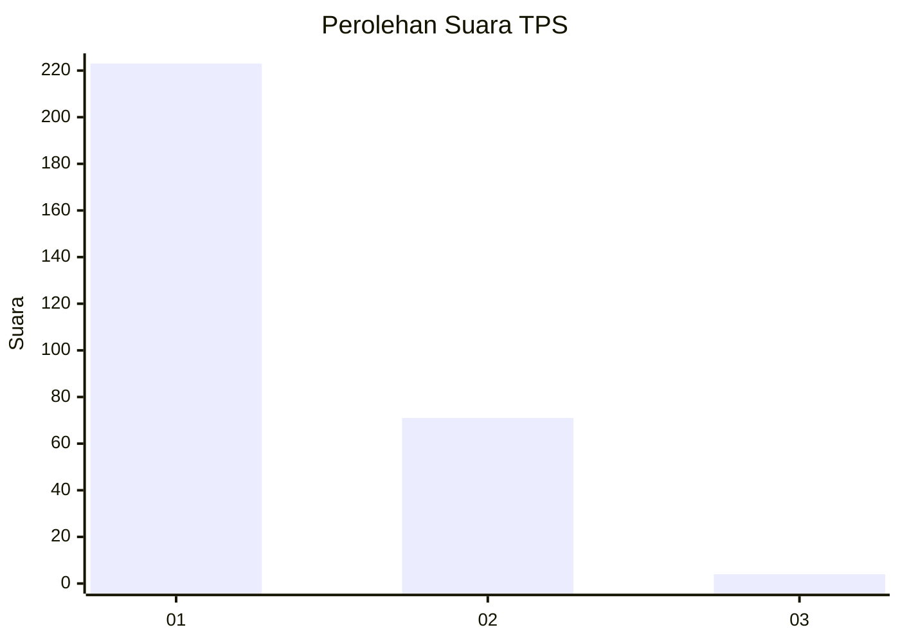
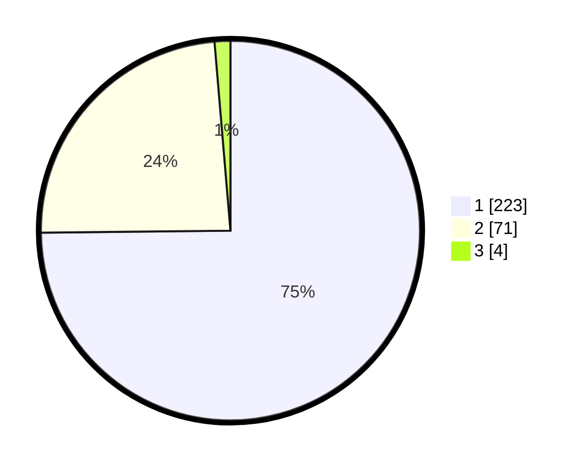

# Hasil

## Grafik

## Tabel

| No. | Nama Paslon    | Suara | Suara (raw) | Persentase |
|:--- |:-------------- | -----:| -----------:| ----------:|
| 1   | ANIES MUHAIMIN | 223   | [223][p-1]  | 74,83      |
| 2   | PRABOWO GIBRAN | 71    | [71][p-2]   | 23,83      |
| 3   | GANJAR MAHFUD  | 4     | [4][p-3]    | 1,34       |

[p-1]: https://github.com/gigit-pemilu/pemilu-2024-35-jawa-timur/blob/main/pilpres/hitung-suara/sub/35-jawa-timur/sub/28-pamekasan/sub/06-palengaan/sub/2007-potoan-laok/sub/003-tps/sub/paslon-1.txt
[p-2]: https://github.com/gigit-pemilu/pemilu-2024-35-jawa-timur/blob/main/pilpres/hitung-suara/sub/35-jawa-timur/sub/28-pamekasan/sub/06-palengaan/sub/2007-potoan-laok/sub/003-tps/sub/paslon-2.txt
[p-3]: https://github.com/gigit-pemilu/pemilu-2024-35-jawa-timur/blob/main/pilpres/hitung-suara/sub/35-jawa-timur/sub/28-pamekasan/sub/06-palengaan/sub/2007-potoan-laok/sub/003-tps/sub/paslon-3.txt

## Foto C Plano

https://sirekap-obj-formc.kpu.go.id/c08c/pemilu/ppwp/35/28/06/20/07/3528062007003-20240215-164326--3c97672f-a6ff-480e-b0ce-b504fae5e74b.jpg

https://sirekap-obj-formc.kpu.go.id/c08c/pemilu/ppwp/35/28/06/20/07/3528062007003-20240215-164431--67946cc7-44f6-4f21-905c-0bfcee503b11.jpg

https://sirekap-obj-formc.kpu.go.id/c08c/pemilu/ppwp/35/28/06/20/07/3528062007003-20240215-164525--3ea65541-86f3-4fd9-9f61-b0bb99cfbdea.jpg

## Metadata

| Key        | Value               |
| ---------- | ------------------- |
| Time Stamp | 2024-02-16 01:30:27 |

## DATA PEMILIH TETAP

Jumlah pemilih dalam DPT: **298**.
 * L: **145**.
 * P: **153**.

## DATA PENGGUNA HAK PILIH

Jumlah pengguna hak pilih dalam DPT: **298**.
 * L: **145**.
 * P: **153**.

Jumlah pengguna hak pilih dalam DPTb: **0**.
 * L: **0**.
 * P: **700**.

Jumlah pengguna hak pilih dalam DPK: **0**.
 * L: **7**.
 * P: **0**.

Jumlah pengguna hak pilih: **298**.
 * L: **145**.
 * P: **153**.

## JUMLAH SUARA SAH DAN TIDAK SAH

JUMLAH SELURUH SUARA SAH: **298**.

JUMLAH SUARA TIDAK SAH: **0**.

JUMLAH SELURUH SUARA SAH DAN SUARA TIDAK SAH: **298**.

