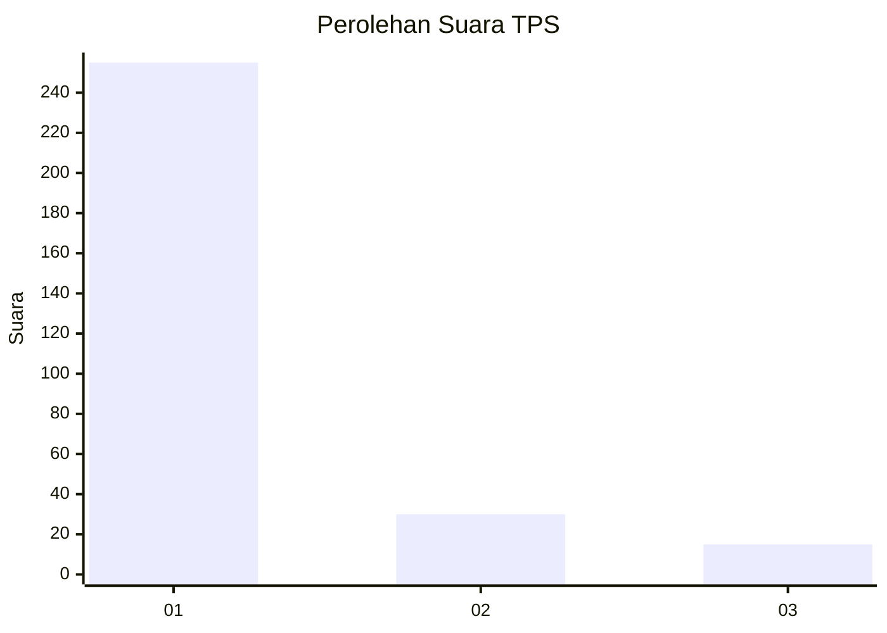
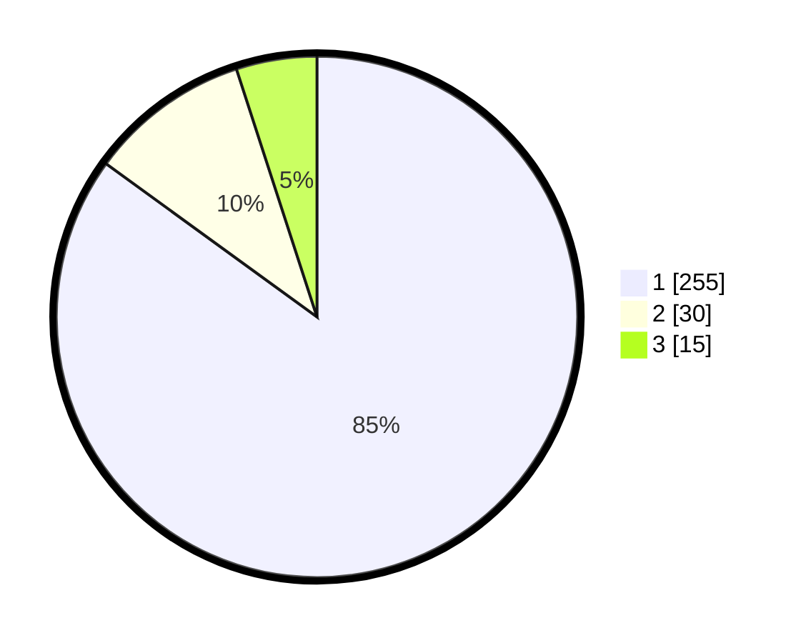

# Hasil

## Grafik

## Tabel

| No. | Nama Paslon    | Suara | Suara (raw) | Persentase |
|:--- |:-------------- | -----:| -----------:| ----------:|
| 1   | ANIES MUHAIMIN | 255   | [255][p-1]  | 85,00      |
| 2   | PRABOWO GIBRAN | 30    | [30][p-2]   | 10,00      |
| 3   | GANJAR MAHFUD  | 15    | [15][p-3]   | 5,00       |

[p-1]: https://github.com/gigit-pemilu/pemilu-2024-35-jawa-timur/blob/main/pilpres/hitung-suara/sub/35-jawa-timur/sub/28-pamekasan/sub/06-palengaan/sub/2008-patoan-daja/sub/001-tps/sub/paslon-1.txt
[p-2]: https://github.com/gigit-pemilu/pemilu-2024-35-jawa-timur/blob/main/pilpres/hitung-suara/sub/35-jawa-timur/sub/28-pamekasan/sub/06-palengaan/sub/2008-patoan-daja/sub/001-tps/sub/paslon-2.txt
[p-3]: https://github.com/gigit-pemilu/pemilu-2024-35-jawa-timur/blob/main/pilpres/hitung-suara/sub/35-jawa-timur/sub/28-pamekasan/sub/06-palengaan/sub/2008-patoan-daja/sub/001-tps/sub/paslon-3.txt

## Foto C Plano

https://sirekap-obj-formc.kpu.go.id/84c6/pemilu/ppwp/35/28/06/20/08/3528062008001-20240215-110256--a3d96c78-3c0d-4adf-91ba-5df7f237dc33.jpg

https://sirekap-obj-formc.kpu.go.id/84c6/pemilu/ppwp/35/28/06/20/08/3528062008001-20240215-110446--29caccae-88a1-4b7a-9d39-d2a5bb768a8b.jpg

https://sirekap-obj-formc.kpu.go.id/84c6/pemilu/ppwp/35/28/06/20/08/3528062008001-20240215-110523--8b96e27b-4738-4490-b496-207a8e79a44e.jpg

## Metadata

| Key        | Value               |
| ---------- | ------------------- |
| Time Stamp | 2024-02-17 16:00:02 |

