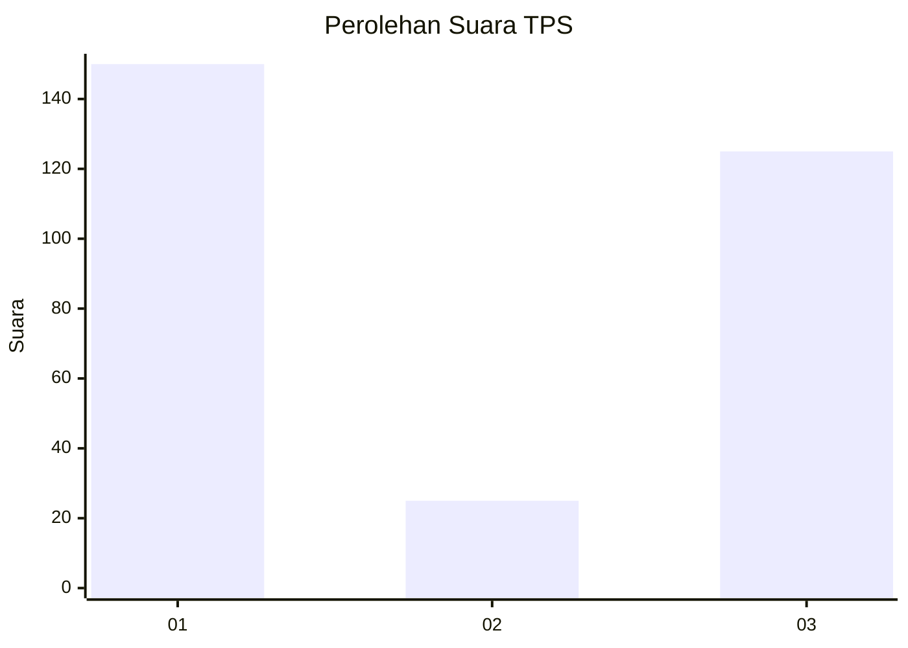
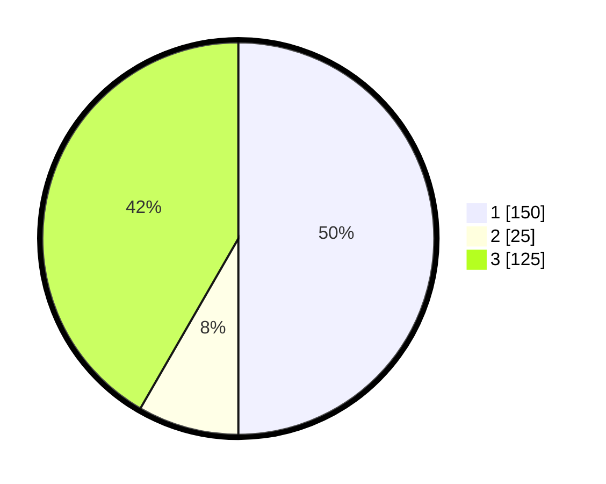

# Hasil

## Grafik

## Tabel

| No. | Nama Paslon    | Suara | Suara (raw) | Persentase |
|:--- |:-------------- | -----:| -----------:| ----------:|
| 1   | ANIES MUHAIMIN | 150   | [150][p-1]  | 50,00      |
| 2   | PRABOWO GIBRAN | 25    | [25][p-2]   | 8,33       |
| 3   | GANJAR MAHFUD  | 125   | [125][p-3]  | 41,67      |

[p-1]: https://github.com/gigit-pemilu/pemilu-2024-35-jawa-timur/blob/main/pilpres/hitung-suara/sub/35-jawa-timur/sub/28-pamekasan/sub/06-palengaan/sub/2008-patoan-daja/sub/002-tps/sub/paslon-1.txt
[p-2]: https://github.com/gigit-pemilu/pemilu-2024-35-jawa-timur/blob/main/pilpres/hitung-suara/sub/35-jawa-timur/sub/28-pamekasan/sub/06-palengaan/sub/2008-patoan-daja/sub/002-tps/sub/paslon-2.txt
[p-3]: https://github.com/gigit-pemilu/pemilu-2024-35-jawa-timur/blob/main/pilpres/hitung-suara/sub/35-jawa-timur/sub/28-pamekasan/sub/06-palengaan/sub/2008-patoan-daja/sub/002-tps/sub/paslon-3.txt

## Foto C Plano

https://sirekap-obj-formc.kpu.go.id/9da0/pemilu/ppwp/35/28/06/20/08/3528062008002-20240215-101406--8a8f6704-78cb-4501-a63e-459bdcfa6e09.jpg

https://sirekap-obj-formc.kpu.go.id/9da0/pemilu/ppwp/35/28/06/20/08/3528062008002-20240215-101707--53b8e3c6-c345-4ed4-87e6-8a55a6a6ed67.jpg

## Metadata

| Key        | Value               |
| ---------- | ------------------- |
| Time Stamp | 2024-02-15 22:30:27 |

