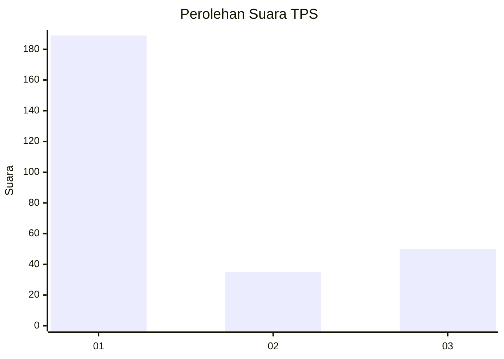
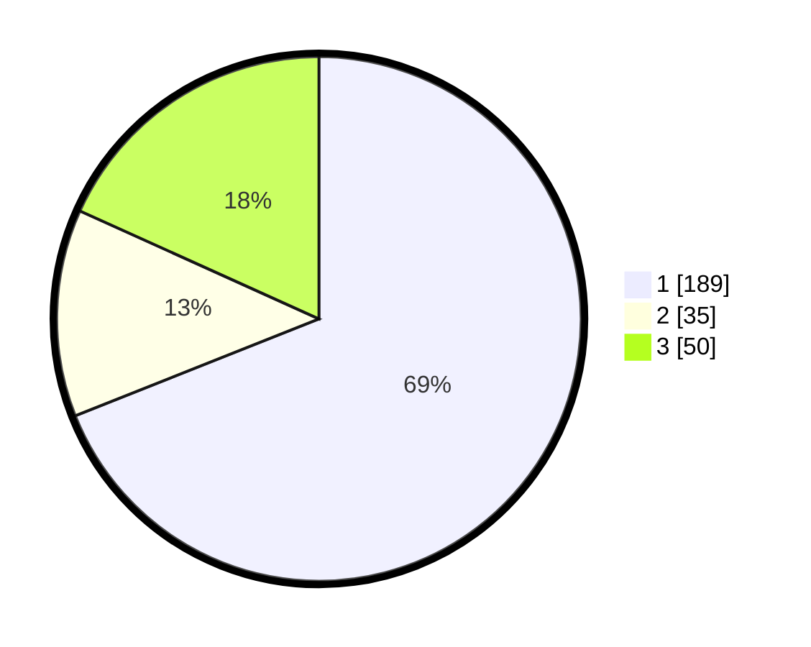

# Hasil

## Grafik

## Tabel

| No. | Nama Paslon    | Suara | Suara (raw) | Persentase |
|:--- |:-------------- | -----:| -----------:| ----------:|
| 1   | ANIES MUHAIMIN | 189   | [189][p-1]  | 68,98      |
| 2   | PRABOWO GIBRAN | 35    | [35][p-2]   | 12,77      |
| 3   | GANJAR MAHFUD  | 50    | [50][p-3]   | 18,25      |

[p-1]: https://github.com/gigit-pemilu/pemilu-2024/blob/main/pilpres/hitung-suara/sub/35-jawa-timur/sub/28-pamekasan/sub/06-palengaan/sub/2008-patoan-daja/sub/004-tps/sub/paslon-1.txt
[p-2]: https://github.com/gigit-pemilu/pemilu-2024/blob/main/pilpres/hitung-suara/sub/35-jawa-timur/sub/28-pamekasan/sub/06-palengaan/sub/2008-patoan-daja/sub/004-tps/sub/paslon-2.txt
[p-3]: https://github.com/gigit-pemilu/pemilu-2024/blob/main/pilpres/hitung-suara/sub/35-jawa-timur/sub/28-pamekasan/sub/06-palengaan/sub/2008-patoan-daja/sub/004-tps/sub/paslon-3.txt

## Foto C Plano

https://sirekap-obj-formc.kpu.go.id/94a3/pemilu/ppwp/35/28/06/20/08/3528062008004-20240214-141148--3a2db9d1-0eca-4a78-9199-e552341f196e.jpg

https://sirekap-obj-formc.kpu.go.id/94a3/pemilu/ppwp/35/28/06/20/08/3528062008004-20240214-141301--d1833040-a263-48e2-a848-208207dd6d9f.jpg

https://sirekap-obj-formc.kpu.go.id/94a3/pemilu/ppwp/35/28/06/20/08/3528062008004-20240214-141459--ffb67eb7-4df1-4825-9de1-57c542a9bdcb.jpg

## Metadata

| Key        | Value               |
| ---------- | ------------------- |
| Time Stamp | 2024-02-17 16:00:02 |

