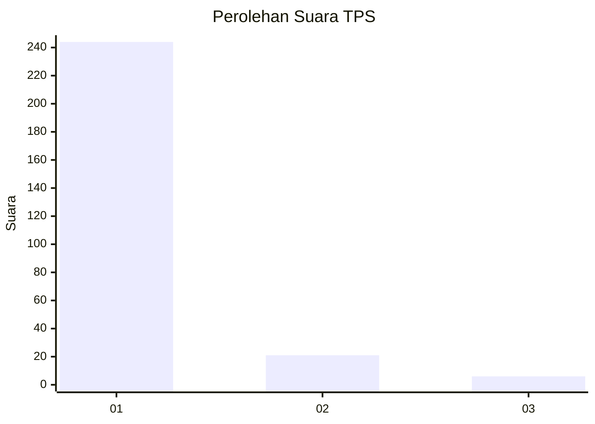
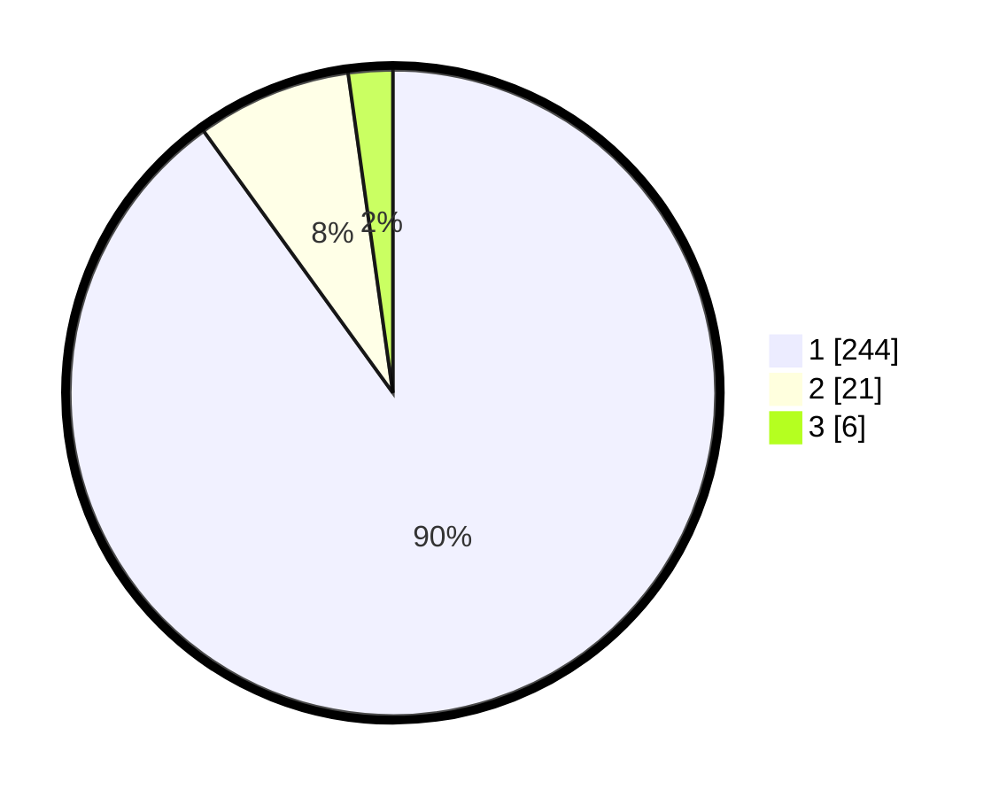

# Hasil

## Grafik

## Tabel

| No. | Nama Paslon    | Suara | Suara (raw) | Persentase |
|:--- |:-------------- | -----:| -----------:| ----------:|
| 1   | ANIES MUHAIMIN | 244   | [244][p-1]  | 90,04      |
| 2   | PRABOWO GIBRAN | 21    | [21][p-2]   | 7,75       |
| 3   | GANJAR MAHFUD  | 6     | [6][p-3]    | 2,21       |

[p-1]: https://github.com/gigit-pemilu/pemilu-2024-35-jawa-timur/blob/main/pilpres/hitung-suara/sub/35-jawa-timur/sub/28-pamekasan/sub/06-palengaan/sub/2008-patoan-daja/sub/008-tps/sub/paslon-1.txt
[p-2]: https://github.com/gigit-pemilu/pemilu-2024-35-jawa-timur/blob/main/pilpres/hitung-suara/sub/35-jawa-timur/sub/28-pamekasan/sub/06-palengaan/sub/2008-patoan-daja/sub/008-tps/sub/paslon-2.txt
[p-3]: https://github.com/gigit-pemilu/pemilu-2024-35-jawa-timur/blob/main/pilpres/hitung-suara/sub/35-jawa-timur/sub/28-pamekasan/sub/06-palengaan/sub/2008-patoan-daja/sub/008-tps/sub/paslon-3.txt

## Foto C Plano

https://sirekap-obj-formc.kpu.go.id/0dd1/pemilu/ppwp/35/28/06/20/08/3528062008008-20240214-222723--737cae48-c72a-4d2e-8a60-14b17bb38b01.jpg

https://sirekap-obj-formc.kpu.go.id/0dd1/pemilu/ppwp/35/28/06/20/08/3528062008008-20240214-222906--24f895b8-9100-4128-b84f-312aa1722c5d.jpg

https://sirekap-obj-formc.kpu.go.id/0dd1/pemilu/ppwp/35/28/06/20/08/3528062008008-20240214-223107--24b7cedd-da07-498a-bbea-626510f6abd6.jpg

## Metadata

| Key        | Value               |
| ---------- | ------------------- |
| Time Stamp | 2024-02-20 11:00:00 |

