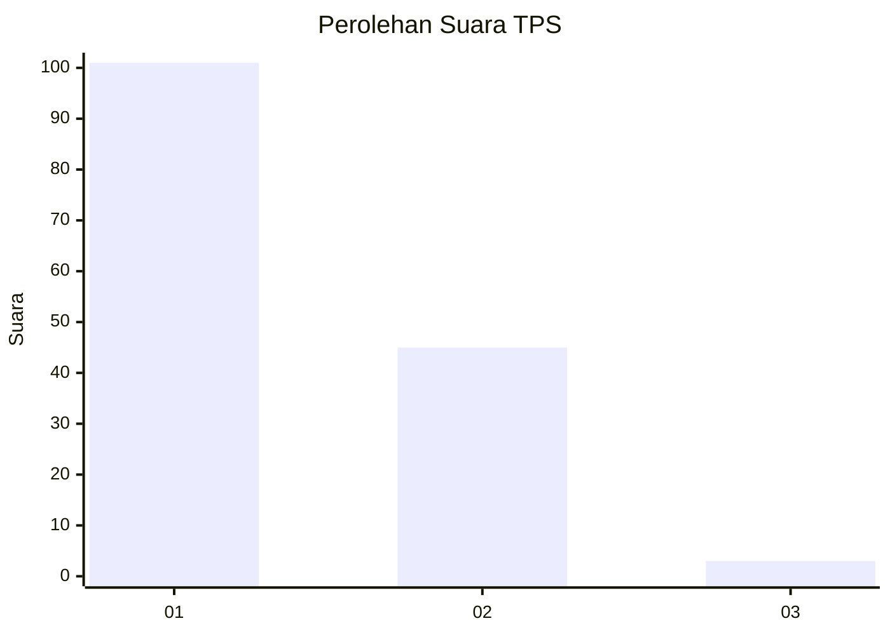
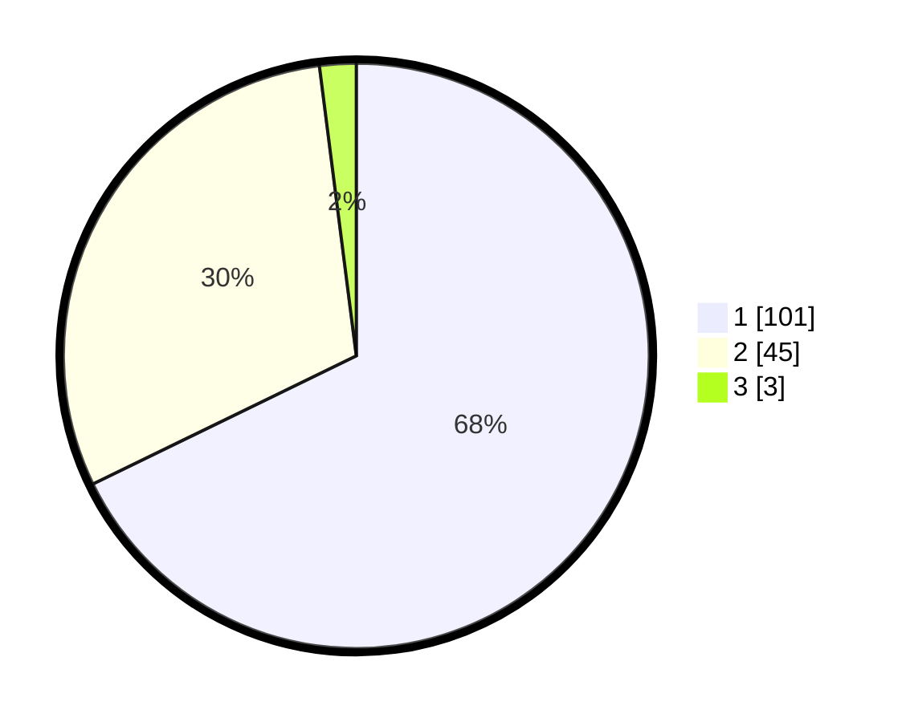

# Hasil

## Grafik

## Tabel

| No. | Nama Paslon    | Suara | Suara (raw) | Persentase |
|:--- |:-------------- | -----:| -----------:| ----------:|
| 1   | ANIES MUHAIMIN | 101   | [101][p-1]  | 67,79      |
| 2   | PRABOWO GIBRAN | 45    | [45][p-2]   | 30,20      |
| 3   | GANJAR MAHFUD  | 3     | [3][p-3]    | 2,01       |

[p-1]: https://github.com/gigit-pemilu/pemilu-2024-35-jawa-timur/blob/main/pilpres/hitung-suara/sub/35-jawa-timur/sub/28-pamekasan/sub/06-palengaan/sub/2008-patoan-daja/sub/010-tps/sub/paslon-1.txt
[p-2]: https://github.com/gigit-pemilu/pemilu-2024-35-jawa-timur/blob/main/pilpres/hitung-suara/sub/35-jawa-timur/sub/28-pamekasan/sub/06-palengaan/sub/2008-patoan-daja/sub/010-tps/sub/paslon-2.txt
[p-3]: https://github.com/gigit-pemilu/pemilu-2024-35-jawa-timur/blob/main/pilpres/hitung-suara/sub/35-jawa-timur/sub/28-pamekasan/sub/06-palengaan/sub/2008-patoan-daja/sub/010-tps/sub/paslon-3.txt

## Foto C Plano

https://sirekap-obj-formc.kpu.go.id/8d31/pemilu/ppwp/35/28/06/20/08/3528062008010-20240214-155202--cb66f054-ad69-4b14-8c9f-27a62cd8d38a.jpg

https://sirekap-obj-formc.kpu.go.id/8d31/pemilu/ppwp/35/28/06/20/08/3528062008010-20240214-155210--195be1d7-f310-4daa-86e3-baa5656ad4dc.jpg

https://sirekap-obj-formc.kpu.go.id/8d31/pemilu/ppwp/35/28/06/20/08/3528062008010-20240214-155310--f0d2c32b-ad74-437a-b40e-6eb8b7f339ec.jpg

## Metadata

| Key        | Value               |
| ---------- | ------------------- |
| Time Stamp | 2024-02-24 22:31:28 |

