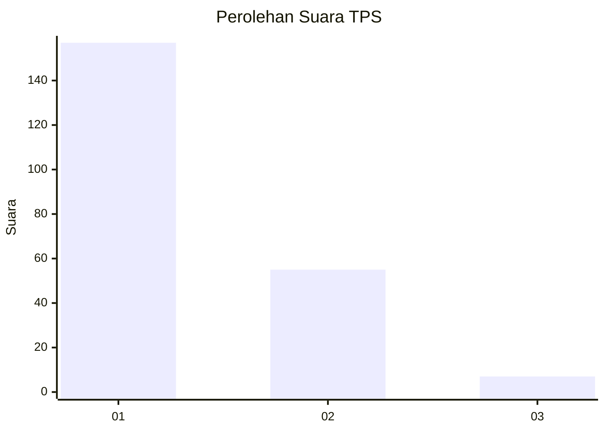
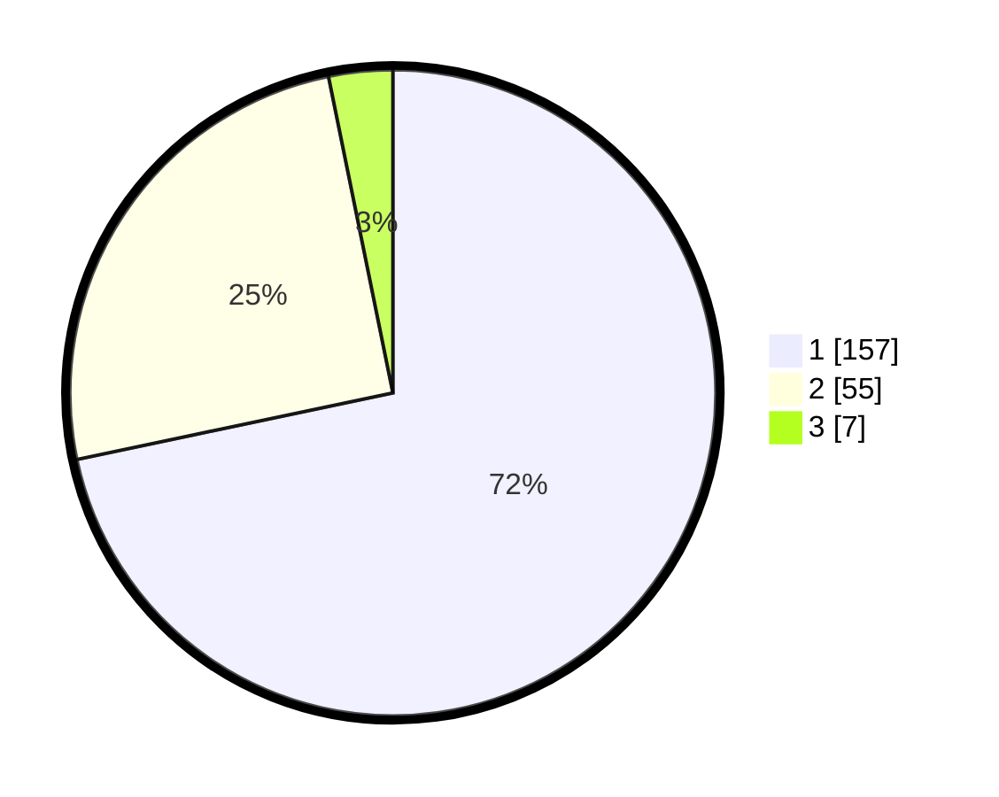

# Hasil

## Grafik

## Tabel

| No. | Nama Paslon    | Suara | Suara (raw) | Persentase |
|:--- |:-------------- | -----:| -----------:| ----------:|
| 1   | ANIES MUHAIMIN | 157   | [157][p-1]  | 71,69      |
| 2   | PRABOWO GIBRAN | 55    | [55][p-2]   | 25,11      |
| 3   | GANJAR MAHFUD  | 7     | [7][p-3]    | 3,20       |

[p-1]: https://github.com/gigit-pemilu/pemilu-2024/blob/main/pilpres/hitung-suara/sub/35-jawa-timur/sub/28-pamekasan/sub/06-palengaan/sub/2008-patoan-daja/sub/011-tps/sub/paslon-1.txt
[p-2]: https://github.com/gigit-pemilu/pemilu-2024/blob/main/pilpres/hitung-suara/sub/35-jawa-timur/sub/28-pamekasan/sub/06-palengaan/sub/2008-patoan-daja/sub/011-tps/sub/paslon-2.txt
[p-3]: https://github.com/gigit-pemilu/pemilu-2024/blob/main/pilpres/hitung-suara/sub/35-jawa-timur/sub/28-pamekasan/sub/06-palengaan/sub/2008-patoan-daja/sub/011-tps/sub/paslon-3.txt

## Foto C Plano

https://sirekap-obj-formc.kpu.go.id/2bea/pemilu/ppwp/35/28/06/20/08/3528062008011-20240214-214247--72a09d5b-0571-451d-9db8-e9168467cc1f.jpg

https://sirekap-obj-formc.kpu.go.id/2bea/pemilu/ppwp/35/28/06/20/08/3528062008011-20240214-214405--7a3569a1-3639-4c84-bddf-4b7e59193551.jpg

https://sirekap-obj-formc.kpu.go.id/2bea/pemilu/ppwp/35/28/06/20/08/3528062008011-20240214-214526--e8f5718f-60f0-4096-a0d3-156287dc8fd8.jpg

## Metadata

| Key        | Value               |
| ---------- | ------------------- |
| Time Stamp | 2024-02-25 12:00:00 |

