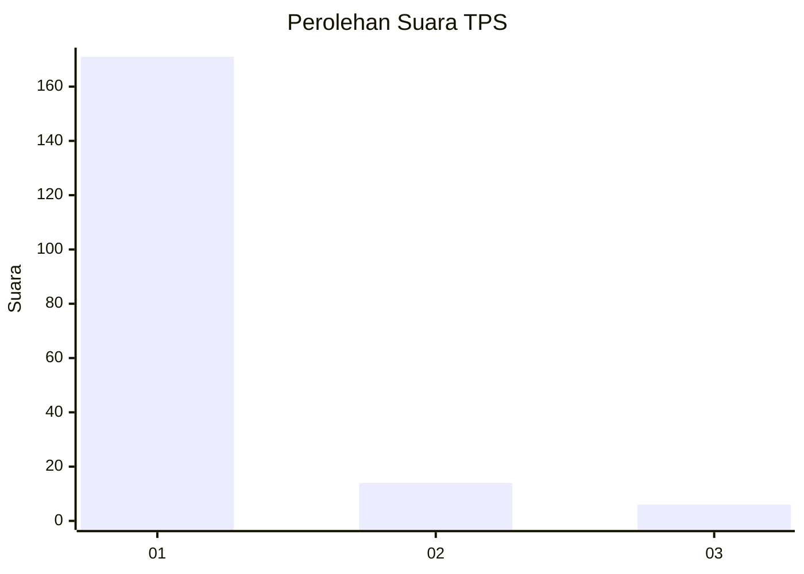
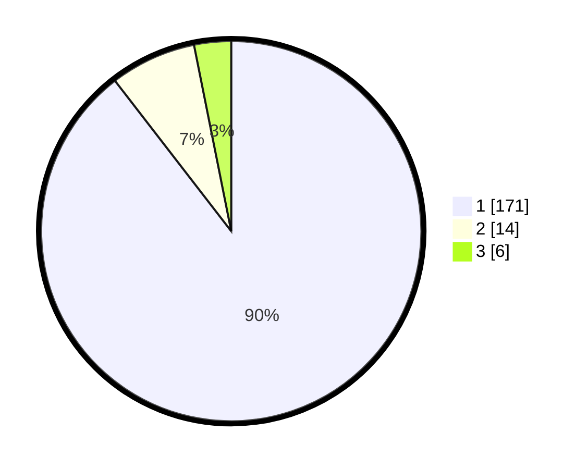

# Hasil

## Grafik

## Tabel

| No. | Nama Paslon    | Suara | Suara (raw) | Persentase |
|:--- |:-------------- | -----:| -----------:| ----------:|
| 1   | ANIES MUHAIMIN | 171   | [171][p-1]  | 89,53      |
| 2   | PRABOWO GIBRAN | 14    | [14][p-2]   | 7,33       |
| 3   | GANJAR MAHFUD  | 6     | [6][p-3]    | 3,14       |

[p-1]: https://github.com/gigit-pemilu/pemilu-2024/blob/main/pilpres/hitung-suara/sub/35-jawa-timur/sub/28-pamekasan/sub/06-palengaan/sub/2008-patoan-daja/sub/902-tps/sub/paslon-1.txt
[p-2]: https://github.com/gigit-pemilu/pemilu-2024/blob/main/pilpres/hitung-suara/sub/35-jawa-timur/sub/28-pamekasan/sub/06-palengaan/sub/2008-patoan-daja/sub/902-tps/sub/paslon-2.txt
[p-3]: https://github.com/gigit-pemilu/pemilu-2024/blob/main/pilpres/hitung-suara/sub/35-jawa-timur/sub/28-pamekasan/sub/06-palengaan/sub/2008-patoan-daja/sub/902-tps/sub/paslon-3.txt

## Foto C Plano

https://sirekap-obj-formc.kpu.go.id/7df3/pemilu/ppwp/35/28/06/20/08/3528062008902-20240214-201222--530f0ea6-4b6e-472c-bd42-f285da70e5fd.jpg

https://sirekap-obj-formc.kpu.go.id/7df3/pemilu/ppwp/35/28/06/20/08/3528062008902-20240214-201354--fdc8e465-32f6-4da5-af15-9642568c92db.jpg

https://sirekap-obj-formc.kpu.go.id/7df3/pemilu/ppwp/35/28/06/20/08/3528062008902-20240214-201452--ff639772-c51a-4e3f-8605-d24fb8ff4a26.jpg

## Metadata

| Key        | Value               |
| ---------- | ------------------- |
| Time Stamp | 2024-02-17 16:00:02 |

